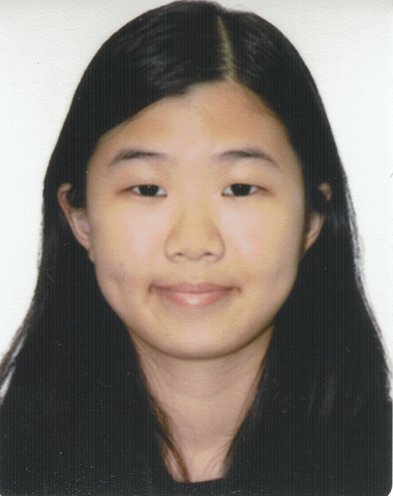
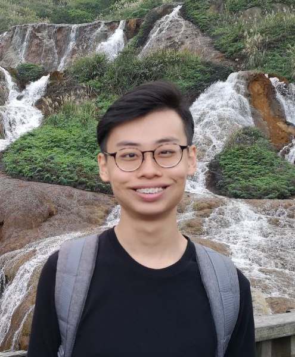

We are a team based in the [School of Computing, National University of Singapore](http://www.comp.nus.edu.sg).

## Project team

### Balasubramaniam Praveen

[[github](https://github.com/pr4aveen)]
[[portfolio](team/pr4aveen.md)]

* Role: Integration
* Responsibilities: Functionality

### Cheong Ying Yi Clara

[[github](https://github.com/claracheong4)]
[[portfolio](team/claracheong4.md)]

* Role: Testing
* Responsibilities: Testing

### Farrell Nah Jun Hao

[[github](https://github.com/boundtotheearth)]
[[portfolio](team/boundtotheearth.md)]

* Role: Integration
* Responsibilities: Functionality

### Kang Su Min

[[github](https://github.com/kkangs0226)]
[[portfolio](team/kkangs0226.md)]

* Role: Documentation and Code Quality
* Responsibilities: Functionality and Documentation

### Khoo De Hui

[[github](http://github.com/khoodehui)]
[[portfolio](team/khoodehui.md)]

* Role: Team Lead, Scheduling and Tracking
* Responsibilities: UI
