* Table of Contents
  [toc]

---

## **Setting up, getting started**

Refer to the guide [_Setting up and getting started_](SettingUp.md).

---

## **Design**

### Architecture

**`Main`** has two classes called [`Main`](https://github.com/se-edu/addressbook-level3/tree/master/src/main/java/seedu/address/Main.java) and [`MainApp`](https://github.com/se-edu/addressbook-level3/tree/master/src/main/java/seedu/address/MainApp.java). It is responsible for,

* At app launch: Initializes the components in the correct sequence, and connects them up with each other.
* At shut down: Shuts down the components and invokes cleanup methods where necessary.

[**`Commons`**](#common-classes) represents a collection of classes used by multiple other components.

The rest of the App consists of four components.

* [**`UI`**](#ui-component): The UI of the App.
* [**`Logic`**](#logic-component): The command executor.
* [**`Model`**](#model-component): Holds the data of the App in memory.
* [**`Storage`**](#storage-component): Reads data from, and writes data to, the hard disk.

Each of the four components,

* defines its _API_ in an `interface` with the same name as the Component.
* exposes its functionality using a concrete `{Component Name}Manager` class (which implements the corresponding API `interface` mentioned in the previous point.

For example, the `Logic` component (see the class diagram given below) defines its API in the `Logic.java` interface and exposes its functionality using the `LogicManager.java` class which implements the `Logic` interface.

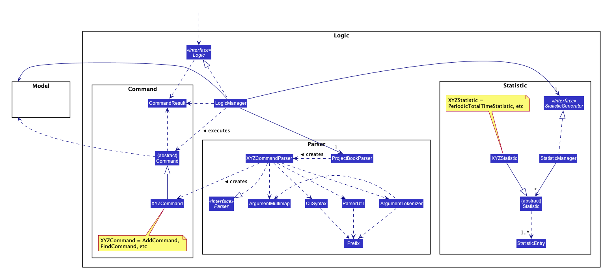

**How the architecture components interact with each other**

The _Sequence Diagram_ below shows how the components interact with each other for the scenario where the user issues the command `delete 1`.

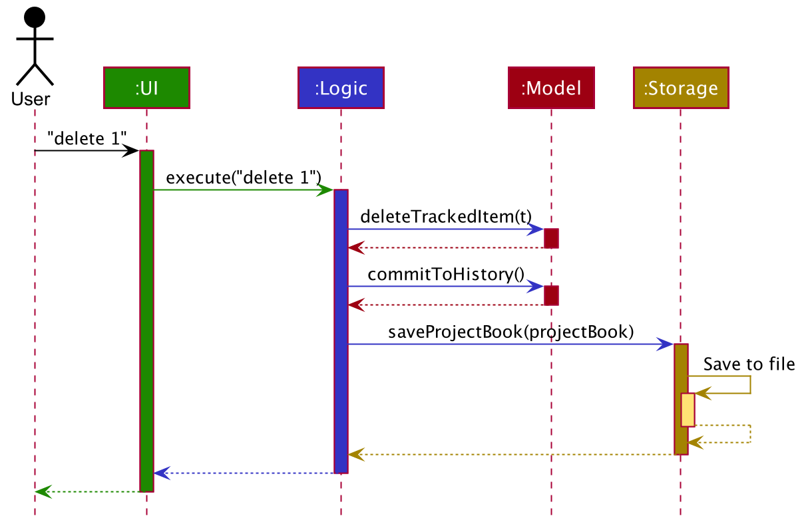

The sections below give more details of each component.

### UI component

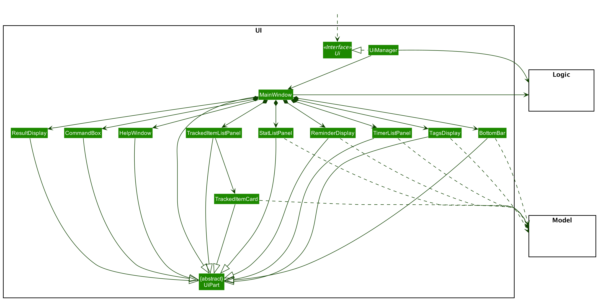

**API** :
[`Ui.java`](https://github.com/se-edu/addressbook-level3/tree/master/src/main/java/seedu/address/ui/Ui.java)

The UI consists of a `MainWindow` that is made up of parts e.g.`CommandBox`, `ResultDisplay`, `ProjectListPanel`, `StatusBarFooter` etc. All these, including the `MainWindow`, inherit from the abstract `UiPart` class.

The `UI` component uses JavaFx UI framework. The layout of these UI parts are defined in matching `.fxml` files that are in the `src/main/resources/view` folder. For example, the layout of the [`MainWindow`](https://github.com/se-edu/addressbook-level3/tree/master/src/main/java/seedu/address/ui/MainWindow.java) is specified in [`MainWindow.fxml`](https://github.com/se-edu/addressbook-level3/tree/master/src/main/resources/view/MainWindow.fxml)

The `UI` component,

* Executes user commands using the `Logic` component.
* Listens for changes to `Model` data so that the UI can be updated with the modified data.

### Logic component

**API** :
[`Logic.java`](https://github.com/se-edu/addressbook-level3/tree/master/src/main/java/seedu/address/logic/Logic.java)

1. `Logic` uses the `ProjectBookParser` class to parse the user command.
1. This results in a `Command` object which is executed by the `LogicManager`.
1. The command execution can affect the `Model` (e.g. adding a project).
1. The result of the command execution is encapsulated as a `CommandResult` object which is passed back to the `Ui`.
1. In addition, the `CommandResult` object can also instruct the `Ui` to perform certain actions, such as displaying help to the user.

Given below is the Sequence Diagram for interactions within the `Logic` component for the `execute("delete 1")` API call.

:information_source: <strong>Note:</strong> The lifeline for `DeleteCommandParser` should end at the destroy marker (X) but due to a limitation of PlantUML, the lifeline reaches the end of diagram.

### Model component

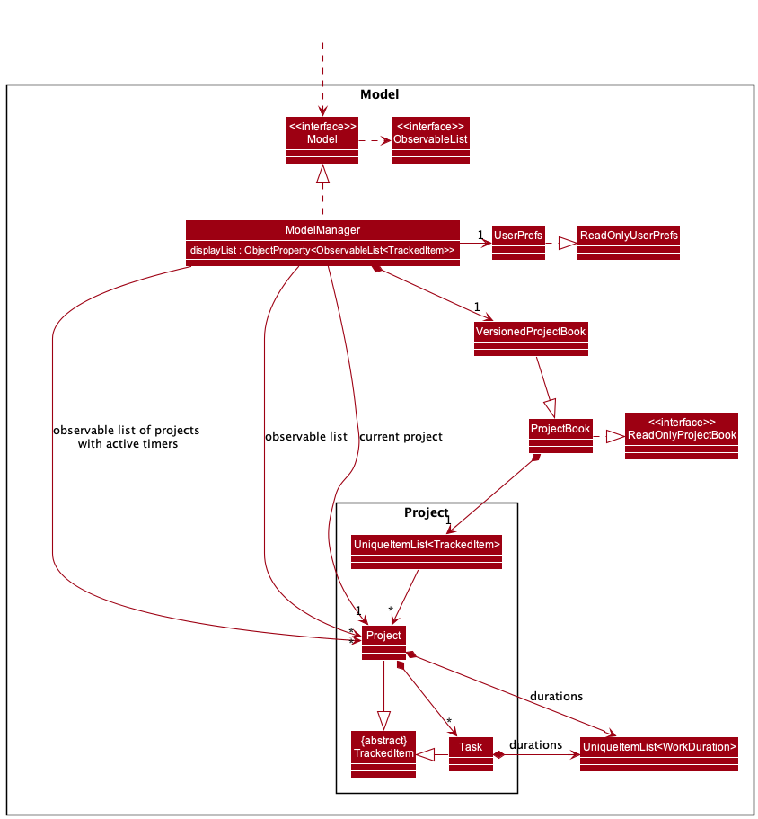

**API** : [`Model.java`](https://github.com/se-edu/addressbook-level3/tree/master/src/main/java/seedu/address/model/Model.java)

The `Model`:

* Stores a `UserPref` object that represents the user’s preferences.
* Stores a `VersionedProjectBook` object that contains Momentum's data.
* Stores a `ReminderManager` object that schedules and removes reminders.
* Stores the following attributes for sorting of `ObservableList<TrackedItems>`:
    * `SortType` object that defines the sort type imposed on the `ObservableList<TrackedItems>`.
    * `boolean` object that defines whether the `ObservableList<TrackedItems>` of total projects and tasks is sorted by ascending order.
    * `boolan` object that defines whether the `ObservableList<TrackedItems>` of total projects and tasks is sorted by completion status.
* Stores a `ViewMode` object that represents the current view mode of Momentum (Task view or Project view).
* Stores a `Project` object that represents the current project Momentum is viewing if user is in Task view within a project.
* Stores a `boolean` object that defines whether the tags display is visible to the users.
* Exposes an unmodifiable `ObjectProperty<ObservableList<TrackedItem>>` that stores the projects or tasks that are currently displayed to the user.
* Exposes an unmodifiable `ObservableList<TrackedItems>` that stores projects or tasks that can be 'observed' e.g. the UI can be bound to this list so that the UI automatically updates when the data in the list change.
* Exposes an unmodifiable `ObservableList<TrackedItems>` that stores the total projects or tasks with running timers that can be 'observed' e.g. the UI can be bound to this list so that the UI automatically updates when the data in the list change.
* Does not depend on any of the other three components.

:information_source: <strong>Note:</strong> An alternative (arguably, a more OOP) model is given below. It has a `Tag` list in the `ProjectBook`, which `Project` references. This allows `ProjectBook` to only require one `Tag` object per unique `Tag`, instead of each `Project` needing their own `Tag` object. 

### Storage component

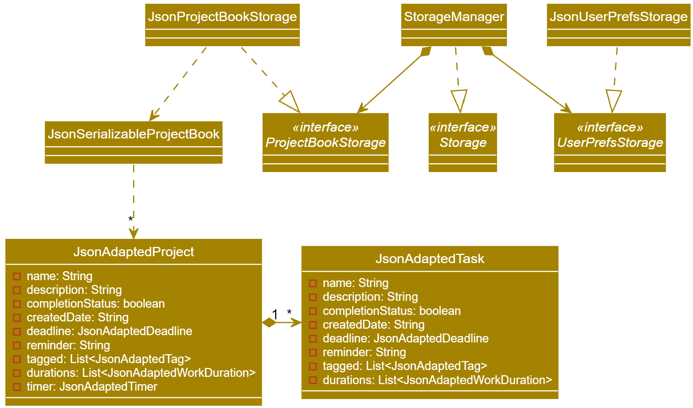

**API** : [`Storage.java`](https://github.com/se-edu/addressbook-level3/tree/master/src/main/java/seedu/address/storage/Storage.java)

The `Storage` component,

* can save `UserPref` objects in json format and read it back.
* can save the project book data in json format and read it back.

### Common classes

Classes used by multiple components are in the `seedu.momentum.commons` package.

---

## **Implementation**

This section describes some noteworthy details on how certain features are implemented.

### Adding Tasks to Projects
Since projects and tasks contain very similar fields, we have chosen to implement an abstract class, `TrackedItem` with these fields, and have both `Project` and `Task` extend from it. We then have each `Project` contain a list of `Task` that can be accessed. This is illustrated in the class diagram below:

//Image here//

This allows us to reduce code duplication, and allows us to handle both projects and task in a more general, abstract way. For example, the same `start`/`stop` command classes can be used for both projects and tasks by implementing them using `TrackedItem`. 

#### Alternate Implementation: Projects in Projects
Instead of have seperate `Project` and `Task` classes, we can model the concept by having each `Project` object contain more `Project` objects, as illustrated in the class diagram below:

//Image here//

We ultimately chose not to use this implementation because we expect `Project` and `Task` to be further differentiated in the future. Our chosen implementation will allow us to modify and extend the functionality of `Project` and `Task` seperately.

#### Alternate Implementation: Using predicates to filter Tasks and Projects
Another implementation we considered was to add all `Project` and `Task` objects the same `UniqueProjectsList`. The UI will only display projects when it is in the project view and tasks when it is in the tasks view. This will be done by modifying the predicates used on the `filteredTrackedItems` list in `ModelManager`. Other commands such as `Find` will modify the predicate similarly. 

We rejected this implementation as we felt that it would be difficult to write more rigorous tests compared to our chosen implementation. The chosen implementation can reuse a lot of the tests that are already present in the codebase. This was an important consideration for us due to the time constraints we are presented with.

### Immutability
`Projects`, `Tasks`, `Timers`, and `WorkDurations` are immutable. This means that anytime a project's details are changed, a new
 object is created with the new details, and the model is updated with the new object.
 
Notable examples include:
* Starting/Stopping a Timer: A new object is created with the updated timer state and durations, 
* Editing a Project: A new object is created with the new project's details, with the same timer and durations recorded.

Below is an example of what happens when a project's timer is stopped:

In this case, since the project's timer is being changed, new `TimerWrapper`, `WorkDuration`, `UniqueDurationList` objects are
 created, which are then used to create a new `Project`, which is subsequently used to replace the old `Project` in
  the model.

We chose to implement projects this way as immutability makes these classes more easily testable.

### Timers and Durations
The time tracking features in Momentum are implemented using `TimerWrapper` and `WorkDuration` objects. The below diagram
 illustrates the relevant classes that work together to produce statistics
 
 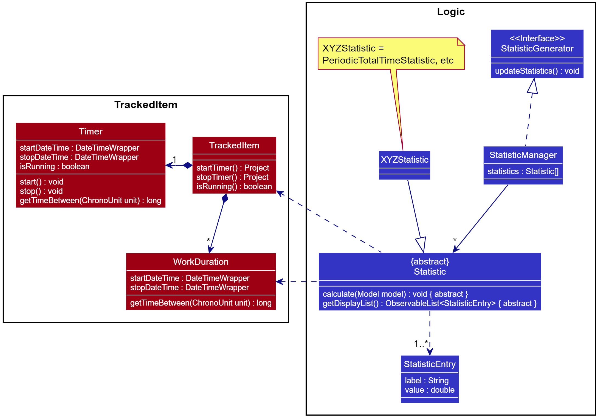

Each project has a `TimerWrapper` that can be started and stopped by the user (using the `start`/`stop` commands). The timer
 does not run actively (counting each second/millisecond), instead it records the time when it was started, and the time
  when it was stopped. 
 
This implementation was chosen because it allows Momentum's timers to continue running even when the application is
closed, bye saving the timer's start/stop times together with project data. We chose to give each `Project` its own
 timer as that allows Momentum to support running multiple timers concurrently, one for each project, for users that
  want to multi-task.

A `WorkDuration` represents a period of time that the user spent working on a project. Each `Project` contains a list
 of `WorkDuration` that represents each time the each the user starts and stops the timer for the project.
 
We chose to do this implementation to allow for flexibility in calculating statistics

### Deadlines

The deadline of a project and tasks is implemented using `DateWrapper` and `TimeWrapper`. The `dateWrapper` and `timeWrapper` is stored as `Optional<DateWrapper>` and `Optional<TimeWrapper>`in the `Deadline` class.
Since both date and time is optional in the class, a deadline is empty when both `dateWrapper` and `timeWrapper` is empty. An empty deadline can be created easily without `Project` needing to know whether it has a deadline. This design was chosen due to the ease of implementation. Another reason is because no dummy data will be required. 

An alternative design is to store date and time in a `DateTimeWrapper` with dummy date and time if the date or time is not present as `LocalDateTime` requires both date and time. However, extra checks will have to be done to differentiate between dummy and actual data.

The date and time of a deadline of a project is parsed separately. This design is chosen as date and time is stored separately and the format of date and time can be more flexible.

An alternative design is to parse both date and time together. This is harder to implement as date and time is stored separately in deadline. This design would also restrict the format of the date and time.

The deadline also has a constraint that is has to be on or after the created date. This constraint has been added so that more meaningful statistics can be generated.

As a result, the deadline has to be aware of the created date when created. The constructor of `Deadline` accepts a created date. For `EditCommand`, a descriptor containing edited fields is created directly from parsing the user input in `EditCommandParser`, hence the created date is unknown. A dummy date using `LocalDate.EPOCH` is passed into the constructor of `Deadline` in `EditCommandParser` to allow creation of the deadline. The check that deadline has to be on or after the created date is done in `EditCommand` after the creation date of the project to be edited is known.

### Reminders

The reminder of a task is implemented using `ReminderManager` and `Reminder`. The date and time of a reminder is stored in `Reminder`. `ReminderManager` schedules the reminder using `Timer` and runs the reminder using `ThreadWrapper`. 

An alternative would be to schedule and run the reminder in `Reminder` class directly. This design was not chosen as that `Reminder` would have to contain references to both `Model` and `ProjectBook`, which is undesired.

`ThreadWrapper` is a utility class which runs runnables using `Platform.runLater` when running the javaFX application, but switches to running the runnables directly when performing automated tests.

An alternative would be to use `Platform.runLater` only to run the reminder. However, automated tests cannot directly run the reminder as it does not support `Platform`. This design was chosen to enable the reminder to be run directly.

`ReminderManager` contains a reference to a `Model` so that the projects and tasks can be iterated through callback methods and the reminders of the projects can be modified. `ReminderManager` makes use of several callback functions such as `rescheduleReminder(ReminderManager reminderManager)` to iterate through the project, which in turns calls `rescheduleReminder(Project project)` in `ReminderManager`.

`ReminderManager` has an inner class `ReminderTimerTask` which implements `TimerTask` that is used to schedule a reminder with `Timer`. This design was chosen as `ReminderTimerTask` references non-static methods of `ReminderMananger` as well as `Model`, which is also referenced in `ReminderManager`.

An alternative implementation is to implement `ReminderTimerTask` as a separate class. With this implementation, `ReminderTimerTask` will have to contain extra references such as `ReminderManager` and `Model`.

The result of the reminder is stored as a `StringProperty` and retrieved from the `Model` so that a listener can be used in `MainWindow` to detect changes and update the GUI acccordingly. This design was chosen due to the ease of implementation. 

`BooleanProperty` is also stored to keep track of whether there are any reminders so that `MainWindow` can detect whether there are reminders and hide or show the reminder panel accordingly. This design was also chosen due to the ease of implementation.

Whenever a project is added, edited or removed, the reminders needs to be adjusted accordingly. The chosen implementations is to reschedule all the reminders. 

An alternative would be to only reschedule projects that are affected by the change. This design was not chosen as it is more complicated and would increase the coupling between `ReminderManager` and other related classes.

### Statistics
Statistics in Momentum are implemented using a Command design pattern, similar to how Commands are implemented. A
 `StatisticManager` contains all the `Statistic` objects and is responsible for updating each `Statistic` whenever
  the model is changed.
  
 Each `Statistic` exposes a `calculate(Model model)` method that is called by the `StatisticManager` to calculate or
  update the data with the information in the model. The method contains instructions on how that particular
   statistic is calculated. 
   
For example, the `PeriodicTotalTimeStatistic` calculates the amount of time the user
spends on each project for some period of time, and is calculated by looking at each project in the model and
 summing up all the `WorkDuration` for the given period.
 
The statistics data is stored in each `Statistic` object as one or more `StatisticEntry` objects. A `StatisticEntry
` represents a unit statistics data, which contains a `label` describing the data and the data's `value`.
 
Here is a sequence diagram to demonstrate how the statistics for time spent per project (weekly) is calculated and
 how the data is retrieved.

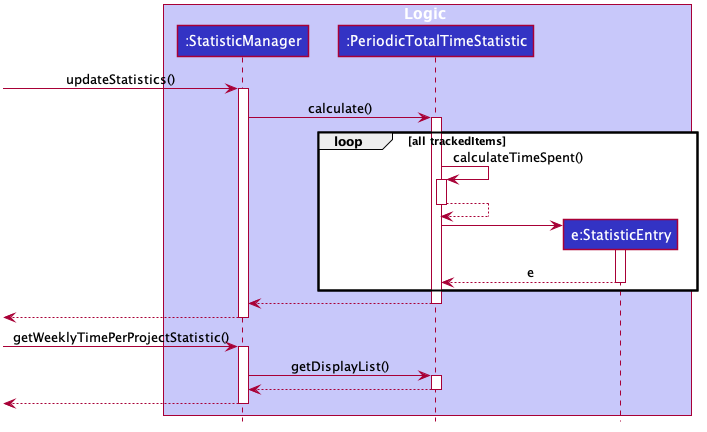

### Managing Time
Time is managed by a `Clock` class. This class has 3 modes that allow for it to perform different functions:
1. Normal: The normal system time is returned.
2. Fixed: The same, preset time is always returned. Used for testing purposes.
3. Manual: The passage of time can be manually controlled, such as fast-forwarding and rewinding time by specific
 amounts. Used for testing purposes.
 
The `Clock` class acts as a consistent, single course of the 'current time' within the application, and provides the
 option to manually set and control the current time for testing purposes. Objects that need to know the current time
  must obtain it from `Clock`.
 
This implementation was chosen because it allows all time-related features to be more easily testable.

#### Rejected Implementation: Using `LocalDateTime.now()` directly
This implementation was considered but ultimately rejected as it introduced several problems in testing time-realted
 features. Notable issues are:
 * It is impossible to check for equality when getting system time directly using `LocalDateTime.now()` and other
  similar methods, since time would always progress by a small amount between each call
 * It is difficult to test features that require the passage of time, such as the `start` and `stop` commands as we
  would need to actually wait an amount of time during the tests.

### Find Command
The find command uses predicate chaining to search for projects/tasks based on one or more parameters. A predicate is created for each type of search parameter (name, description, tags, completion status). There are four predicates classes defined for this purpose.

* `NameContainsKeywordPredicate` - Searches for projects/tasks based on name.
* `DescriptionContainsKeywordPredicate` - Searches for projects/tasks based on description.
* `TagListContainsKeywordPredicate` - Searches for projects/tasks based on tags.
* `CompletionStatusPredicate` - Searches for projects/tasks based on completion status.

The `FindCommandParser` creates a list of predicates based on the arguments entered into the command. Each predicate takes in a match type, represented by the enumeration `FindType`.

*check if correct representation for non-static*-> `FindCommandParser#combinePredicates` is then used to chain these predicates using the `Predicate#or` or `Predicate#and` methods depending on the `FindType` selected. This returns a `Predicate<TrackedItem>`. The `filteredTrackedItemsList` is updated to contain all projects and tasks without updating the user interface. After this, `FindCommand` uses used to update the`filteredTrackedItemsList` and the user interface.

This design was chosen as it built on the existing implementation of the find command, which passed a `NameContainsKeywordPredicate` to the `filteredTrackedItemsList`. This means that minimal changes to other parts of the project were required. 

// should i include a disadvantge of this method -- testability of predicate chaining //

The following sequence diagram shows how the find command works.

// Insert seq diagram here. //

### \[Proposed\] Undo/redo feature

#### Proposed Implementation

The proposed undo/redo mechanism is facilitated by `VersionedProjectBook`. It extends `ProjectBook` with an undo/redo history, stored internally as an `projectBookStateList` and `currentStatePointer`. Additionally, it implements the following operations:

* `VersionedProjectBook#commit()` — Saves the current project book state in its history.
* `VersionedProjectBook#undo()` — Restores the previous project book state from its history.
* `VersionedProjectBook#redo()` — Restores a previously undone project book state from its history.

These operations are exposed in the `Model` interface as `Model#commitProjectBook()`, `Model#undoProjectBook()` and `Model#redoProjectBook()` respectively.

Given below is an example usage scenario and how the undo/redo mechanism behaves at each step.

Step 1. The user launches the application for the first time. The `VersionedProjectBook` will be initialized with the initial project book state, and the `currentStatePointer` pointing to that single project book state.

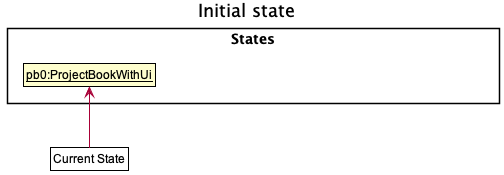

Step 2. The user executes `delete 5` command to delete the 5th project in the project book. The `delete` command calls `Model#commitProjectBook()`, causing the modified state of the project book after the `delete 5` command executes to be saved in the `projectBookStateList`, and the `currentStatePointer` is shifted to the newly inserted project book state.

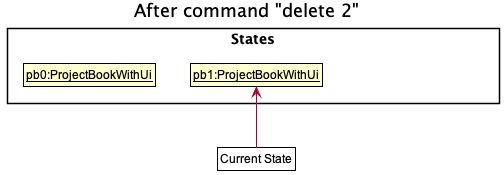

Step 3. The user executes `add n/David …​` to add a new project. The `add` command also calls `Model#commitProjectBook()`, causing another modified project book state to be saved into the `projectBookStateList`.

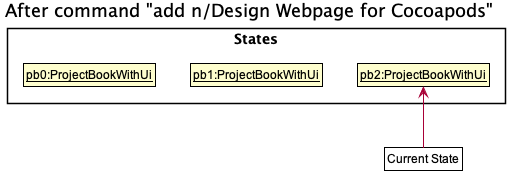

:information_source: <strong>Note:</strong> If a command fails its execution, it will not call `Model#commitProjectBook()`, so the project book state will not be saved into the `projectBookStateList`.

Step 4. The user now decides that adding the project was a mistake, and decides to undo that action by executing the `undo` command. The `undo` command will call `Model#undoProjectBook()`, which will shift the `currentStatePointer` once to the left, pointing it to the previous project book state, and restores the project book to that state.

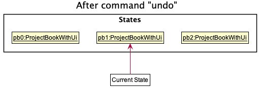

:information_source: <strong>Note:</strong> If the `currentStatePointer` is at index 0, pointing to the initial ProjectBook state, then there are no previous ProjectBook states to restore. The `undo` command uses `Model#canUndoProjectBook()` to check if this is the case. If so, it will return an error to the user rather
than attempting to perform the undo.

The following sequence diagram shows how the undo operation works:

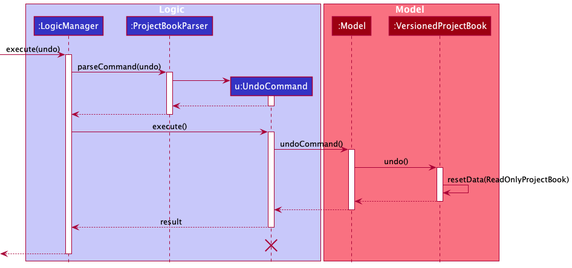

:information_source: <strong>Note:</strong> The lifeline for `UndoCommand` should end at the destroy marker (X) but due to a limitation of PlantUML, the lifeline reaches the end of diagram.

The `redo` command does the opposite — it calls `Model#redoProjectBook()`, which shifts the `currentStatePointer` once to the right, pointing to the previously undone state, and restores the project book to that state.

:information_source: <strong>Note:</strong> If the `currentStatePointer` is at index `projectBookStateList.size() - 1`, pointing to the latest project book state, then there are no undone ProjectBook states to restore. The `redo` command uses `Model#canRedoProjectBook()` to check if this is the case. If so, it will return an error to the user rather than attempting to perform the redo.

Step 5. The user then decides to execute the command `list`. Commands that do not modify the project book, such as `list`, will usually not call `Model#commitProjectBook()`, `Model#undoProjectBook()` or `Model#redoProjectBook()`. Thus, the `projectBookStateList` remains unchanged.

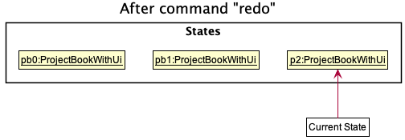

Step 6. The user executes `clear`, which calls `Model#commitProjectBook()`. Since the `currentStatePointer` is not pointing at the end of the `projectBookStateList`, all project book states after the `currentStatePointer` will be purged. Reason: It no longer makes sense to redo the `add n/David …​` command. This is the behavior that most modern desktop applications follow.

The following activity diagram summarizes what happens when a user executes a new command:

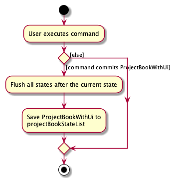

#### Design consideration:

##### Aspect: How undo & redo executes

* **Alternative 1 (current choice):** Saves the entire project book.
  * Pros: Easy to implement.
  * Cons: May have performance issues in terms of memory usage.

* **Alternative 2:** Individual command knows how to undo/redo by
  itself.
  * Pros: Will use less memory (e.g. for `delete`, just save the project being deleted).
  * Cons: We must ensure that the implementation of each individual command are correct.

_{more aspects and alternatives to be added}_

### \[Proposed\] Data archiving

_{Explain here how the data archiving feature will be implemented}_

---

## **Documentation, logging, testing, configuration, dev-ops**

* [Documentation guide](Documentation.md)
* [Testing guide](Testing.md)
* [Logging guide](Logging.md)
* [Configuration guide](Configuration.md)
* [DevOps guide](DevOps.md)

---

## **Appendix: Requirements**

### Product scope

**Target user profile**:

* Freelancers
  * Freelancers may take on multiple projects simultaneously, so they need to manage and track the time they spend on each project.
  * Freelancers want to know how much time they spend on a project in order to accurately bill their clients and set future rates.
  * Freelancers might want to know more about how they distribute their time and track the time spent on each project so that they can better understand their working style, and plan their time more efficiently.

**Value proposition**:

* Time tracking app
  * Dashboard view for freelancer to get an overview of all projects
  * Multiple groups to represent different categories to help in grouping of tasks such as freelance projects.
  * Predefined groups that are commonly used for freelancers, such as projects and self-learning/improvement
  * Timer to track the duration of a task or Indicate start time and end time for a task, so that the user can price their rates and charge clients more accurately.
  * Reminder to start doing a task (only when application is open).
  * Users can generate reports of time usage after a week/any specified duration to understand their work style better and optimise their time usage so that they can plan their time better.
  * Users can also generate reports of their income over a period of time from various freelance projects
  * Interesting/creative views for visualizing the reports/data.

### User stories

Priorities: High (must have) - `* * *`, Medium (nice to have) - `* *`, Low (unlikely to have) - `*`

| Priority | As a …​                                     | I want to …​                         | So that I can…​                                                         |
| -------- | ------------------------------------------- | ------------------------------------ | ----------------------------------------------------------------------- |
| `* * *`  | new user                                    | see usage instructions               | refer to instructions when I forget how to use the App                  |
| `* * *`  | user                                        | add a new project                    |                                                                         |
| `* * *`  | user                                        | view the project creation date                    |  
| `* * *`  | user                                        | view the project completion status                    |  |
| `* * *`  | user                                        | add and edit a deadline for a project                    |                                                                         |
| `* * *`  | user                                        | add and edit a reminder for a project                    |                                                                         |
| `* * *`  | user                                        | delete a project                     | remove entries that I no longer need                                    |
| `* * *`  | user                                        | find a project by name               | locate details of projects without having to go through the entire list |
| `* * *`  | user                                        | find a project by completion status               | locate projects that are completed or imcomplete without having to go through the entire list |
| `*`      | user with many projects in the project book | sort projects by name                | locate a project easily                                                 |
| `*`      | user with many projects in the project book | sort projects by completion status                | locate an incomplete or complete project easily                                                 |
| `*`      | user with many projects in the project book | hide and show the tags panel                | focus more on statistics and timers                                                 |
| `* *`    | new user                                    | start and stop a timer for a project | track the time I spent on the project                                   |
| `* *`    | user                                        | see the amount of time I spend on each project | gain insights on how I am using my time |
| `* *`    | user | can create tasks within a project | better organize my work

_{More to be added}_

### Use cases

(For all use cases below, the **System** is the `Momentum` and the **Actor** is the `user`, unless specified otherwise)

**Use case: Start and End a Timer**

**MSS**

1.  User requests to start a timer for a specific project in the list.
2.  Momemtum starts the timer for the project.
3.  User requests to end a timer for a specific project in the list.
4.  Momemtum ends the timer for the project.
(For all use cases below, the **System** is the `ProjectBook` and the **Actor** is the `user`, unless specified
 otherwise).

**Extensions**

* 2a. There is an existing timer for the given project id.
  
  * a1. Momentum shows an error message.

    Use case ends.

* 3a. There is no ongoing timer for the given project id.
  
  * a1. Momentum shows an error message.

    Use case ends.

* *a. The given project id is invalid.
  
  * a1. Momentum shows an error message.

    Use case ends.

**Use case: Delete a project**

**MSS**

1.  User requests to list projects
2.  ProjectBook shows a list of projects
3.  User requests to delete a specific project in the list
4.  ProjectBook deletes the project

    Use case ends.

**Extensions**

* 3a. The given project id is invalid.
  
  * a1. Momentum  shows an error message.

    Use case ends.

_{More to be added}_

### Non-Functional Requirements

1.  Should work on any _mainstream OS_ as long as it has Java `11` or above installed.
2.  Should be able to hold up to 1000 projects without a noticeable sluggishness in performance for typical usage.
3.  A user with above average typing speed for regular English text (i.e. not code, not system admin commands) should be able to accomplish most of the tasks faster using commands than using the mouse.
4.  

_{More to be added}_

### Glossary

* **Command Line Interface(CLI)**: Command Line Interface processes commands in the form of text
* **Mainstream OS**: Windows, Linux, Unix, OS-X

---

## **Appendix: Instructions for manual testing**

Given below are instructions to test the app manually.

:information_source: <strong>Note:</strong> These instructions only provide a starting point for testers to work on;
testers are expected to do more *exploratory* testing.

### Launch and shutdown

1. Initial launch

   1. Download the jar file and copy into an empty folder

   1. Double-click the jar file Expected: Shows the GUI with a set of sample contacts. The window size may not be optimum.

1. Saving window preferences

   1. Resize the window to an optimum size. Move the window to a different location. Close the window.

   1. Re-launch the app by double-clicking the jar file. 
      Expected: The most recent window size and location is retained.

1. _{ more test cases …​ }_

### Deleting a project

1. Deleting a project while all projects are being shown

   1. Prerequisites: List all projects using the `list` command. Multiple projects in the list.

   1. Test case: `delete 1` 
      Expected: First contact is deleted from the list. Details of the deleted contact shown in the status message. Timestamp in the status bar is updated.

   1. Test case: `delete 0` 
      Expected: No project is deleted. Error details shown in the status message. Status bar remains the same.

   1. Other incorrect delete commands to try: `delete`, `delete x`, `...` (where x is larger than the list size) 
      Expected: Similar to previous.

1. _{ more test cases …​ }_

### Saving data

1. Dealing with missing/corrupted data files

   1. _{explain how to simulate a missing/corrupted file, and the expected behavior}_

1. _{ more test cases …​ }_

### Add a project

1. Adding a project while all projects are shown.

    1. Prerequisites: List all projects using the `list` command. Multiple projects in the list.
    
    1. Test case: `add n/project1` 
    Expected: A new project with the name `project1` will be created. Details of the project shown in the status message.
    
    1. Test case: `add n/project2 d/desc2` 
    Expected: A new project with the name `project2` and description `desc2` will be created. Details of the project shown in the status message.    
    
    1. Test case: `add n/project3 t/tagA t/tagB` 
    Expected: A new project with the name `project3` and tags `tagA` and `tagB` will be created. Details of the project shown in the status message.    
    
    1. Test case: `add n/project4 c/` 
    Expected: A new project with the name `project4` and completion status `done` will be created. Details of the project shown in the status message.     
    
    1. Test case: `add n/project5 dd/2020-12-21` 
    Expected: A new project with the name `project5` and deadline date `2020-12-21` will be created. Details of the project shown in the status message.     
    
    1. Test case: `add n/project6 dd/2020-12-21 dt/12:34:56` 
    Expected: A new project with the name `project5` and deadline date `2020-12-21` and deadline time `12:34:56` will be created. Details of the project shown in the status message.    
    
    1. Test case: `add n/project7 r/x` where `x` is a time later that the current time in the `YYYY-MM-DDTHH:MM:SS` format. 
    Expected: A new project with the name `project6` and a reminder scheduled at time `x` will be created. Details of the project shown in the status message.

1. Adding a project while only some projects are shown.
    
    1. Prerequisites: List only some projects using the `find` command.
    
    1. Test case: `add n/project1` 
    Expected: A new project with the name `project1` will be created. Details of the project shown in the status message. View will be reset and all projects should be shown.
    
    1. Test case: `add n/project2 d/desc2` 
    Expected: A new project with the name `project2` and description `desc2` will be created. Details of the project shown in the status message. View will be reset and all projects should be shown.   
    
    1. Test case: `add n/project3 t/tagA t/tagB` 
    Expected: A new project with the name `project3` and tags `tagA` and `tagB` will be created. Details of the project shown in the status message. View will be reset and all projects should be shown.   
    
    1. Test case: `add n/project4 c/` 
    Expected: A new project with the name `project4` and completion status `done` will be created. Details of the project shown in the status message. View will be reset and all projects should be shown.    
    
    1. Test case: `add n/project5 dd/2020-12-21` 
    Expected: A new project with the name `project5` and deadline date `2020-12-21` will be created. Details of the project shown in the status message. View will be reset and all projects should be shown.    
    
    1. Test case: `add n/project6 dd/2020-12-21 dt/12:34:56` 
    Expected: A new project with the name `project5` and deadline date `2020-12-21` and deadline time `12:34:56` will be created. Details of the project shown in the status message. View will be reset and all projects should be shown.    
    
    1. Test case: `add n/project7 r/x` where `x` is a time later that the current time in the `YYYY-MM-DDTHH:MM:SS` format. 
    Expected: A new project with the name `project6` and a reminder scheduled at time `x` will be created. Details of the project shown in the status message. View will be reset and all projects should be shown.

1. Adding a project with invalid inputs parameters.

    1. Prerequisites: List all projects using the `list` command. Multiple projects in the list.
    
    1. Test case: `add n/$$` 
    Expected: A new project will not be created. Invalid name format message shown in the status message.    
    
    1. Test case: `add n/project3 t/invalid tag` 
    Expected: A new project will not be created. Invalid name format message shown in the status message.    
    
    1. Test case: `add n/project5 dd/2020-21-12` 
    Expected: A new project will not be created. Invalid date format message shown in the status message.     
    
    1. Test case: `add n/project6 dd/2020-12-21 dt/99:99:99` 
    Expected: A new project will not be created. Invalid time format message shown in the status message.    
    
    1. Test case: `add n/project7 r/x` where `x` is a time earlier that the current time in the `YYYY-MM-DDTHH:MM:SS` format. 
    Expected: A new project will not be created. Invalid reminder date and time message shown in the status message.

### Edit a project

1. Editing a project while all projects are shown.

    1. Prerequisites: List all projects using the `list` command. Multiple projects in the list.
    
    1. Test case: `edit x n/project1` where `x` is the index of a project in the list. 
    Expected: The project at index `x` will be edited to have the name `project1` Details of the edited project shown in the status message.
    
    1. Test case: `edit x d/desc2` where `x` is the index of a project in the list. 
    Expected: The project at index `x` will be edited to have the description `desc2`. Details of the edited project shown in the status message.   
    
    1. Test case: `edit x t/tagA t/tagB` where `x` is the index of a project in the list. 
    Expected: The project at index `x` will be edited to have the tags `tagA` and `tagB`. Details of the edited project shown in the status message.    
    
    1. Test case: `edit x c/` where `x` is the index of a project in the list. 
    Expected: The project at index `x` will be edited to have the completion status `done`. Details of the edited project shown in the status message.     
    
    1. Test case: `edit x dd/2020-12-21` where `x` is the index of a project in the list. 
    Expected: The project at index `x` will be edited to have the deadline date `2020-12-21`. Details of the edited project shown in the status message.     
    
    1. Test case: `edit x dd/2020-12-21 dt/12:34:56` where `x` is the index of a project in the list. 
    Expected: The project at index `x` will be edited to have thr deadline date `2020-12-21` and deadline time `12:34:56`. Details of the edited project shown in the status message.    
    
    1. Test case: `edit x r/y` where `x` is the index of a project in the list and `y` is a time later that the current time in the `YYYY-MM-DDTHH:MM:SS` format. 
    Expected: The project at index `x` will be edited to have the name `project6` and a reminder scheduled at time `y`. Details of the edited project shown in the status message.

1. Editing a project while only some projects are shown.

    1. Prerequisites: List only some projects using the `find` command.
    
    1. Test case: `edit x n/project1` where `x` is the index of a project in the list. 
    Expected: The project at index `x` will be edited to have the name `project1` Details of the edited project shown in the status message. View will persist and only some projects should be shown.
    
    1. Test case: `edit x d/desc2` where `x` is the index of a project in the list. 
    Expected: The project at index `x` will be edited to have the description `desc2`. Details of the edited project shown in the status message. View will persist and only some projects should be shown.   
    
    1. Test case: `edit x t/tagA t/tagB` where `x` is the index of a project in the list. 
    Expected: The project at index `x` will be edited to have the tags `tagA` and `tagB`. Details of the edited project shown in the status message. View will persist and only some projects should be shown.    
    
    1. Test case: `edit x c/` where `x` is the index of a project in the list. 
    Expected: The project at index `x` will be edited to have the completion status `done`. Details of the edited project shown in the status message. View will persist and only some projects should be shown.     
    
    1. Test case: `edit x dd/2020-12-21` where `x` is the index of a project in the list. 
    Expected: The project at index `x` will be edited to have the deadline date `2020-12-21`. Details of the edited project shown in the status message. View will persist and only some projects should be shown.     
    
    1. Test case: `edit x dd/2020-12-21 dt/12:34:56` where `x` is the index of a project in the list. 
    Expected: The project at index `x` will be edited to have thr deadline date `2020-12-21` and deadline time `12:34:56`. Details of the edited project shown in the status message. View will persist and only some projects should be shown.    
    
    1. Test case: `edit x r/y` where `x` is the index of a project in the list and `y` is a time later that the current time in the `YYYY-MM-DDTHH:MM:SS` format. 
    Expected: The project at index `x` will be edited to have the name `project6` and a reminder scheduled at time `y`. Details of the edited project shown in the status message. View will persist and only some projects should be shown.

1. Editing a project with invalid inputs parameters.

    1. Prerequisites: List all projects using the `list` command. Multiple projects in the list.
    
    1. Test case: `edit x n/$$` where `x` is the index of a project in the list. 
    Expected: The project at index `x` will not be edited. Invalid name format message shown in the status message. 
    
    1. Test case: `edit x t/invalid tag` where `x` is the index of a project in the list. 
    Expected: The project at index `x` will not be edited. Invalid tag format message shown in the status message.    
    
    1. Test case: `edit x dd/2020-21-12` where `x` is the index of a project in the list. 
    Expected: The project at index `x` will not be edited. Invalid date format message shown in the status message.      
    
    1. Test case: `edit x dd/2020-12-21 dt/99:99:99` where `x` is the index of a project in the list. 
    Expected: The project at index `x` will not be edited. Invalid time format message shown in the status message.   
    
    1. Test case: `edit x r/y` where `x` is the index of a project in the list and `y` is a time later that the current time in the `YYYY-MM-DDTHH:MM:SS` format. 
    Expected: The project at index `x` will not be edited. Invalid reminder date and time message shown in the status message. 

### Delete a project

1. Deleting a project while all projects are shown.

    1. Prerequisites: List all projects using the `list` command. Multiple projects in the list.
    
    1. Test case: `delete 1` 
    Expected: The first project in the list will be deleted. Details of the deleted project shown in the status message.
    
    1. Test case: `delete 0`, `delete` 
    Expected: No project will be deleted. Invalid command format message shown. No change to the list of projects.
    
    1. Test case: `delete x`, where x is greater than the number of projects 
    Expected: No project will be deleted. Invalid index message shown.

1. Deleting a project while only some projects are being shown.

    1. Prerequisites: Find some projects using the `find` command. Multiple projects in the filtered list.
    
    1. Test case: `delete 1` 
    Expected: First project in the filtered list will be deleted. Details of the deleted project shown in the status message.  
    
    1. Test case: `delete 0`, `delete` 
    Expected: No project will be deleted. Invalid command format message shown. No change to the list of projects.
    
    1. Test case: `delete x`, where x is greater than the number of projects 
    Expected: No project will be deleted. Invalid index message shown.

1. Deleting a project while only one project is being shown.
    
    1. Prerequisites: Find a single project using the `find` command. Only one project in the filtered list.
    
    1. Test case: `delete 1` 
    Expected: First project in the filtered list will be deleted. Details of the deleted project shown in the status message. The filtered list will be empty. Application will not revert to an unfiltered list.  
    
    1. Test case: `delete 0`, `delete` 
    Expected: No project will be deleted. Invalid command format message shown. No change to the list of projects.
    
    1. Test case: `delete x`, where x is greater than the number of projects 
    Expected: No project will be deleted. Invalid index message shown.

### Clear all projects

1. Clearing projects when all projects are shown.
    
    1. Prerequisites: List all projects using the `list` command. Multiple projects in the list.
    
    1. Test case: `clear` 
    Expected: All projects and tasks in the project book will be deleted. 

1. Clearing projects when only some projects are shown.

    1. Prerequisites: Find some projects using the `find` command. Multiple projects in the filtered list.
    
    1. Test case: `clear` 
    Expected: All projects and tasks in the project book will be deleted. 

### Add a task

1. Adding a task while all tasks are shown.

    1. Prerequisites: Viewing tasks for any project. List all tasks using the `list` command. Multiple tasks in the list.
    
    1. Test case: `add n/task1` 
    Expected: A new task with the name `task1` will be created. Details of the task shown in the status message.
    
    1. Test case: `add n/task2 d/desc2` 
    Expected: A new task with the name `task2` and description `desc2` will be created. Details of the task shown in the status message.    
    
    1. Test case: `add n/task3 t/tagA t/tagB` 
    Expected: A new task with the name `task3` and tags `tagA` and `tagB` will be created. Details of the task shown in the status message.    
    
    1. Test case: `add n/task4 c/` 
    Expected: A new task with the name `task4` and completion status `done` will be created. Details of the task shown in the status message.     
    
    1. Test case: `add n/task5 dd/2020-12-21` 
    Expected: A new task with the name `task5` and deadline date `2020-12-21` will be created. Details of the task shown in the status message.     
    
    1. Test case: `add n/task6 dd/2020-12-21 dt/12:34:56` 
    Expected: A new task with the name `task5` and deadline date `2020-12-21` and deadline time `12:34:56` will be created. Details of the task shown in the status message.    
    
    1. Test case: `add n/task7 r/x` where `x` is a time later that the current time in the `YYYY-MM-DDTHH:MM:SS` format. 
    Expected: A new task with the name `task6` and a reminder scheduled at time `x` will be created. Details of the task shown in the status message.

1. Adding a task while only some tasks are shown.
    
    1. Prerequisites: Viewing tasks for any project.List only some tasks using the `find` command.
    
    1. Test case: `add n/task1` 
    Expected: A new task with the name `task1` will be created. Details of the task shown in the status message. View will be reset and all tasks should be shown.
    
    1. Test case: `add n/task2 d/desc2` 
    Expected: A new task with the name `task2` and description `desc2` will be created. Details of the task shown in the status message. View will be reset and all tasks should be shown.   
    
    1. Test case: `add n/task3 t/tagA t/tagB` 
    Expected: A new task with the name `task3` and tags `tagA` and `tagB` will be created. Details of the task shown in the status message. View will be reset and all tasks should be shown.   
    
    1. Test case: `add n/task4 c/` 
    Expected: A new task with the name `task4` and completion status `done` will be created. Details of the task shown in the status message. View will be reset and all tasks should be shown.    
    
    1. Test case: `add n/task5 dd/2020-12-21` 
    Expected: A new task with the name `task5` and deadline date `2020-12-21` will be created. Details of the task shown in the status message. View will be reset and all tasks should be shown.    
    
    1. Test case: `add n/task6 dd/2020-12-21 dt/12:34:56` 
    Expected: A new task with the name `task5` and deadline date `2020-12-21` and deadline time `12:34:56` will be created. Details of the task shown in the status message. View will be reset and all tasks should be shown.    
    
    1. Test case: `add n/task7 r/x` where `x` is a time later that the current time in the `YYYY-MM-DDTHH:MM:SS` format. 
    Expected: A new task with the name `task6` and a reminder scheduled at time `x` will be created. Details of the task shown in the status message. View will be reset and all tasks should be shown.

1. Adding a task with invalid inputs parameters.

    1. Prerequisites: Viewing tasks for any project. List all tasks using the `list` command. Multiple tasks in the list.
    
    1. Test case: `add n/$$` 
    Expected: A new task will not be created. Invalid name format message shown in the status message.    
    
    1. Test case: `add n/task3 t/invalid tag` 
    Expected: A new task will not be created. Invalid name format message shown in the status message.    
    
    1. Test case: `add n/task5 dd/2020-21-12` 
    Expected: A new task will not be created. Invalid date format message shown in the status message.     
    
    1. Test case: `add n/task6 dd/2020-12-21 dt/99:99:99` 
    Expected: A new task will not be created. Invalid time format message shown in the status message.    
    
    1. Test case: `add n/task7 r/x` where `x` is a time earlier that the current time in the `YYYY-MM-DDTHH:MM:SS` format. 
    Expected: A new task will not be created. Invalid reminder date and time message shown in the status message.

### Edit a task

1. Editing a task while all tasks are shown.

    1. Prerequisites: Viewing tasks for any project. List all tasks using the `list` command. Multiple tasks in the list.
    
    1. Test case: `edit x n/task1` where `x` is the index of a task in the list. 
    Expected: The task at index `x` will be edited to have the name `task1` Details of the edited task shown in the status message.
    
    1. Test case: `edit x d/desc2` where `x` is the index of a task in the list. 
    Expected: The task at index `x` will be edited to have the description `desc2`. Details of the edited task shown in the status message.   
    
    1. Test case: `edit x t/tagA t/tagB` where `x` is the index of a task in the list. 
    Expected: The task at index `x` will be edited to have the tags `tagA` and `tagB`. Details of the edited task shown in the status message.    
    
    1. Test case: `edit x c/` where `x` is the index of a task in the list. 
    Expected: The task at index `x` will be edited to have the completion status `done`. Details of the edited task shown in the status message.     
    
    1. Test case: `edit x dd/2020-12-21` where `x` is the index of a task in the list. 
    Expected: The task at index `x` will be edited to have the deadline date `2020-12-21`. Details of the edited task shown in the status message.     
    
    1. Test case: `edit x dd/2020-12-21 dt/12:34:56` where `x` is the index of a task in the list. 
    Expected: The task at index `x` will be edited to have thr deadline date `2020-12-21` and deadline time `12:34:56`. Details of the edited task shown in the status message.    
    
    1. Test case: `edit x r/y` where `x` is the index of a task in the list and `y` is a time later that the current time in the `YYYY-MM-DDTHH:MM:SS` format. 
    Expected: The task at index `x` will be edited to have the name `task6` and a reminder scheduled at time `y`. Details of the edited task shown in the status message.

1. Editing a task while only some tasks are shown.

    1. Prerequisites: Viewing tasks for any project. List only some tasks using the `find` command.
    
    1. Test case: `edit x n/task1` where `x` is the index of a task in the list. 
    Expected: The task at index `x` will be edited to have the name `task1` Details of the edited task shown in the status message. View will persist and only some tasks should be shown.
    
    1. Test case: `edit x d/desc2` where `x` is the index of a task in the list. 
    Expected: The task at index `x` will be edited to have the description `desc2`. Details of the edited task shown in the status message. View will persist and only some tasks should be shown.   
    
    1. Test case: `edit x t/tagA t/tagB` where `x` is the index of a task in the list. 
    Expected: The task at index `x` will be edited to have the tags `tagA` and `tagB`. Details of the edited task shown in the status message. View will persist and only some tasks should be shown.    
    
    1. Test case: `edit x c/` where `x` is the index of a task in the list. 
    Expected: The task at index `x` will be edited to have the completion status `done`. Details of the edited task shown in the status message. View will persist and only some tasks should be shown.     
    
    1. Test case: `edit x dd/2020-12-21` where `x` is the index of a task in the list. 
    Expected: The task at index `x` will be edited to have the deadline date `2020-12-21`. Details of the edited task shown in the status message. View will persist and only some tasks should be shown.     
    
    1. Test case: `edit x dd/2020-12-21 dt/12:34:56` where `x` is the index of a task in the list. 
    Expected: The task at index `x` will be edited to have thr deadline date `2020-12-21` and deadline time `12:34:56`. Details of the edited task shown in the status message. View will persist and only some tasks should be shown.    
    
    1. Test case: `edit x r/y` where `x` is the index of a task in the list and `y` is a time later that the current time in the `YYYY-MM-DDTHH:MM:SS` format. 
    Expected: The task at index `x` will be edited to have the name `task6` and a reminder scheduled at time `y`. Details of the edited task shown in the status message. View will persist and only some tasks should be shown.

1. Editing a task with invalid inputs parameters.

    1. Prerequisites: Viewing tasks for any project. List all tasks using the `list` command. Multiple tasks in the list.
    
    1. Test case: `edit x n/$$` where `x` is the index of a task in the list. 
    Expected: The task at index `x` will not be edited. Invalid name format message shown in the status message. 
    
    1. Test case: `edit x t/invalid tag` where `x` is the index of a task in the list. 
    Expected: The task at index `x` will not be edited. Invalid tag format message shown in the status message.    
    
    1. Test case: `edit x dd/2020-21-12` where `x` is the index of a task in the list. 
    Expected: The task at index `x` will not be edited. Invalid date format message shown in the status message.      
    
    1. Test case: `edit x dd/2020-12-21 dt/99:99:99` where `x` is the index of a task in the list. 
    Expected: The task at index `x` will not be edited. Invalid time format message shown in the status message.   
    
    1. Test case: `edit x r/y` where `x` is the index of a task in the list and `y` is a time later that the current time in the `YYYY-MM-DDTHH:MM:SS` format. 
    Expected: The task at index `x` will not be edited. Invalid reminder date and time message shown in the status message. 

### Delete a task

1. Deleting a task while all tasks are shown.

    1. Prerequisites: Viewing tasks for any project. List all tasks using the `list` command. Multiple tasks in the list.
    
    1. Test case: `delete 1` 
    Expected: The first task in the list will be deleted. Details of the deleted task shown in the status message.
    
    1. Test case: `delete 0`, `delete` 
    Expected: No task will be deleted. Invalid command format message shown. No change to the list of tasks.
    
    1. Test case: `delete x`, where x is greater than the number of tasks 
    Expected: No task will be deleted. Invalid index message shown.

1. Deleting a task while only some tasks are being shown.

    1. Prerequisites: Viewing tasks for any project. Find some tasks using the `find` command. Multiple tasks in the filtered list.
    
    1. Test case: `delete 1` 
    Expected: First task in the filtered list will be deleted. Details of the deleted task shown in the status message.  
    
    1. Test case: `delete 0`, `delete` 
    Expected: No task will be deleted. Invalid command format message shown. No change to the list of tasks.
    
    1. Test case: `delete x`, where x is greater than the number of tasks 
    Expected: No task will be deleted. Invalid index message shown.

1. Deleting a task while only one task is being shown.
    
    1. Prerequisites: Viewing tasks for any project. Find a single task using the `find` command. Only one task in the filtered list.
    
    1. Test case: `delete 1` 
    Expected: First task in the filtered list will be deleted. Details of the deleted task shown in the status message. The filtered list will be empty. Application will not revert to an unfiltered list.  
    
    1. Test case: `delete 0`, `delete` 
    Expected: No task will be deleted. Invalid command format message shown. No change to the list of tasks.
    
    1. Test case: `delete x`, where x is greater than the number of tasks 
    Expected: No task will be deleted. Invalid index message shown.

### Clear all tasks

1. Clearing tasks when all tasks are shown.
    
    1. Prerequisites: Viewing tasks for any project. List all tasks using the `list` command. Multiple tasks in the list.
    
    1. Test case: `clear` 
    Expected: All tasks associated with the project being viewed will be deleted. Other projects and their tasks should not be deleted. 

1. Clearing projects when only some tasks are shown.

    1. Prerequisites: Viewing tasks for any project. Find some tasks using the `find` command. Multiple tasks in the filtered list.
    
    1. Test case: `clear` 
    Expected: All tasks associated with the project being viewed will be deleted. Other projects and their tasks should not be deleted. 

### Changing Views

1. Changing view while viewing all projects.

    1. Prerequisites: View all projects by running the `home` command.
    
    1. Test case: `view x` where `x` is the index of a project in the list. 
    Expected: All tasks associated with the selected project will be displayed.
    
    1. Test case: `home` 
    Expected: All projects should be displayed. Viewing all projects message should be displayed. 
    
1. Changing view while viewing all tasks associated with a project.

    1. Prerequisites: Viewing tasks for any project. Run `home` followed by `view x` where `x` is the index of any project in the list.
    
    1. Test case: `view x` where `x` is the index of a task in the list. 
    Expected: View will not change. Message saying that you cannot use the `view` command on a task will be shown.
    
    1. Test case: `home` 
    Expected: All projects should be displayed. Viewing all projects message will be shown.  

### Finding tasks

1. Finding projects that match a single search parameter that only contains one value.
    
    1. Prerequisites: View all projects by running the `home` command.
    
    1. Test case: `find n/test` 
    Expected: All projects that contain the word `test` in their names will be displayed.
    
    1. Test case: `find match/any n/test` 
    Expected: All projects that contain the word `test` in their names will be displayed.
     
    1. Test case: `find match/all n/test` 
    Expected: All projects that contain the word `test` in their names will be displayed.
    
    1. Test case: `find d/desc` 
    Expected: All projects that contain the word `desc` in their description will be displayed.
    
    1. Test case: `find match/any d/desc` 
    Expected: All projects that contain the word `desc` in their description will be displayed.
    
    1. Test case: `find match/all d/desc` 
    Expected: All projects that contain the word `desc` in their description will be displayed.
    
    1. Test case: `find t/tagA` 
    Expected: All projects that contain the tag `tagA` will be displayed.
    
    1. Test case: `find match/any t/tagA` 
    Expected: All projects that contain the tag `tagA` will be displayed.
    
    1. Test case: `find match/all t/tagA` 
    Expected: All projects that contain the tag `tagA` will be displayed.
    
    1. Test case: `find c/completed` 
    Expected: All projects that are marked as done will be displayed.
    
    1. Test case: `find match/any c/completed` 
    Expected: All projects that are marked as done will be displayed.
    
    1. Test case: `find match/all c/completed` 
    Expected: All projects that are marked as done will be displayed.
    
    1. Test case: `find c/incomplete` 
    Expected: All projects that are marked as done will be displayed.
    
    1. Test case: `find match/any c/incomplete` 
    Expected: All projects that are not marked as done will be displayed.
    
    1. Test case: `find match/all c/incomplete` 
    Expected: All projects that are not marked as done will be displayed.

1. Finding projects that match a single search parameter that only contains multiple values.
    
    1. Prerequisites: View all projects by running the `home` command.
    
    1. Test case: `find n/test case` 
    Expected: All projects that contain `test` or `case` in their names will be displayed.
    
    1. Test case: `find match/any n/test` 
    Expected: All projects that contain `test` or `case` in their names will be displayed.
     
    1. Test case: `find match/all n/test` 
    Expected: All projects that contain both `test` and `case` in their names will be displayed.
    
    1. Test case: `find d/desc ription` 
    Expected: All projects that contain `desc` or `ription` in their descriptions will be displayed.
    
    1. Test case: `find match/any d/desc ription` 
    Expected: All projects that contain `desc` or `ription` in their descriptions will be displayed.
    
    1. Test case: `find match/all d/desc ription` 
    Expected: All projects that contain both `desc` and `ription` in their descriptions will be displayed.
    
    1. Test case: `find t/tagA tagB` 
    Expected: All projects that contain the tags `tagA` or `tagB` will be displayed.
    
    1. Test case: `find match/any t/tagA tagB` 
    Expected: All projects that contain the tags `tagA` or `tagB` will be displayed.
    
    1. Test case: `find match/all t/tagA tagB` 
    Expected: All projects that contain both tags `tagA` and `tagB` will be displayed.

1. Finding projects that match multiple parameters that each contain multiple values.

    1. Prerequisites: View all projects by running the `home` command.

    1. Test case: `find n/test case d/desc ription t/tagA tagB` 
    Expected: All projects that contain any one of the following will be shown:
        1. `test` or `case` in their names.
        1. `desc` or `ription` in their descriptions.
        1. The tags`tagA` or `tagB`
    
    1. Test case: `find match/any n/test case d/desc ription t/tagA tagB` 
    Expected: All projects that contain any one of the following will be shown:
        1. `test` or `case` in their names.
        1. `desc` or `ription` in their descriptions.
        1. The tags`tagA` or `tagB`
    
    1. Test case: `find match/all n/test case d/desc ription t/tagA tagB` 
    Expected: All projects that contain all of the following will be shown:
        1. Both `test` and `case` in their names.
        1. Both `desc` and `ription` in their descriptions.
        1. Both tags`tagA` and `tagB`

### Sorting tasks

1. Sorting projects by different parameters.

    1. Prerequisites: View all projects by running the `home` command. There are multiple projects in the list.

    1. Test case: `sort order/asc type/alpha` 
    Expected: Projects should be sorted by their names in alphabetical, ascending order.
    
    1. Test case: `sort order/dsc type/alpha` 
    Expected: Projects should be sorted by their names in alphabetical descending order.
    
    1. Test case: `sort order/asc type/created` 
    Expected: Projects should be sorted by their created date in ascending order.
    
    1. Test case: `sort order/dsc type/created` 
    Expected: Projects should be sorted by their created date in descending order.
    
    1. Test case: `sort order/asc type/deadline` 
    Expected: Projects should be sorted in their deadlines in ascending order. Projects without a deadline will be sent to the bottom.
    
    1. Test case: `sort order/dsc type/deadline` 
    Expected: Projects should be sorted in their deadlines in descending order. Projects without a deadline will be sent to the bottom.

1. Sorting tasks by different parameters.

    1. Prerequisites: View all tasks by running the `home` command followed by `view x` where x is the index of a project in the list. There are multiple projects in the list.

    1. Test case: `sort order/asc type/alpha` 
    Expected: Tasks should be sorted by their names in alphabetical, ascending order.
    
    1. Test case: `sort order/dsc type/alpha` 
    Expected: Tasks should be sorted by their names in alphabetical descending order.
    
    1. Test case: `sort order/asc type/created` 
    Expected: Tasks should be sorted by their created date in ascending order.
    
    1. Test case: `sort order/dsc type/created` 
    Expected: Tasks should be sorted by their created date in descending order.
    
    1. Test case: `sort order/asc type/deadline` 
    Expected: Tasks should be sorted in their deadlines in ascending order. Projects without a deadline will be sent to the bottom, displayed in alphabetical ascending order.
    
    1. Test case: `sort order/dsc type/deadline` 
    Expected: Tasks should be sorted in their deadlines in descending order. Projects without a deadline will be sent to the bottom, displayed in alphabetical descending order.

1. Persistence of sort

    1. Prerequisites: Run `sort order/asc type/alpha` in any view. There are multiple projects in the list.
    
    1. Test case: `home` 
    Expected: Projects should be sorted by their names in alphabetical, ascending order.
    
    1. Test case: `view x` where x is the index of a project in the list. 
    Expected: Tasks should be sorted by their names in alphabetical, ascending order.
    
1. Sorting by completion status in addition to a given sort order

    1. Prerequisites: There are multiple projects in the list. Sort by completion status is disabled.
    
    1. Test case: `sort order/dsc type/created c/` 
    Expected: Entries should be sorted by completion status. Entries from each completion status will be sorted by their created date in descending order.
    
1. Ignoring completion status for a given sort order

    1. Prerequisites: There are multiple projects in the list. Sort by completion status is enabled.
    
    1. Test case: `sort order/dsc type/created c/` 
    Expected: Entries should only be sorted by their created date in descending order.
    
### Time tracking

1. Starting Timers for Projects

    1. Prerequisites: View all projects by running the `home` command.
    
    1. Test case: `start x` where `x` is the index of a project in the list. 
    Expected: There should be a new timer for the project at index `x`.
    
    1. Test case: `start x` where x is the greater than the number of projects. 
    Expected: No timer started. Invalid index message shown. 
    
1. Stopping Timers for Projects

    1. Prerequisites: View all projects by running the `home` command.
    
    1. Test case: `stop x` where `x` is the index of a project in the list with an active timer. 
    Expected: There the timer for the project at index `x` should be stopped.
    
    1. Test case: `stop x` where `x` is the index of a project in the list without an active timer. 
    Expected: No timer stopped. No timer running message shown.
    
    1. Test case: `stop x` where x is the greater than the number of projects. 
    Expected: No timer stopped. Invalid index message shown. 
    
1. Starting Timers for Tasks

    1. Prerequisites: View all tasks by running `home` followed by `view x` command, where `x` is the index of a project in the list.
    
    1. Test case: `start x` where `x` is the index of a task in the list. 
    Expected: There should be a new timer for the task at index `x`.
    
    1. Test case: `start x` where x is the greater than the number of tasks. 
    Expected: No timer started. Invalid index message shown. 
    
1. Stopping Timers for Tasks

    1. Prerequisites: View all tasks by running `home` followed by `view x` command, where `x` is the index of a project in the list.
    
    1. Test case: `stop x` where `x` is the index of a task in the list with an active timer. 
    Expected: There the timer for the task at index `x` should be stopped.
    
    1. Test case: `stop x` where `x` is the index of a task in the list without an active timer. 
    Expected: No timer stopped. No timer running message shown.
    
    1. Test case: `stop x` where x is the greater than the number of tasks. 
    Expected: No timer stopped. Invalid index message shown. 

### Statistics tracking

1. No available durations

    1. Prerequisites: There are no durations available for all time frames.
    
    1. Test case: `set st/daily`. 
    Expected: Time spent section should indicate that there are no durations in the list.
    
    1. Test case: `set st/weekly`. 
    Expected: Time spent section should indicate that there are no durations in the list.
    
    1. Test case: `set st/monthly`. 
    Expected: Time spent section should indicate that there are no durations in the list.
    
1. Durations available

    1. Prerequisites: There are no durations available for all time frames.
    
    1. Test case: `set st/daily`. 
    Expected: Time spent section should display a pie chart, and a table that shows all durations associated with a project/task.
    
    1. Test case: `set st/weekly`. 
    Expected: Time spent section should display a pie chart, and a table that shows all durations associated with a project/task.
    
    1. Test case: `set st/monthly`. 
    Expected: Time spent section should display a pie chart, and a table that shows all durations associated with a project/task.

### Undo/Redo

1. Undoing a command
    
    1. Prerequisites: A command that can be undone has been used.
    
    1. Test case: `undo`  
    Expected: Actions of undone command have been reverted.
    
1. Redoing a command
    
    1. Prerequisites: A command has been undone.
    
    1. Test case: `redo`  
    Expected: Actions of undone command have been redone.

### UI testing

1. Hiding Tag List.
    
    1. Prerequisites: Tag list is visible.
    
    1. Test case: `show t/`  
    Expected: Tag list should be hidden.
    
1. Showing Tag List.
    
    1. Prerequisites: Tag list is not visible.
    
    1. Test case: `show t/`  
    Expected: Tag list should be shown.

1. Updating tag list after find command.
    
    1. Prerequisites: Multiple projects in the list. Tag list is visible.
    
    1. Test case: `find n/test`  
    Expected: Only the tags associated with the visible projects are shown.

1. Waiting for a reminder.
    
    1. Prerequisites: Reminder has been set.
    
    1. Test case: Wait till reminder time  
    Expected: Reminder will be displayed in the UI.

1. Dismissing a reminder.
    
    1. Prerequisites: Reminder is displayed in the UI.
    
    1. Test case: `dismiss`  
    Expected: The reminder should no longer be visible.

### Settings

1. Changing colour scheme.

    1. Prerequisites: Program is open.
    
    1. Test case: `set th/dark` 
    Expected: Program should switch to dark mode if it is not already in it.
        
    1. Test case: `set th/light` 
    Expected: Program should switch to light mode if it is not already in it.
    
1. Changing statistics time frame.

    1. Prerequisites: Program is open.
    
    1. Test case: `set st/daily` 
    Expected: Statistics panel should display `Daily Time Spent`
    
    1. Test case: `set st/weekly` 
    Expected: Statistics panel should display `Weekly Time Spent`
    
    1. Test case: `set st/monthly` 
    Expected: Statistics panel should display `Monthly Time Spent`

### Exit the program

1. Exit a program using the exit command.

    1. Prerequisites: Program is open
    
    1. Test case: `exit` 
    Expected: Program should close.

1. Exit a program using the menu bar.

    1. Prerequisites: Program is open
    
    1. Test case: Click `file` followed by `exit` in the menu bar. 
    Expected: Program should close.
