Momentum is a **desktop app** that **helps freelancers track time spent on different projects** and **gain insights on how their time is spent**.

It is designed for people that prefer typing, so that frequent tasks can be done faster by typing in commands.

* Table of Contents
{:toc}

--------------------------------------------------------------------------------------------------------------------

## Quick Start

1. Ensure you have Java `11` or above installed in your computer.

2. Download the latest `momentum.jar` from [here](https://github.com/AY2021S1-CS2103T-T10-1/tp/releases).

3. Copy the file to the folder you want to use as the _home folder_ for Momentum.

4. Double-click the file to start Momentum. The GUI similar to below should appear in a few seconds.  
   

5. Type the command in the command box and press Enter to execute it. e.g. typing **`help`** and pressing Enter will open the help window. 
   Some example commands you can try:

   * **`view`**`1` : View the tasks of project at index 1.

   * **`home`** : Go to home.

   * **`add`**`n/Momentum d/CS2103T Team Project` : Add a project named `Momentum` to the Project Book in project view. Add a task named `Momentum` to the project in task view.

   * **`edit`**`3 n/NewMomentum d/newDescription` : Update the 3rd project/task in the current list. The name will be changed to "NewMomentum" and the description will be changed to "NewDescription".

   * **`delete`**`3` : Delete the 3rd project/task shown in the current list.

   * **`find`**`n/NewMomentum` : Find a project/task that has `NewMomentum` in its name.

   * **`list`** : List all projects or tasks based on the current view mode.

   * **`sort`**`type/deadline order/asc` : Sort the list of projects/tasks by deadline in ascending order.

   * **`start`**`1` : Start the timer of project/task at index 1.

   * **`stop`**`1` : Stop the timer of project/task at index 1.

   * **`exit`** : Exit the app.

Refer to the [Features](#features) below for a more comprehensive set of features available in Momentum.

--------------------------------------------------------------------------------------------------------------------

## User Interface Overview

Momentum uses a GUI (Graphical User Interface) to get input from you, and display information to you. Different parts of this GUI perform different functions, as explained below:

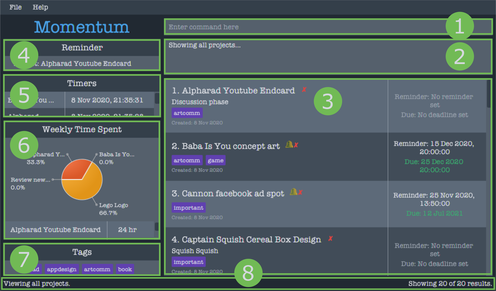

1. **Command Box**: The place where you enter in your commands.
2. **Results Box**: Displays the result of executing the commands that you enter.
3. **Display List**: Displays a list of projects or tasks.
4. **Reminders Panel**: This is where reminders will appear. The panel will only be present when there are reminders that have not yet been dismissed.
5. **Active Timers Panel**: Displays all the timers that are currently running.
(see [Active Timers Panel](#active-timers-panel))
6. **Statistics Panel**: Displays the statistics data calculated by Momentum.
(see [Statistics](#statistics))
7. **Tags Panel**: Displays a collection of all the tags visible in the display list.
8. **Bottom Bar**: Displays contextual information about what you are viewing, such as the specific project that you are viewing, and the number of items in the display list hidden due to finding or sorting commands.

The active timers, statistics, tags and reminders panels can be resized to display more information by clicking and draging their edges.

### User Interface Theme

The GUI Momentum also comes with two themes, light and dark. These themes are shown below:

You can adjust the themes to your preference, by changing it in the application settings. (see [Settings](#settings))

## Command Format

Below is an explanation of the formatting used to show commands:

* Words in `UPPER_CASE` are the parameters to be supplied by the user.
  e.g. in `add n/NAME`, `NAME` is a parameter which can be used as `add n/Blog Design`.
* Items in square brackets are optional.
  e.g `n/NAME [t/TAG]` can be used as `n/Blog Design t/friend` or as `n/Blog Design`.
* Items with `…`​ after them can be used multiple times including zero times.
  e.g. `[t/TAG]…​` can be used as ` ` (i.e. 0 times), `t/friend`, `t/friend t/family` etc.
* Items with `…` inside square brackets `[t/TAG [MORE_TAGS]...]` can take in multiple space separated arguments
  e.g. `[[t/TAG [MORE_TAGS]...]` can represent `t/friend friend family`.
* Parameters can be in any order.
  e.g. If the command specifies `n/NAME dd/2020-11-05`, `dd/2020-11-05 n/NAME` is also acceptable.

## Date and Time Terms

This is a guide to the date and time formats used in Momentum.

### Date Terms

Dates should be entered in the order `YYYY-MM-DD`.

Term  | Meaning | Example
----- |-------- | -------
`YYYY`| Year    | `2020`
`MM`  | Month   | `02`
`DD`  | Day     | `09`

**Valid**: `2020-08-02`

**Invalid**: `2-8-20` Wrong number of digits.

**Invalid**: `02-08-20` Wrong order of year, month and date.

**Invalid**: `2nd August 2020` You cannot use text to enter dates.

### Time Terms

Times should be entered in 24 hour format, in the order `HH:MM:SS`.

Term | Meaning | Example
-----|-------- | -------
HH   | Hour    | `16`
MM   | Minute  | `52`
SS   | Second  | `03`

**Valid**: `15:08:02`

**Invalid**: `15:8:2` Wrong number of digits.

**Invalid**: `8:15:2` Wrong order of hour, minute and second.

**Invalid**: `03:08:02PM` Only 24 hour time is accepted.

### Combining Date and Time

You may also have to enter both dates and times together. When entered together, dates and times should be entered in the order `YYYY-MM-DDTHH:MM:SS`. The letter `T` separates the date and time.

**Valid**: `2020-08-02T15:08:02`

**Invalid**: `15:08:02T2020-08-02` Wrong order of date and time.

## Features

### Projects and Tasks

Done by: Farrell Nah Jun Hao

You can add projects into Momentum to be tracked. Each project has the following information:

* Name
* Description
* Completion Status
* Deadline Date
* Deadline Time
* Reminder
* Tag

Apart from the name, all other information is optional.

Each project can also contain several tasks, each with the same information as a project.

When you first open Momentum, you will see all the projects being tracked in Momentum. You can then view the tasks for each project separately.

**:information_source: Most commands in Momentum will do different things depending on whether you are viewing projects or tasks.** 
Please refer to each command for these differences.

#### View Projects: `home`

Done by: Farrell Nah Jun Hao

View all the projects being tracked by Momentum.
This is the default view when Momentum is first opened.

Format: `home`

#### Viewing a Project's Tasks: `view`

Done by: Farrell Nah Jun Hao

View the tasks for a project.

Format: `view ID`

* The id refers to the id number shown in the displayed project list.
* The id **must be a positive integer** 1, 2, 3, …​

Example: `view 1`

#### Creating a Project/Task: `add`

Done by: Balasubramaniam Praveen

When looking at projects, this command will create a new project. When looking at the tasks in a project, this command will create a new task for the project.

Format: `add n/NAME [d/DESCRIPTION] [c/] [dd/DEADLINE_DATE [dt/DEADLINE_TIME]] [r/REMINDER_DATE_TIME] [t/TAG]`

* `n/NAME`
  * Name can contain alphanumeric characters (a-Z, 0-9) and spaces.
* `[d/DESCRIPTION]`
  * There is no restriction imposed on descriptions.
* `[c/]`
  * The project is incomplete by default, adding `c/` will set the completion status to complete.
* `[dd/DEADLINE_DATE [dt/DEADLINE_TIME]]`
  * The `dt\DEADLINE_TIME` is part of the the prefix `dd/`, and is optional.
  * A deadline cannot contain only the time field, but a deadline can contain only the date field.
  * The format for date of the deadline is YYYY-MM-DD, refer to [Date Terms](#Date-Terms) for more information on YYYY, MM and DD.
  * The format for time of the deadline is HH:MM:SS in 24 hour format, refer to [Time Terms](#Time-Terms) for more information on HH, MM and SS.
  * The date of the deadline cannot be earlier than the creation date of the project.
* `[r/REMINDER_DATE_TIME]`
  * Both date and time is compulsory for a reminder.
  * The format for date and time of the reminder is YYYY-MM-DDTHH:MM:SS, refer to [Date and Time Terms](#Date-and-Time-Terms) for more information on YYYY, MM, DD, HH, MM, and SS.
  * The date and time of the reminder needs to be later than the current time, refer to [Reminders](#reminders) section for more details on reminders.
* `[t/TAG]`
  * Similar to names, tags can contain alphanumeric characters (a-Z, 0-9) and spaces.

:bulb: **Tip:**

* Projects and tasks can have any number of tags (including 0).
* A project can have an empty description.
* `T` separates the date and time in a reminder.

Example: `add n/Momentum d/CS2103T Team Project dd/2021-12-07 dt/11:01:12 r/2021-12-07T11:01:12 t/impt`

Result: Creates a project named "Momentum" with a description "CS2103T Team Project", a tag "impt", deadline date "2020-10-07" with deadline time "11:01:12" and reminder "2020-10-07T11:01:12".

##### Walkthrough of Creating a Project

1. Type `add n/Momentum d/CS2103T Team Project c/ dd/2021-12-07 dt/11:01:12 r/2021-12-07T11:01:12 t/impt` in the command box, and press the `Enter` key to execute it.

2. The result box will display a message to indicate that the command has been executed successfully.
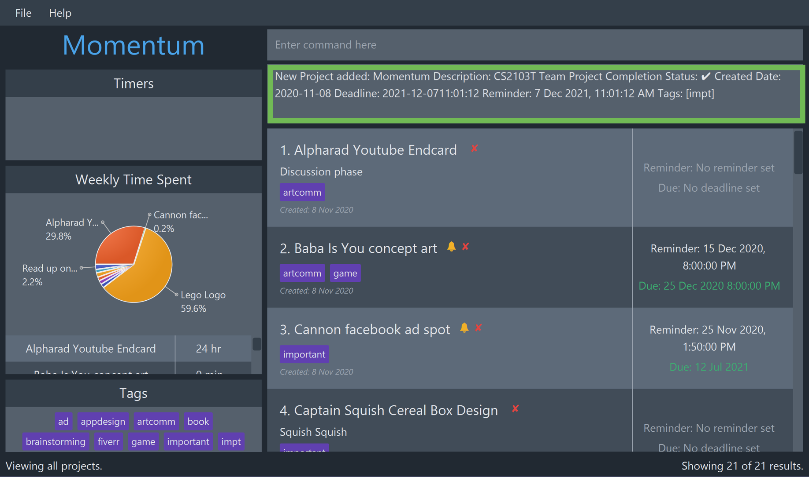
3. A project will be added to the project list as shown below.
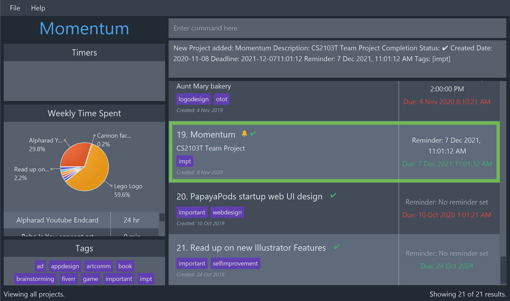
4. On 7 December 2021, at 11:01:12, the reminder panel will be shown and the reminder of the project will be removed.
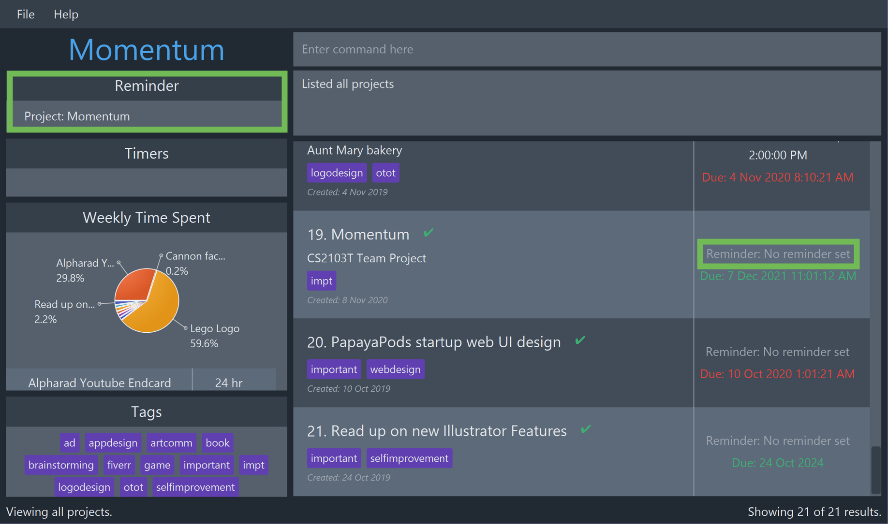

#### Editing a Project/Task: `edit`

Done by Balasubramaniam Praveen

Edits a project or task that was been previously created.

Format: `edit ID [n/NAME] [d/DESCRIPTION] [c/] [dd/DEADLINE_DATE [dt/DEADLINE_TIME]] [r/REMINDER_DATE_TIME] [t/TAG]`

* At least one of the optional fields must be provided.
* Existing values will be updated to the input values.
* You can remove a description, deadline or reminder by typing `d/` or `dd/` or `r/` without specifying anything after it.

* ID
  * The id refers to the id number shown in the displayed list.
  * The id **must be a positive integer** 1, 2, 3, …​
* `n/NAME`
  * Name can contain alphanumeric characters (a-Z, 0-9) and spaces.
* `[d/DESCRIPTION]`
  * There is no restriction imposed on descriptions.
* `[c/]`
  * Adding `c/` will reverse the completion status, if the project was incomplete the completion status will change to complete.
* `[dd/DEADLINE_DATE [dt/DEADLINE_TIME]]`
  * The `dt\DEADLINE_TIME` is part of the the prefix `dd/`, and is optional.
  * A deadline cannot be edited with only the time field, but a deadline can be edited with only the date field.
  * The deadline will be replaced with an edit.
  * The format for date of the deadline is YYYY-MM-DD, refer to [Date Terms](#Date-Terms) for more information on YYYY, MM and DD.
  * The format for time of the deadline is HH:MM:SS in 24 hour format, refer to [Time Terms](#Time-Terms) for more information on HH, MM and SS.
  * The date of the deadline cannot be earlier than the creation date of the project.
* `[r/REMINDER_DATE_TIME]`
  * Both date and time is compulsory for a reminder.
  * The format for date and time of the reminder is YYYY-MM-DDTHH:MM:SS, refer to [Date and Time Terms](#Date-and-Time-Terms) for more information on YYYY, MM, DD, HH, MM, and SS.
  * The date and time of the reminder needs to be later than the current time, refer to [Reminders](#reminders) section for more details on reminders.
* `[t/TAG]`
  * Similar to names, tags can contain alphanumeric characters (a-Z, 0-9) and spaces.
  * When editing tags, the existing tags of the project will be removed i.e adding of tags is not cumulative.
  * You can remove all the project’s tags by typing `t/` without specifying any tags after it.

Example: `edit 3 n/NewMomentum d/NewDescription dd/2021-12-07 t/normal`

Result: Updates the project with id 3. The name will be changed to "NewMomentum", the description will be changed to "NewDescription", all the tags will be removed and a tag named normal is added, and the deadline will be changed to "2021-12-07".

##### Walkthrough of Editing a Task

1. In task view, type `edit 3 n/NewMomentum d/NewDescription dd/2021-12-07 r/ t/normal` in the command box, and press the `Enter` key to execute it.
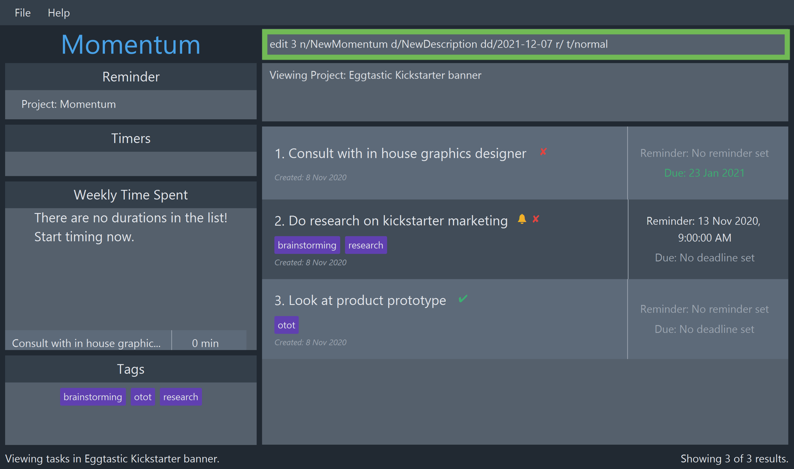
2. The result box will display a message to indicate that the command has been executed successfully.
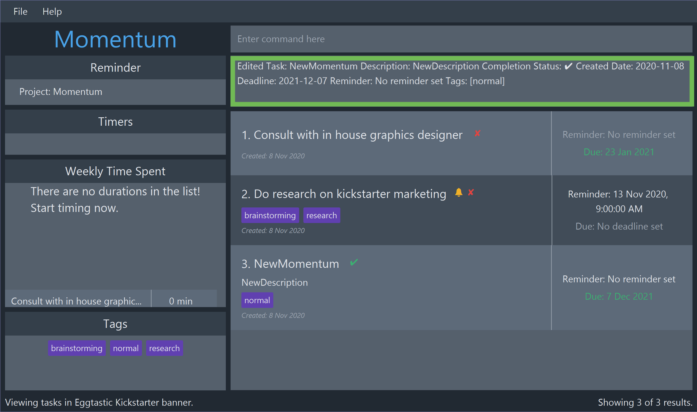
3. A task will be updated as shown below.
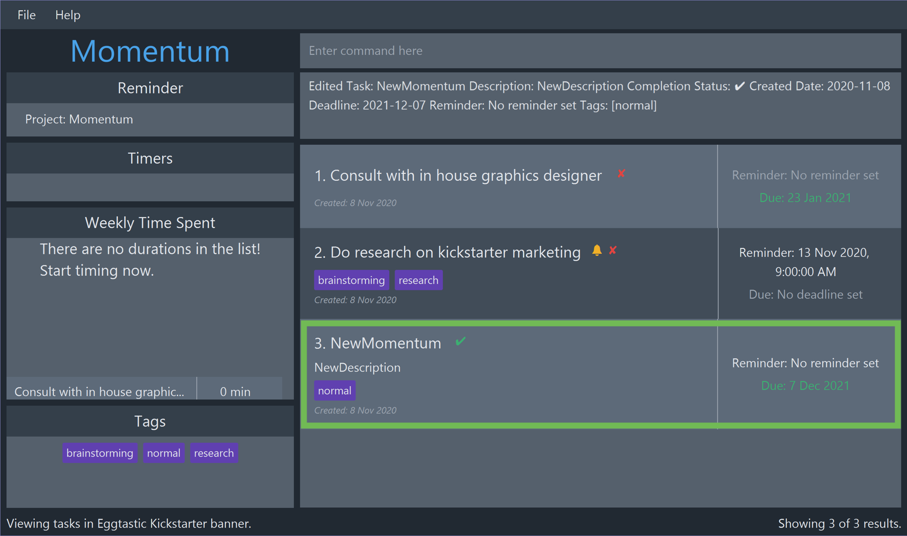

#### Deleting a Project/Task: `delete`

Done by Farrell Nah Jun Hao

Deletes a project or task in the list.

Format: `delete ID`

* Deletes the project at the specified `ID`.
* The id refers to the id number shown in the displayed project list.
* The id **must be a positive integer** 1, 2, 3, …​

Example: `delete 2`

Result: Deletes the second project in the list.

#### Project/Task Organisation

##### View All Projects : `list`

Done by Farrell Nah Jun Hao

When viewing projects, this command shows a list of all projects in Momentum.

When viewing a project's tasks, this command shows a list of all the tasks for the project.

Note that this command is different from the `home` command. When viewing a project's tasks, the `home` command will change the view to show all the projects being tracked by Momentum. However, the `list` will only show all the tasks for the project.

Format: `list`

##### Sort Projects : `sort`

Done by Kang Su Min

Sorts the list of displayed projects or tasks in the application.

Format: `sort [type/SORT_TYPE] [order/SORT_ORDER] [c/]`

* There are 3 types of sort.
  * `type/alpha` will sort the list of projects in alphabetical order.
  * `type/deadline` will sort the list of projects according to their deadlines.
  * `type/created` will sort the list of projects according to their date of creation.

* There are 2 sort orders.
  * `order/asc` will sort the list of projects in ascending order.
  * `order/dsc` will sort the list of projects in descending order.

* The projects can be sorted by incomplete then completed.
    * This is the default sort, and is also the "dominant sort" that will ensure that all incomplete projects/tasks will be ordered before complete projects/tasks when completion status order is on.
    Within incomplete and complete projects/tasks, they will be ordered by specified order (alphabetical/deadline/created date, ascending/descending).
    * Run `sort c/` to toggle the default completion status sort.

:bulb: **Tip:**

* `type/alpha` and `order/asc` will be used as default if both sort type and order are not specified (i.e. command is `sort`)
* Current sort type will be used if the `type` is not specified but `order` is specified.
* `order/asc` will be used as default if the `order` is not specified but `type` is specified.
* For `sort type/deadline`, projects without deadlines will be ordered alphabetically after the ordered list of projects with deadlines.
* For both `sort type/deadline` and `sort type/created`, projects with same deadline or same created date will be sorted alphabetically.

Example:

The following are 3 projects in the project book.

Project 1. Name: `Ant Hole`, Deadline: `2020-02-02`, Created Date: `2000-02-02`
Project 2. Name: `Brunch`, Deadline: `2010-01-01`, Created Date: `2002-09-09`
Project 3. Name: `Create Logo` , Deadline: `2040-04-04`, Created Date: `2001-01-01`

**Sorting by Default order**

Format: `sort`

* Sorts projects in alphabetical, ascending order

The following walkthrough shows how a user can sort projects in Momentum by specifying only the sort order.

1. Key in command `sort` in the command window.

2. The result box will display a message to indicate that the command has been executed successfully:

3. All projects are ordered in default ascending alphabetical order with incomplete tasks showing up at the top of the list.
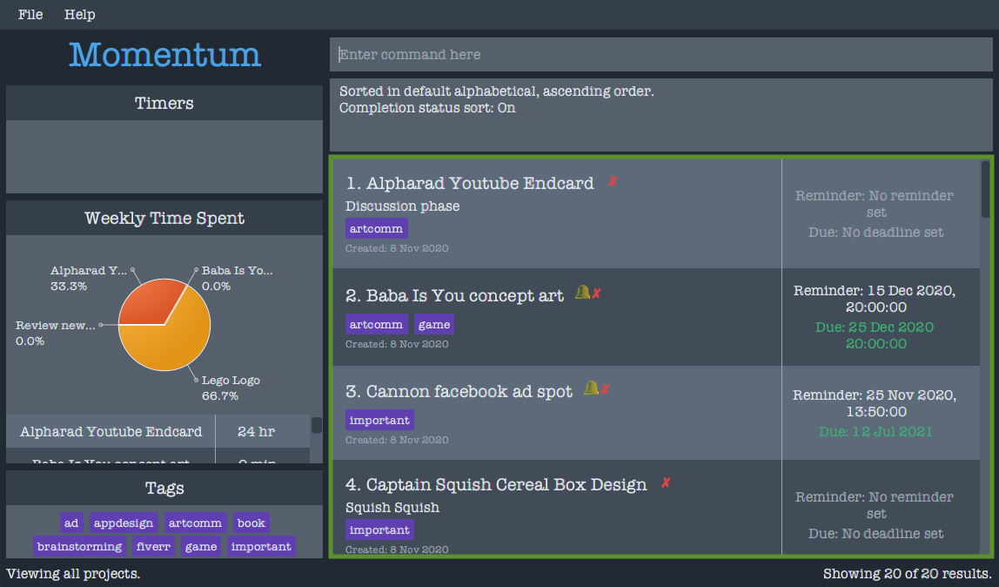

##### Sorting With Completion Status Toggle

* Toggles the completion status order i.e. if the completion status order is "on" with incomplete projects/tasks showing up at the top of the list, the completion status order is turned "off", which sorts the projects/tasks in the specified order without regard for its completion status.

Format: `sort c/`

This toggles the completion status order and then sorts projects in default alphabetical, ascending order.

The following walkthrough shows how a user can sort projects in Momentum by toggling the completion status order.

1. Key in command `sort c/` in the command window.
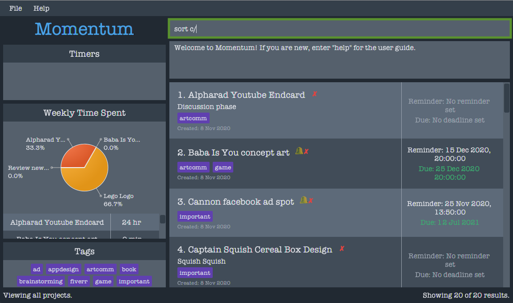
2. The result box will display a message to indicate that the command has been executed successfully:
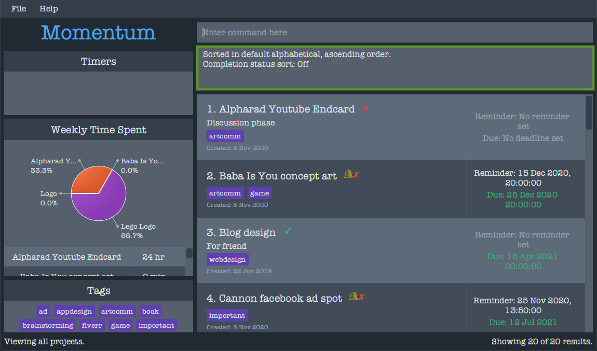
3. All projects are ordered in default ascending alphabetical order without regard for completion status.
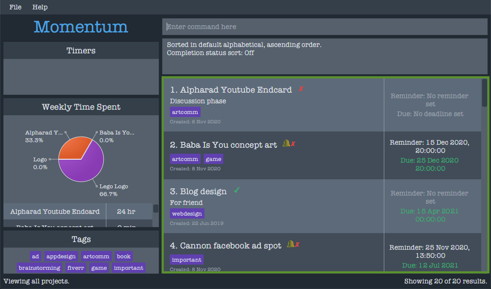

###### Sorting With Only Type Specified

Format: `sort type/SORT_TYPE`

* Sorts projects in a specified order
* Since order is not specified, default order is ascending

Example: `sort type/deadline`

The following walkthrough shows how a user can sort projects in Momentum by specifying only the sort type.

1. Key in command `sort type/deadline` in the command window.
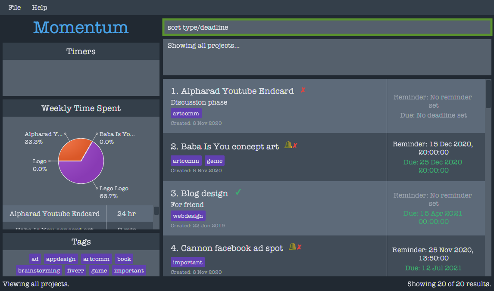
2. The result box will display a message to indicate that the command has been executed successfully:
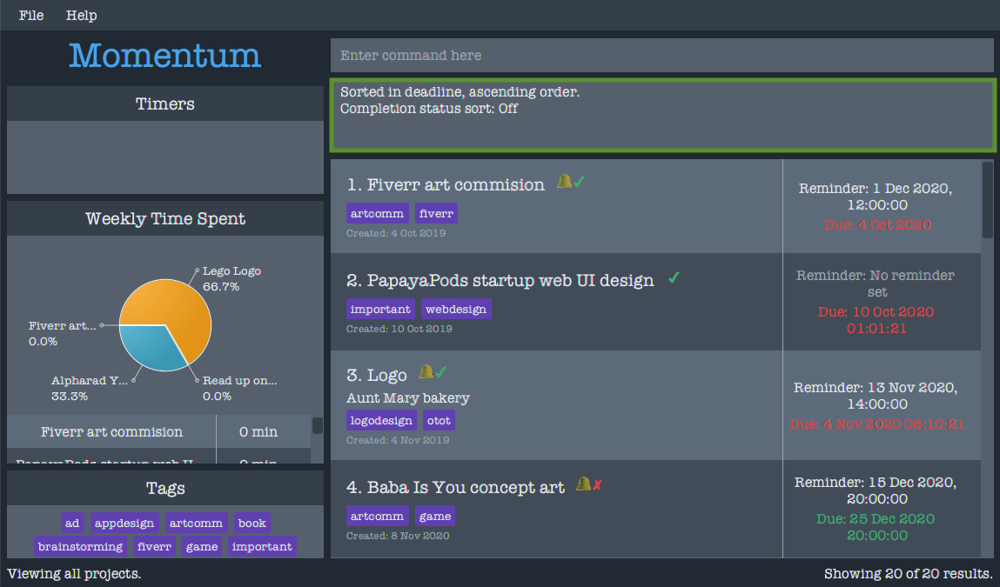
3. All projects are ordered in ascending deadline order.
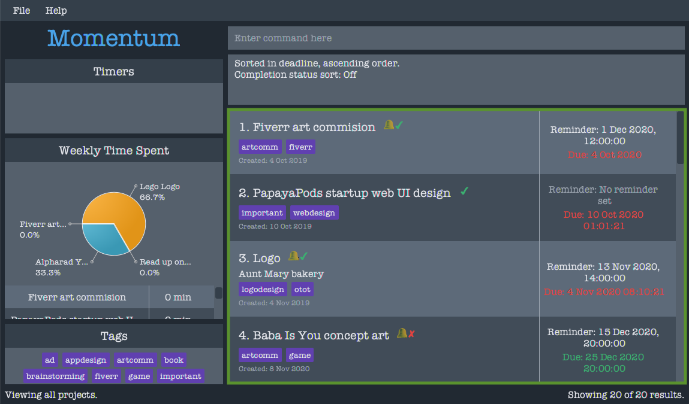

##### Sorting With Only Order Specified

Format: `sort order/SORT_ORDER`

* Sorts projects in specified sort order, according to current sort type.
* If there is no existing project order (when the application restarts), order will be alphabetical by default.

Example: `sort order/dsc`

The following walkthrough shows how a user can sort projects in Momentum by specifying only the sort order.

1. Key in command `sort order/dsc` in the command window.
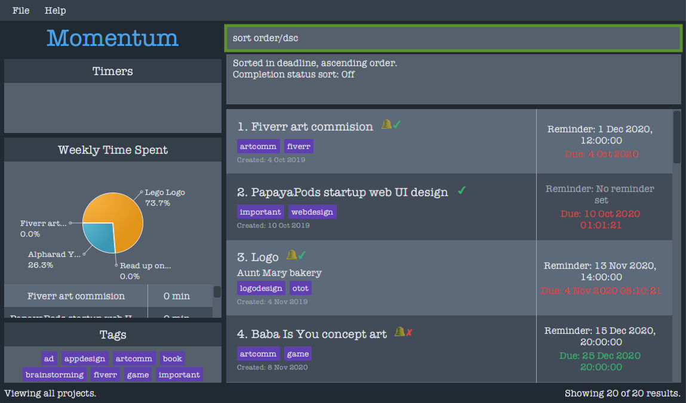
2. The result box will display a message to indicate that the command has been executed successfully:
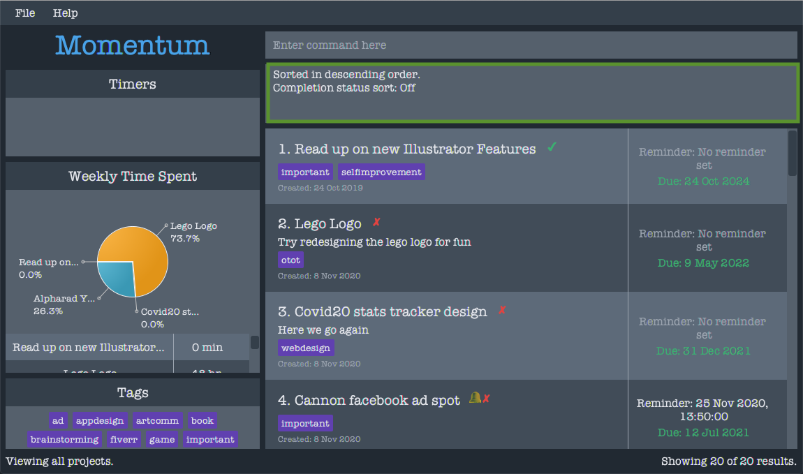
3. All projects are ordered in descending deadline order (Projects were ordered by deadline previously).
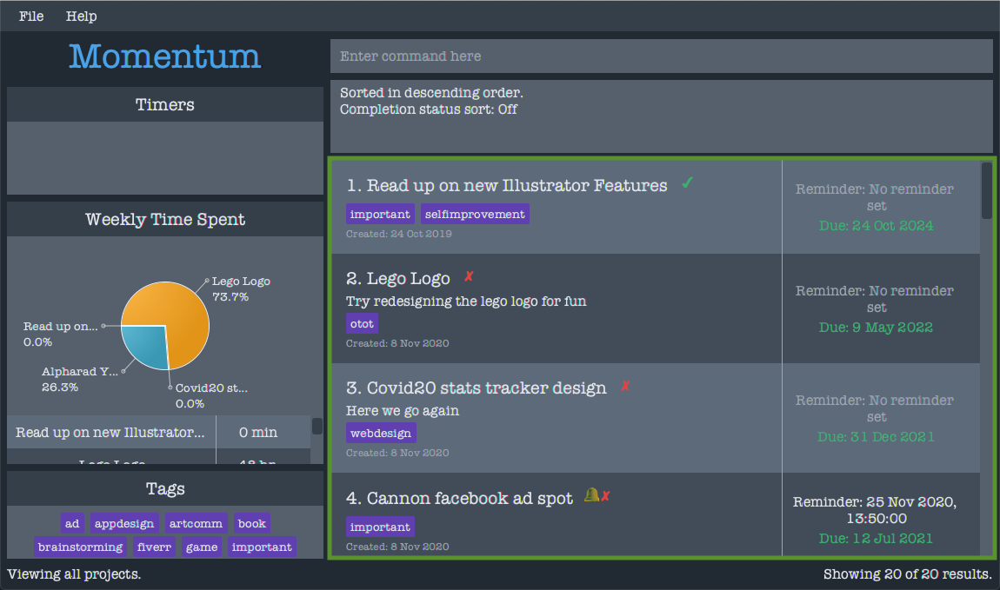

##### Sorting With Both Type and Order Specified

* Sorts projects in specified type and order.

Example: `sort type/created order/dsc`

The following walkthrough shows how a user can sort projects in Momentum by specifying both sort type and order.

1. Key in command `sort type/created order/dsc` in the command window.
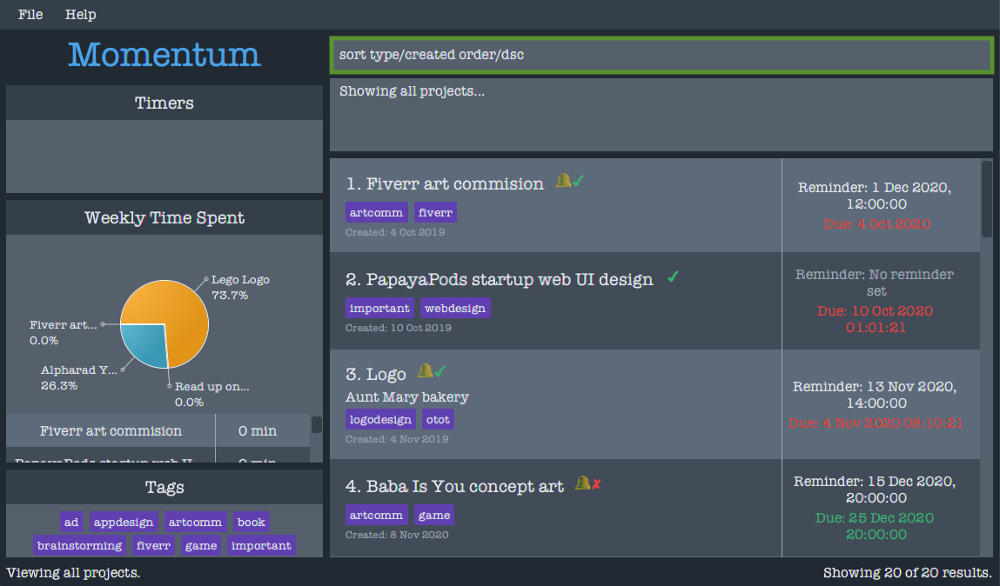
2. The result box will display a message to indicate that the command has been executed successfully:
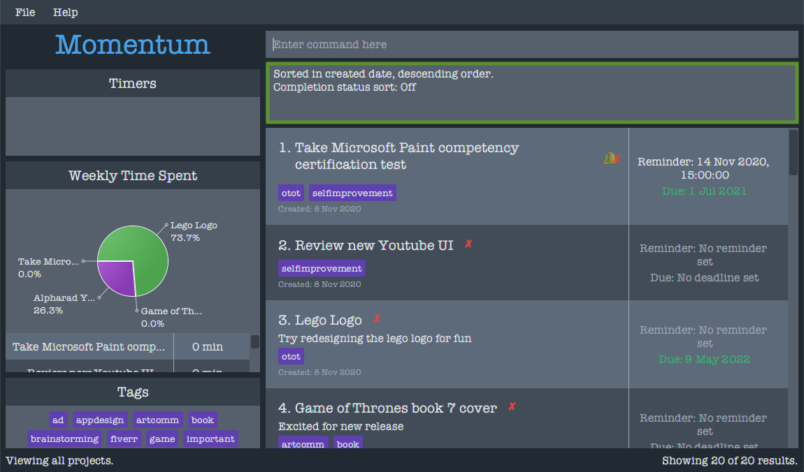
3. All projects are ordered in descending created date order.
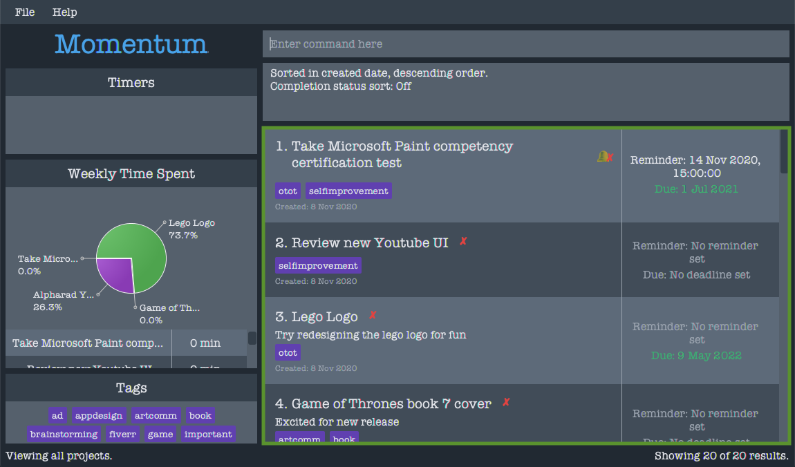

##### Filtering Projects: `find`

Done by Balasubramaniam Praveen

Searches for projects or tasks in the project book based on certain parameters.

Format: `find [match/FILTER_TYPE] [n/NAME [MORE_NAMES]...] [d/DESCRIPTION [MORE_DESCRIPTIONS]...] [t/TAG [MORE_TAGS]...] [c/COMPLETION_STATUS]`

* There are three values for the `match` parameter.
    * `match/all` shows an entry only if **all** of the parameters provided in the user's input matches the user's input.
    * `match/any` shows an entry as long as **any** of the parameters provided in the user's input matches the user's input.
    * `match/none` shows an entry only if **none** of the parameters provided in the user's input matches the user's input.

:bulb: **Tip:**
You can only search for projects in the project view and tasks in the tasks view

:bulb: **Tip:**
`match/any` will be used if the `match` type is not specified.

:bulb: **Tip:**
Search parameters are not case sensitive.

###### Searching by Name

* The `n/` command checks whether a project has a certain name. There can be multiple names added to this command. For example, `n/car window` will check for the projects that contain `car` or `window` in their names.
* Searching by name only requires a partial match. This means that a project with the name `carpet` and `car` can potentially be the result of searching for the term `car`.

The following walkthrough shows how a user can use the find command to search for projects with the `ad` in their names.

1. Key in the command `find n/ad` in the command window.
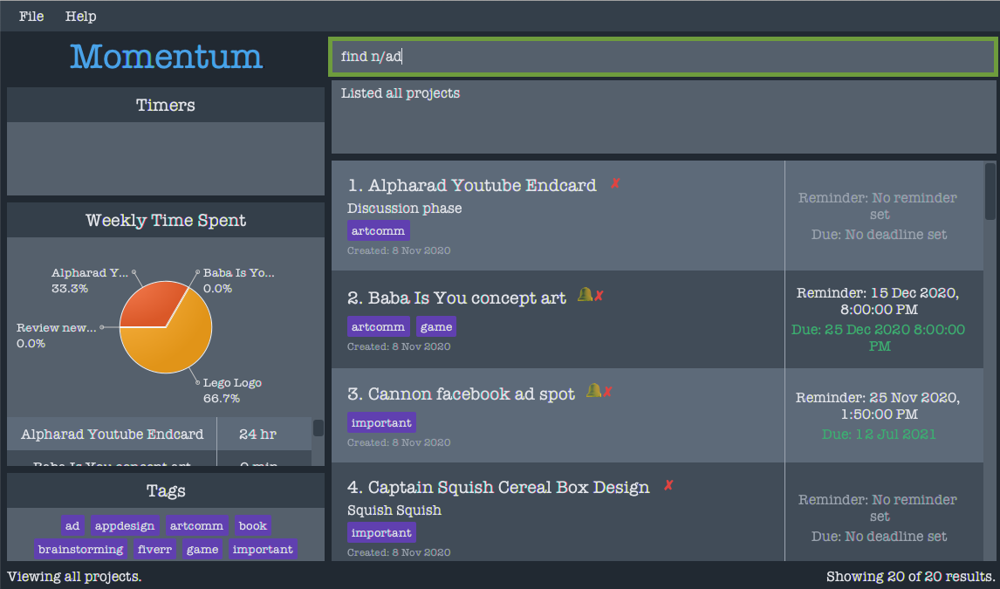
2. The result box will display a message to indicate that the command has been executed successfully:
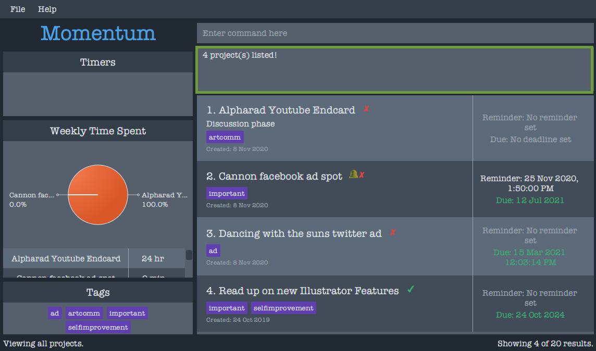
3. All projects that contain `ad` in their name will be shown.
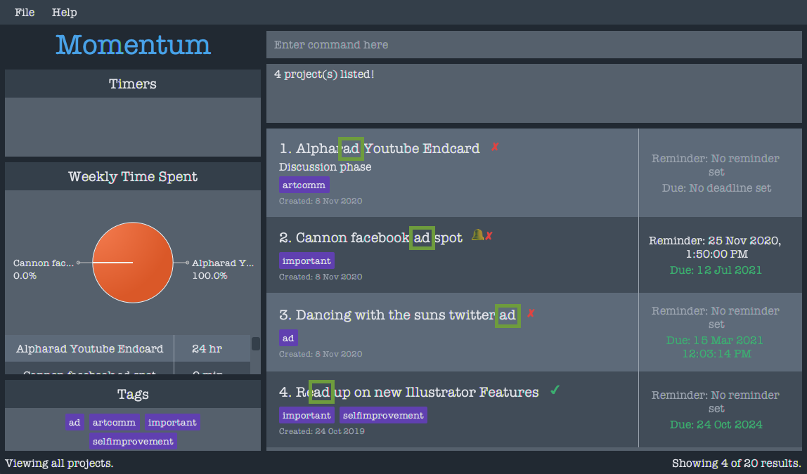

###### Searching by Description

* The `d/` command checks whether a project has a certain description. There can be multiple descriptions added to this command. For example, `d/sunday october` will check for the projects that contain `sunday` or `october` in their description.
* Searching by description only requires a partial match, similar to searching by name.

The following walkthrough shows how a user can use the find command to search for projects with the `discussion` in their description.

1. Key in the command `find d/discussion` in the command window.

2. The result box will display a message to indicate that the command has been executed successfully:
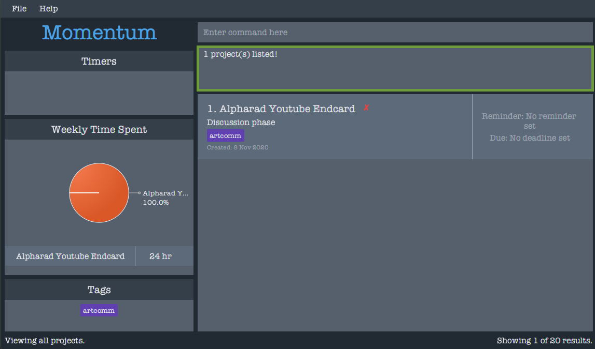
3. All projects that contain `discussion` in their description will be shown.
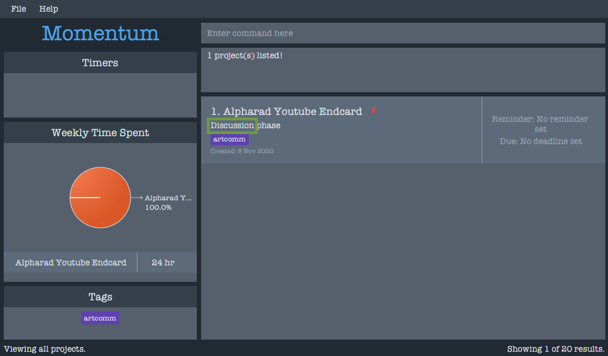

###### Searching by Tag

* The `t/` command checks whether a project has a certain tag. There can be multiple tags added to this command. For example, `t/freelance errands` will check for the projects that contain the tags `freelance` or `errands`.
* Searching by tags will require a full word match unlike searching by name or description. This means that searching for the tag `free` will not find a project with the tag `freelance`.

:bulb: **Tip:**
Searches for tags require a full match whilst searches partial matches are sufficient for searches by name and description.

The following walkthrough shows how a user can use the find command to search for projects with the tag `webdesign`.

1. Key in the command `find t/webdesign` in the command window.

2. The result box will display a message to indicate that the command has been executed successfully:
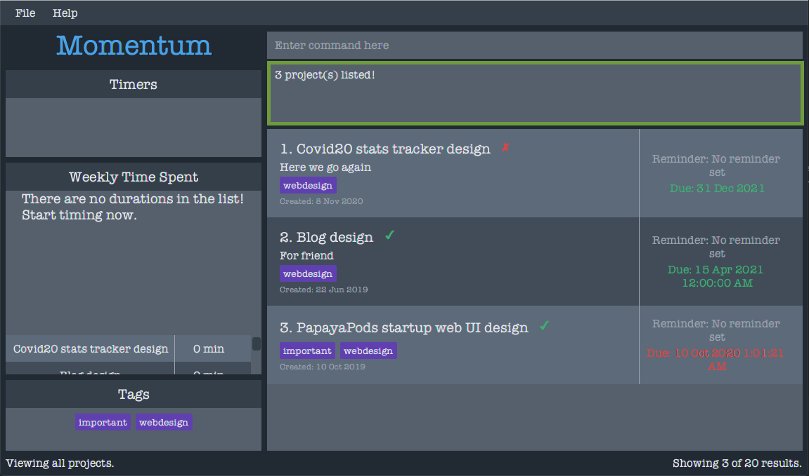
3. All projects that contain the tag `webdesign` will be shown.
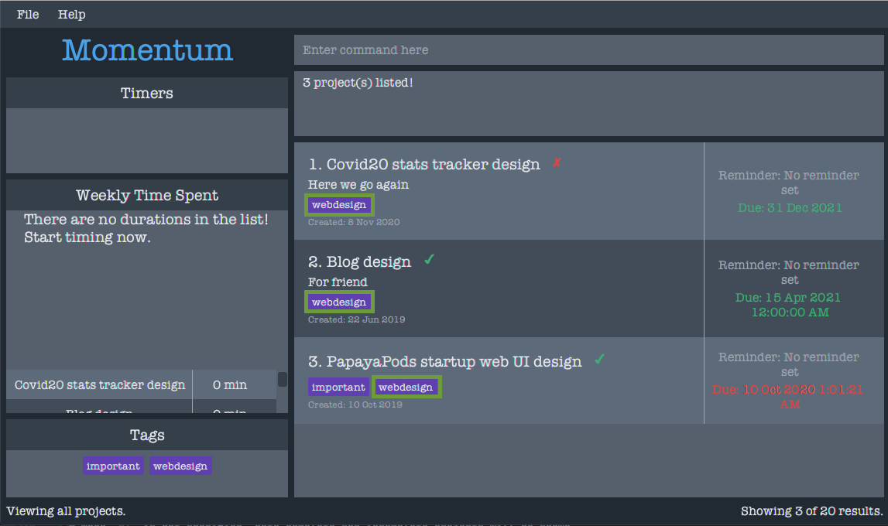

###### Searching by Completion Status

* There are keywords, completed and incomplete for`c/KEYWORD`. Other keywords are not accepted.
* The `c/` command checks whether a project is completed. For example, `c/completed` will check for the projects that are completed.
* When `c/` is not specified, both complete and incomplete projects will be shown.

The following walkthrough shows how a user can use the find command to search for projects that have been completed.

1. Key in the command `find c/completed` in the command window.
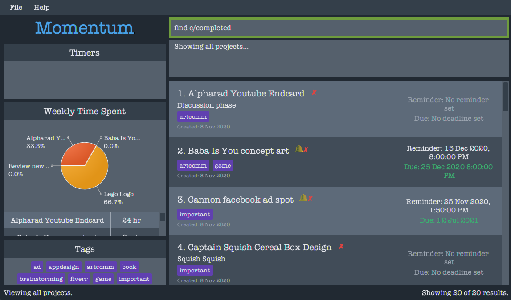
2. The result box will display a message to indicate that the command has been executed successfully:
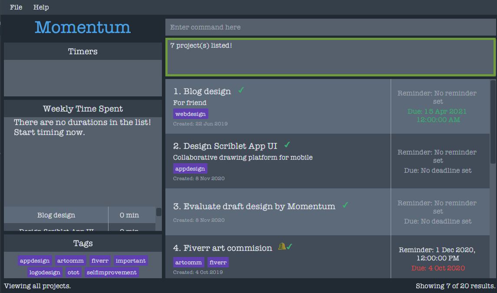
3. All projects that are completed will be shown.
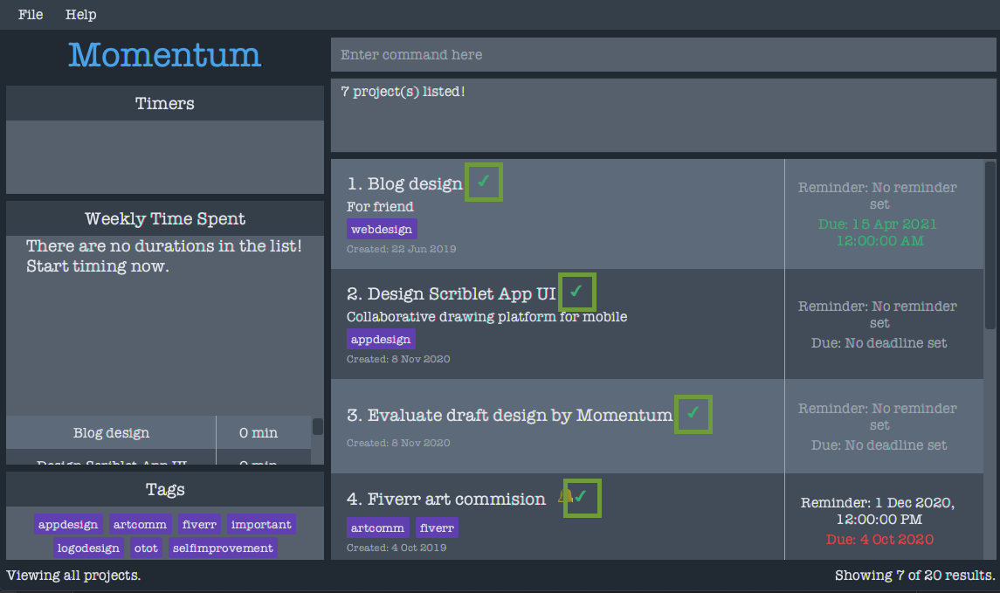

###### Searching with Multiple Parameters

You can search for projects/tasks with multiple keywords for names, descriptions and tags in a single search.

A match type can also be specified as mentioned at the [start of this section](#filtering-projects).

Please look at the examples below to get a better understanding of how you can make searches with multiple commands.

Examples:

Let's say that you have the following projects in Momentum:

1. Name: `Create Logo` , Description: `Make logo for startup XYZ`, Tags: `Design`
2. Name: `Write Song`, Description: `80s rock music, three minutes`, Tags: `Music`
3. Name: `Write Article`, Description: `Write an article about why Momentum is the best app out there`, Tags: `Press` and `Writing`

* `find match/any n/song article d/startup t/design` will return all three projects. This is because project 1 contains the keyword `startup` in its description and the tag `design`, project 2 contains the keyword `song` in its name and project 3 contains the keyword `article` in its name.
* `find match/all n/song article d/startup t/design` will not return any project as there is no project with `song` **and** `article` in its name **and** the `startup` in its description and the tag `design`.
* `find match/none n/song article d/startup t/design` will not return any project as there is no project that **does not** contain `song` and `article` in its name, `startup` in its description and the tag `design`.
* `find match/any n/write d/rock` will return projects 2 and 3. This is because project 2 contains `write` in its name and `rock` in its description. Project 3 also contains the word `write` in its name.
* `find match/all n/write d/rock` will only return project 2. This is because project 2 is the only project that contains both `write` in its name **and** `rock` in its description.
* `find match/none n/write d/rock` will return projects 1. This is because only project 1 **does not** contain `write` in its name and `rock` in its descriptions.

:bulb: **Tip:**
If a certain search type is used more than once, the latest entry will be used.
`find n/a n/b n/c` will only search for projects/task that contain`c` in their name.

:bulb: **Tip:**
The projects/tasks in Momentum will no longer be filtered after the `Add`, `View` or `Home` Commands are used.
They will continue to be filtered after the `Edit` and `Delete` Commands are used.

### Time Tracking

Done by Farrell Nah Jun Hao

You can track the time you spend working on a project or task by starting a timer when you start working, and then
 stopping the timer once you finish.

Momentum remembers each timer that you start/stop and uses this information to calculate statistics.

#### Starting a Timer for a Project: `start`

Format: `/start ID`

* Starts a timer for the project or task at the specified `ID`.
* Only 1 timer can be running for each project or task at any time.
* The id refers to the id number shown in the displayed list.
* The id **must be a positive integer** 1, 2, 3, …​

:bulb: **Tip:**
You can run timers for more than one project or task concurrently, if you are multi-tasking.

:bulb: **Tip:**
You can run timers for a project separately from its tasks. This allows you to track the time you spent on the
 project as a whole, as well as the time spent on each individual task.

Example: `/start 2`

Result: Starts a timer for the second project or task in the display list.

#### Stopping a Timer for a Project: `stop`

Format: `/stop ID`

* Stops a running timer for the project or task at the specified `ID`.
* A timer can only be stopped if there is one already running.
* The id refers to the id number shown in the displayed list.
* The id **must be a positive integer** 1, 2, 3, …​

Example: `/stop 2`

Result: Stops the timer for the second project or task in the display list.

#### Active Timers Panel

On the left side of the window is the Active Timers Panel. This is where Momentum shows you all the timers that are
 currently running.

This panel will show you the name of the project/task, as well as when the timer was started.

#### Time Tracking Example

Here is an example of how you can use the `start` and `stop` commands to track the time that you spend on a project.
Suppose that you are going to start working on the project "Alpharad Youtube Endcard", which is the first item shown
 below:

You can perform time tracking with the following steps:

1. To start the timer, type `start 1` into the command box and press `enter`.

1. You should see the following message in the result box, indicating that the timer has been successfully started.

1. You should also see the project's name and start time in the active timers panel:

1. Now that the timer has been successfully started, you can proceed to do your work. You can also choose to close
 Momentum. The timer will continue to run even when Momentum is closed. Proceed to the next step when you are done
  with your work.

1. To stop the timer, type `stop 1` into the command box and press `enter`.

1. You should see the following message in the result box, indicating that the timer has been successfully stopped.

1. You should also see that the project has been removed from the active timers panel:

1. The statistics panel (see [statistics](#statistics)) will also be updated to reflect the time that you have spent
 working on the
 project:

## Reminders

Done by Cheong Ying Yi Clara

* A reminder will be shown in the reminder panel of the sidebar at the date and time specified.
* The reminder will be removed after it is shown in the sidebar.
* If a reminder was missed, it will be greyed out.
* Refer to [Walkthrough of Creating a Project](#walkthrough-of-creating-a-project) for more details on how a reminder will be shown.
* Refer to [Walkthrough of Dismissing a Reminder](#walkthrough-of-dismissing-a-reminder) for more details on hoe to dismiss a reminder.

:warning: **Warning**
If there are multiple reminders set at the same date and time, only one of the reminders will appear in the reminder panel. Other reminders will be missed.

## Undo/Redo

Done By Kang Su Min

Undo command undoes previous commmand and redo command redoes previously undone command.

### Undoing the Previous Command: `undo`

The undo command resets the application to the state before previous command was executed.

Format: `/undo`

Example: `start 1`, `undo`

Result: Timer for project/task at index 1 is started, then stopped and removed after undo is executed.

The following walkthrough shows how a user can start a timer for a project, then undo the command.

1. Key in command `start 1` in the command window.

2. The result box will display a message to indicate that the command has been executed successfully, and the timer for that project will appear at the side panel.

3. Key in command `undo` in the command window.

4. The result box will display a message to indicate that the command has been undone successfully.
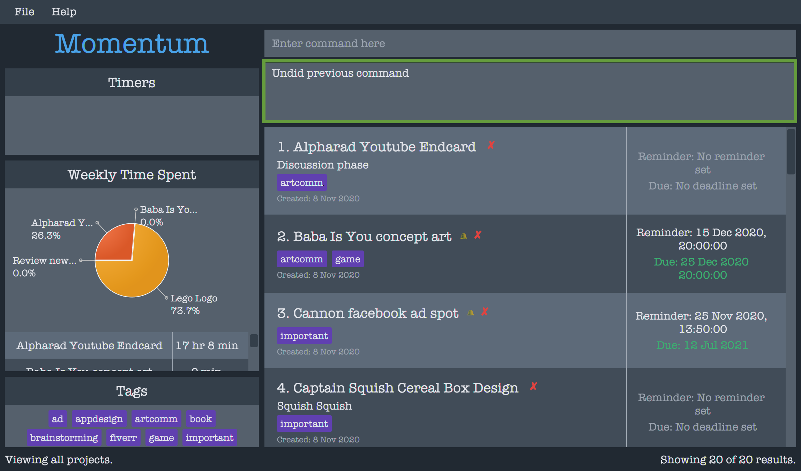
5. The timer has been removed from the project. Timer is no longer running.
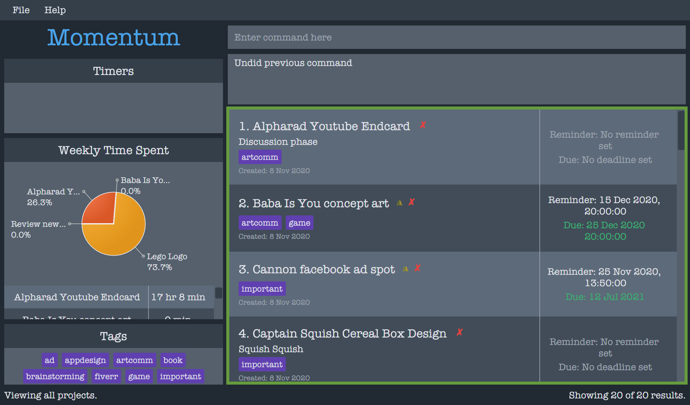

### Redoing the Previous Command: `redo`

The redo command redoes previously undone command and resets the application to the state before the previous undo command.

Format: `/redo`

Example: `sort type/deadline`, `undo`, `redo`

Result: Projects are sorted by deadline, then the application is reset to the sorting order before sort command was executed, then reset back to sort by deadline after redo command.

The following walkthrough shows how a user can start a timer for a project, then undo the command.

1. Key in command `sort type/deadline` in the command window.
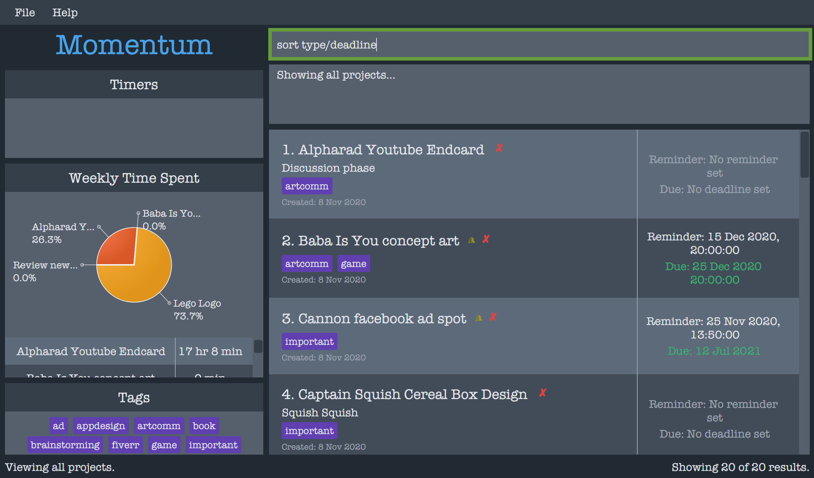
2. The result box will display a message to indicate that the command has been executed successfully. Projects have been sorted in ascending deadline order (Completion Status: On).
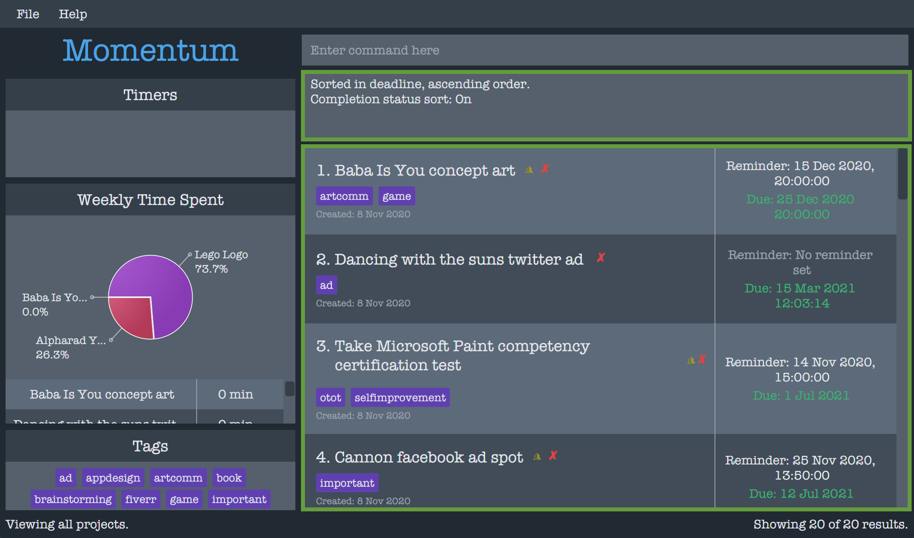
3. Key in command `undo` in the command window.

4. The result box will display a message to indicate that the command has been undone successfully. Projects have been reverted to their original order before the last sort command was executed.
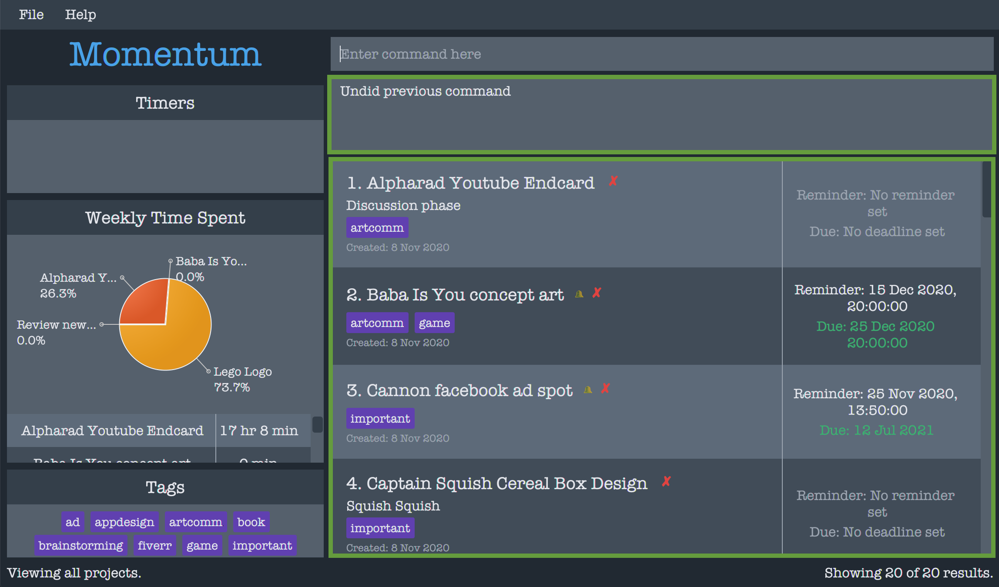
5. Key in command `redo` in the command window.

6. The result box will display a message to indicate that the command has been redone successfully.
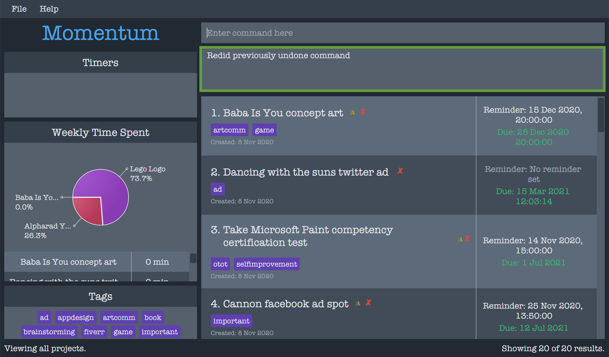
7. Projects are again sorted in ascending deadline order (Completion Status: On).
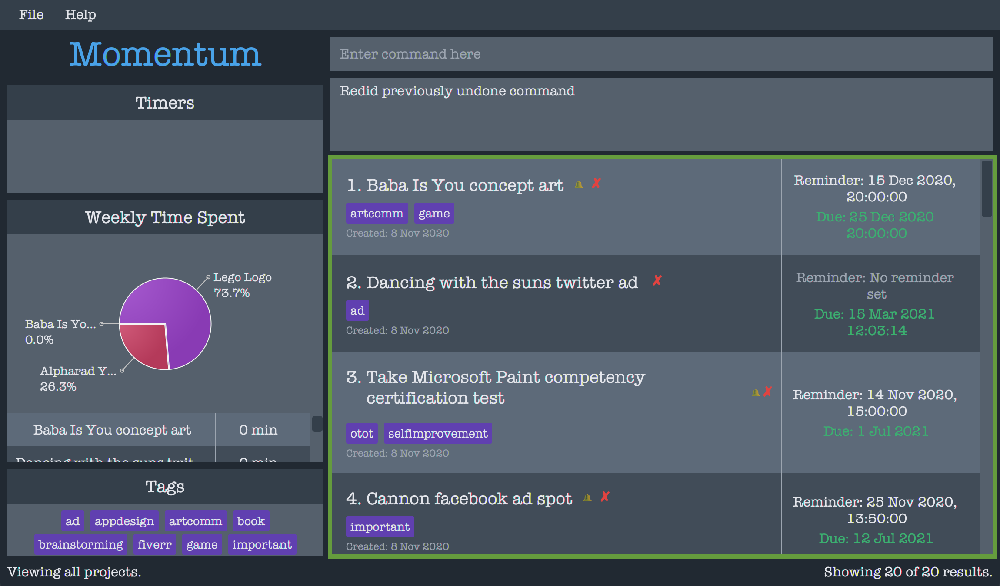

:bulb: **Tip:**

* Undo/redo feature keeps track of changes in state, and hence will not work on `help` command which does not change the state of the application.
* Redo command only works if there the previous command is `undo`.

## Statistics

Done by Farrell Nah Jun Hao

Momentum uses the data collected from your timers (see [time tracking](#time-tracking)) to calculate statistics. These
 statistics are automatically generated and updated whenever you make any changes to your projects and tasks, such as
  when timers for a project/task are started or stopped.
 These statistics can be seen in a panel on the left side of the window, as shown here:

The statistics displayed correspond to the projects or tasks currently shown in the list, and will automatically
 change when the items in the list changes (such as when you find specific projects or sort the list of projects).

You do not need to use any additional commands to update or view the statistics.

### Timeframes

Momentum only tracks your statistics within a particular timeframe. By default, the timeframe will be set to weekly.
You can change the timeframe through the [settings](#settings).

Momentum allows you to track the time spent within these timeframes:

* Daily
* Weekly
* Monthly

Here are the statistics being tracked by Momentum:

### Time Spent Per Project

This statistic tells you the total amount of time you have spent within the timeframe. For projects, this includes
 all the time you have spent on each individual task, as well as on the project as a whole.

The statistics are displayed in 2 different formats:

1. **Pie Chart**: Shows the relative time spent on each project. Useful for comparing different projects and tasks. Projects
 and tasks with less time spent on them may not be shown.
2. **Table**: Shows the exact (in minutes) amount of time spent on each project. Useful for calculations.

## Settings

Done by Khoo De Hui
You can adjust various settings in Momentum, which includes:
* GUI Theme
* Statistics Timeframe

Format: `set [th/THEME] [st/TIMEFRAME]`
* At least one of the optional fields must be provided.
* There are two GUI themes available, light and dark. The commands to apply them are:
  * `th/light`
  * `th/dark`
* There are three available timeframes for statistics, daily, weekly and monthly. The commands to apply them are:

  * `st/daily`
  * `st/weekly`
  * `st/monthly`

Example: `set th/light st/monthly`
Result: Sets a dark theme to the GUI and changes the statistics pane to show the time spent on projects within the day.

### Walkthrough of Changing Application Settings
1. In order to set the GUI theme to light and the statistic timeframe to daily, enter `set th/light th/monthly` in the command box and press the `Enter` key to execute it.
 
2. The result box will display a message to indicate that the command has been executed successfully.
 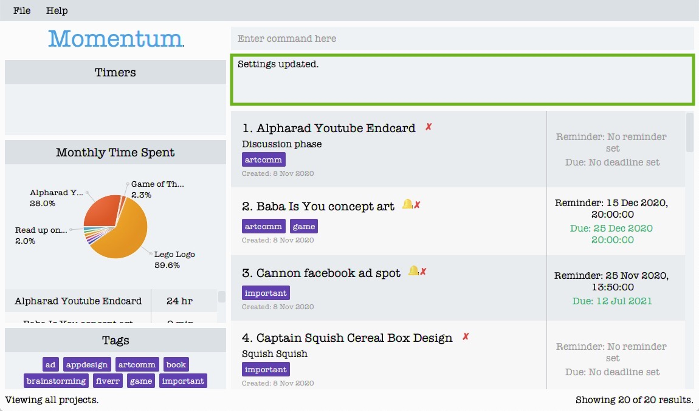
3. The GUI theme has now been set to the light theme, and information in the statistics panel has been updated.
 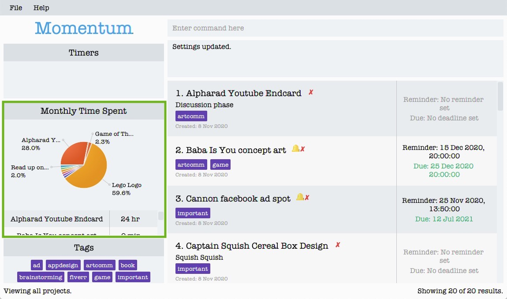

## Clear All Projects/Tasks : `clear`

Done by Farrell Nah Jun Hao

When viewing all projects, this command deletes all the projects in Momentum, including their tasks.

When viewing a specific project's tasks, this command will delete all the tasks in the project. The project will itself will not be deleted.
Removes all projects and tasks in Momentum.

:warning: **Warning**
This command will also delete the saved data for the projects or tasks. You can undo this operation while Momentum remains open. However, you will not be able to undo this if once you close Momentum.

Format: `clear`

## Dismissing a Reminder : `dismiss`

Done by Cheong Ying Yi Clara

Format: `dismiss`

* If the reminder panel of the sidebar is not visible, it cannot be dismissed.

Result: Hides the reminder panel of the sidebar.

:warning: **Warning**
A reminder that has been dismissed cannot be shown again in the reminder panel.
Undo a dismissal to show an expired reminder in the project.

### Walkthrough of Dismissing a Reminder

This walkthrough is a followup of [Walkthrough of Creating a Project](#walkthrough-of-creating-a-project).

1. After the reminder panel is shown, type `dismiss` in the command box, and press the `Enter` key to execute it.
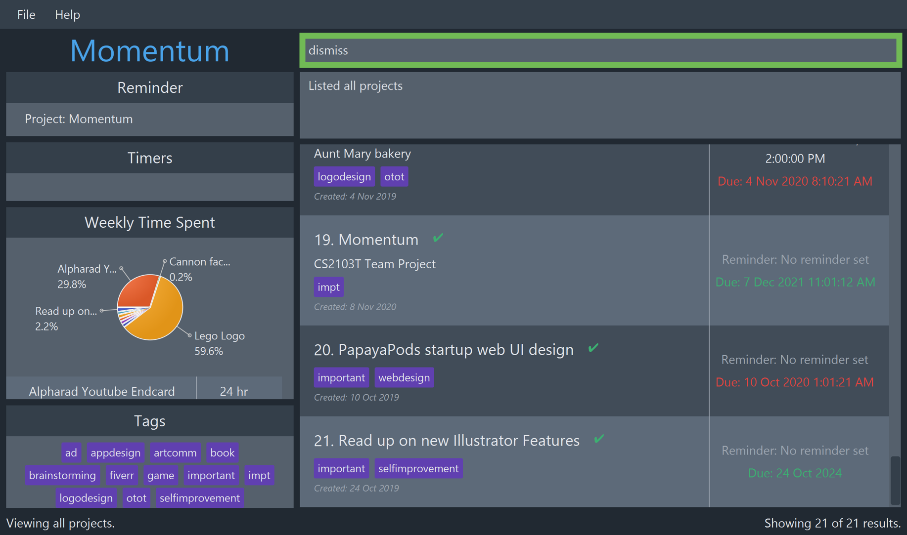
1. The result box will display a message to indicate that the command has been executed successfully.
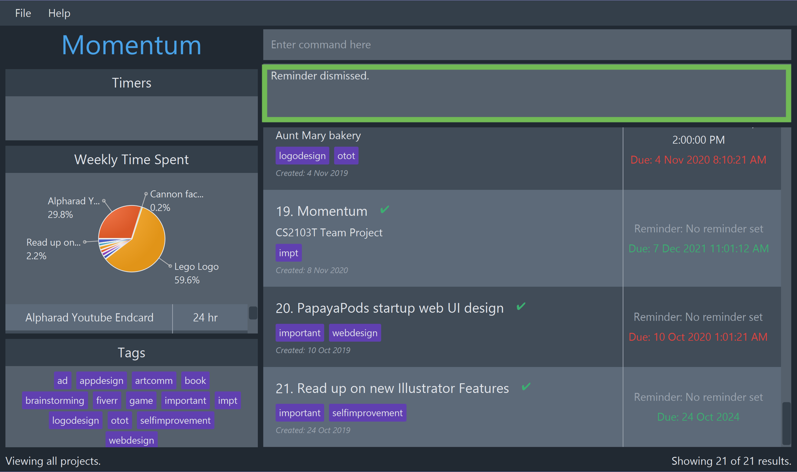
1. The reminder panel is now hidden.
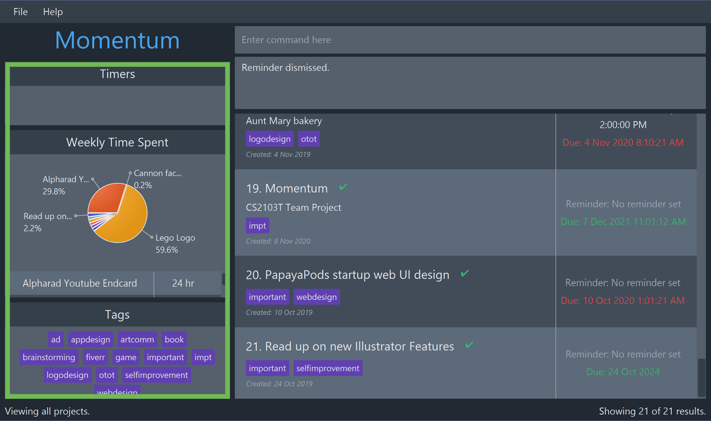

## Showing and Hiding SideBar Components : `show`

Done by Cheong Ying Yi Clara

You can hide or show the tags panel of the sidebar.

Format: `show t/`

* `t/` would hide the tags if the tags panel was shown.
* `t/` would show the tags if the tags panel was hidden.

Result: Shows or Hides the tags panel of the sidebar.

### Walkthrough of Hiding Tags

1. Type `show t/` in the command box, and press the `Enter` key to execute it.
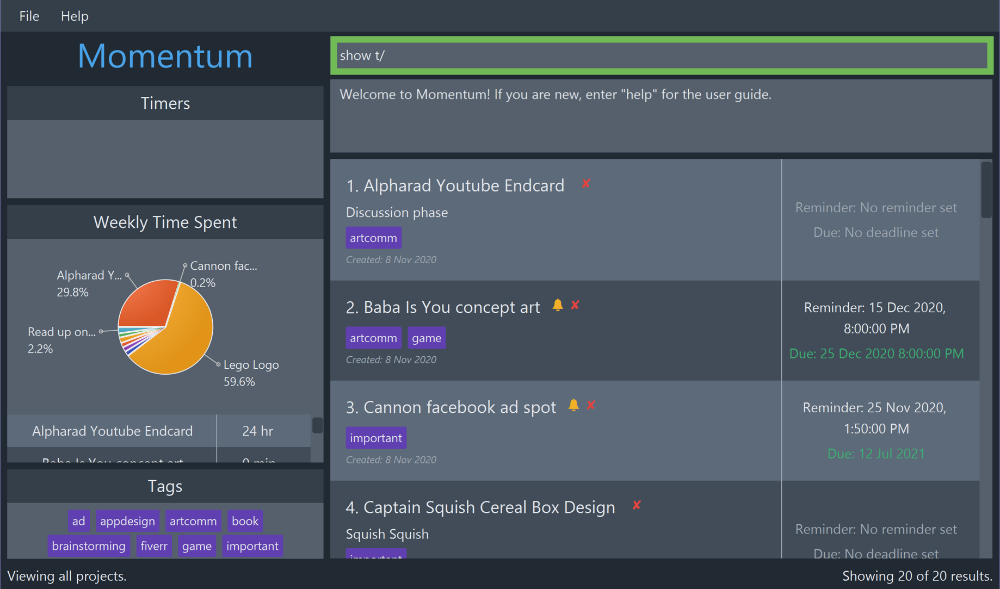
2. The result box will display a message to indicate that the command has been executed successfully:
   `Tags is removed from the sidebar.`
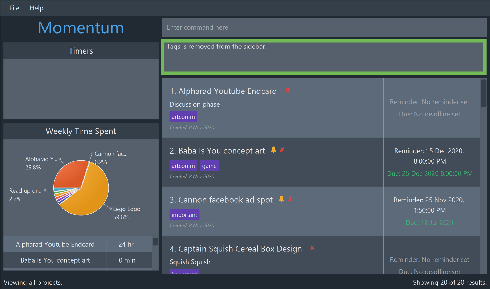
3. The tags panel is now hidden.
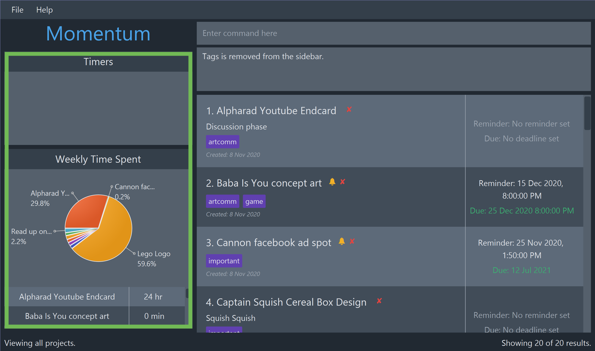

### Viewing help : `help`

Shows a message explaning how to access the help page.

Format: `help`

## Exiting the Program : `exit`

All project, task and timer data are saved automatically after every command. There is no need to save manually.

You can find the saved data in the following file in the same location where Momentum is located: `data/projectbook.json`

Format: `exit`

Result: Exits the program.

--------------------------------------------------------------------------------------------------------------------

## FAQ

**Q**: How do I transfer my data to another Computer?  
**A**: Install the app in the other computer and overwrite the empty data file it creates with the file that contains the data of your previous Momentum home folder.

--------------------------------------------------------------------------------------------------------------------

--------------------------------------------------------------------------------------------------------------------

## Glossary

* **Command Line Interface(CLI)**: Command Line Interface processes commands in the form of text
* **Mainstream OS**: Windows, Linux, Unix, OS-X
* **Project View**: View all projects in the project book.
* **Task View**: View all tasks that are added to a single project.
--------------------------------------------------------------------------------------------------------------------

## Command Summary

Action | Format | Example
--------|-------|-----------
**View tasks in a project**| `view ID` |`view 3`
**View all projects**| `home` | `home`
**Creating a Project/Task** | `add n/NAME [d/DESCRIPTION] [c/] [dd/DEADLINE_DATE [dt/DEADLINE_TIME]] [r/REMINDER_DATE_TIME] [t/TAG]​`|  `project n/Momentum d/CS2103T Team Project dd/2021-12-07 t/impt`
**Editing a Project/Task** | `edit ID [n/NAME] [d/DESCRIPTION] [c/]  [dd/DEADLINE_DATE [dt/DEADLINE_TIME]] [r/REMINDER_DATE_TIME] [t/TAG]`| `edit 3 n/NewMomentum d/NewDescription dl/2021-12-07 r/2021-12-07T01:21:21 t/normal`
**Delete a project/task** | `delete ID` | `delete 3`
**Clear all projects/tasks** | `clear` | `clear`
**Find a project/task** | `find [match/FILTER_TYPE] [n/NAME [MORE_NAMES]...] [d/DESCRIPTION [MORE_DESCRIPTIONS]...] [t/TAG [MORE_TAGS]...]  [c/]`  | `find match/any n/Momentum d/new t/normal`
**Show all projects/tasks (after find)** | `list` | `list`
**Sort projects/tasks** | `sort [type/SORT_TYPE] [order/SORT_ORDER] [c/]` | `sort type/deadline order/dsc c/`
**Start Timer** | `start ID` | `start 2`
**Stop Timer** | `stop ID` | `stop 2`
**Dismissing a Reminder** | `dismiss` | `dismiss`
**Showing and Hiding SideBar Components** | `show t/` | `show t/`
**Undo** | `undo` | `undo`
**Redo** | `redo` | `redo`
**Settings** | `set [th/THEME] [st/TIMEFRAME]` | `set th/dark st/daily`
**Exit** | `exit` | `exit`
