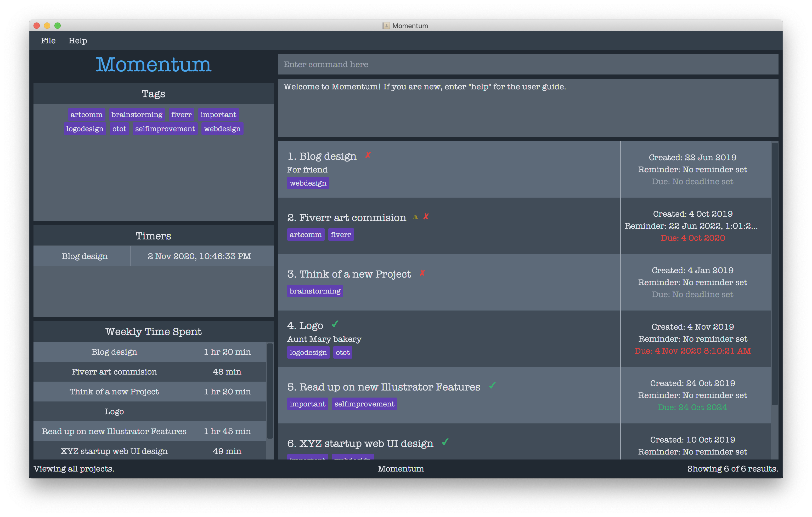
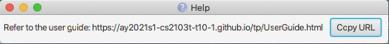

Momentum is a **desktop app** that **helps freelancers track time spent on different projects** and **gain insights on how their time is spent**. It is optimized for **Command Line Interface(CLI) users** so that frequent tasks can be done faster by typing in commands.

* Table of Contents
{:toc}

--------------------------------------------------------------------------------------------------------------------

## Quick Start

1. Ensure you have Java `11` or above installed in your Computer.

2. Download the latest `momentum.jar` from [here](https://github.com/se-edu/addressbook-level3/releases).

3. Copy the file to the folder you want to use as the _home folder_ for your ProjectBook.

4. Double-click the file to start the app. The GUI similar to the below should appear in a few seconds. Note how the app contains some sample data. 
   

5. Type the command in the command box and press Enter to execute it. e.g. typing **`help`** and pressing Enter will open the help window. 
   Some example commands you can try:

   * **`project`**`n/Momentum d/CS2103T Team Project` : Adds a project named `Momentum` to the Project Book.

   * **`edit`**`3 n/NewMomentum d/newDescription` : Update the 3rd project in the current list. The name will be changed to “NewMomentum” and the description will be changed to “NewDescription”.
   
   * **`find`**`n/NewMomentum` : Find a project that has `NewMomentum` in its name.

   * **`delete`**`3` : Deletes the 3rd project shown in the current list.
   
   * **`sort`**`type/deadline order/asc` : Sorts the list of projects by deadline in ascending order.

   * **`/exit`** : Exits the app.

6. Refer to the [Features](#features) below for details of each command.

--------------------------------------------------------------------------------------------------------------------

## Features

**:information_source: Notes about the command format:** 

* Words in `UPPER_CASE` are the parameters to be supplied by the user. 
  e.g. in `add n/NAME`, `NAME` is a parameter which can be used as `add n/John Doe`.

* Items in square brackets are optional. 
  e.g `n/NAME [t/TAG]` can be used as `n/John Doe t/friend` or as `n/John Doe`.

* Items with `…`​ after them can be used multiple times including zero times. 
  e.g. `[t/TAG]…​` can be used as ` ` (i.e. 0 times), `t/friend`, `t/friend t/family` etc.

* Parameters can be in any order. 
  e.g. if the command specifies `n/NAME p/PHONE_NUMBER`, `p/PHONE_NUMBER n/NAME` is also acceptable.

<!-- ### Viewing help : `help`

Shows a message explaning how to access the help page.

Format: `help` -->

### Creating a Project: `project`

Create a project to be tracked by the application.

Format: `project n/NAME [d/DESCRIPTION] [dd/DEADLINE_DATE [dt/DEADLINE_TIME]] [t/TAG]`

:bulb: **Tip:**
A project can have any number of tags (including 0)

:bulb: **Tip:**
A deadline of a project can include time

:bulb: **Tip:**
A project can have an empty description

Example: `project n/Momentum d/CS2103T Team Project dd/2020-12-07 dt/11:01:12 t/impt`

Result: Creates a project named “Momentum” with a description “CS2103T Team Project”, a tag "impt" and deadline "2020-10-07" with time "11:01:12".

### Editing a Project: `edit`

Edit a project that has been previously created.

Format: `edit PROJECT_ID [n/NAME] [d/DESCRIPTION] [dd/DEADLINE_DATE [dt/DEADLINE_TIME]] [t/TAG]`

* Edits the project at the specified `PROJECT_ID`.
* The id refers to the id number shown in the displayed project list.
* The id **must be a positive integer** 1, 2, 3, …​
* At least one of the optional fields must be provided.
* Existing values will be updated to the input values.
* Removing a description or deadline by typing `d/` or `dd/` without specifying anything after it.
* When editing tags, the existing tags of the project will be removed i.e adding of tags is not cumulative.
* You can remove all the project’s tags by typing `t/` without specifying any tags after it.

Example: `project 3 n/NewMomentum d/NewDescription dd/2020-12-07 t/normal`

Result: Updates the project with id 3. The name will be changed to “NewMomentum”, the description will be changed to “NewDescription”, all the tags will be removed and a tag named normal is added, and the deadline will be changed to "2020-12-07".

### Deleting a Project: `delete`

Deletes a project in the list.

Format: `delete PROJECT_ID`

* Deletes the project at the specified `PROJECT_ID`.
* The id refers to the id number shown in the displayed project list.
* The id **must be a positive integer** 1, 2, 3, …​

Example: `delete 2`

Result: Deletes the second project in the list.

### View

#### View All Projects : `list`

Shows a list of all projects in the project book.

Format: `list`

#### Sort Projects : `sort`

Sorts the list of displayed projects in the application.

Format: `sort [type/SORT_TYPE] [order/SORT_ORDER]`

* There are 3 types of sort.
    * `type/alpha` will sort the list of projects in alphabetical order.
    * `type/deadline` will sort the list of projects according to their deadlines.
    * `type/created` will sort the list of projects according to their date of creation.
    
* There are 2 sort orders.
    * `sort/asc` will sort the list of projects in ascending order.
    * `sort/dsc` will sort the list of projects in descending order.
   

:bulb: **Tip:**
`type/alpha` and `order/asc` will be used as default if both sort type and order are not specified (i.e. command is `sort`)

:bulb: **Tip:**
Current sort type will be used if the `type` is not specified but `order` is specified.

:bulb: **Tip:**
`order/asc` will be used as default if the `order` is not specified but `type` is specified.

:bulb: **Tip:**
For `sort type/deadline`, projects without deadlines will be ordered alphabetically after the ordered list of projects with deadlines.
For both `sort type/deadline` and `sort type/created`, projects with same deadline or same created date will be sorted alphabetically.

Example:

The following are 3 projects in the project book.

Project 1. Name: `Ant Hole`, Deadline: `2020-02-02`, Created Date: `2000-02-02`
Project 2. Name: `Brunch`, Deadline: `2010-01-01`, Created Date: `2002-09-09`
Project 3. Name: `Create Logo` , Deadline: `2040-04-04`, Created Date: `2001-01-01`

##### Sorting by Default order 

Format: `sort`

* Sorts projects in alphabetical, ascending order

Result: [Project 1, Project 2, Project 3]

##### Sorting With Only Type Specified 

Format: `sort type/SORT_TYPE`

* Sorts projects in a specified order
* Since order is not specified, default order is ascending

Example: `sort type/alpha`
Result: [Project 1, Project 2, Project 3]

Example: `sort type/deadline`
Result: [Project 2, Project 1, Project 3]

Example: `sort type/created`
Result: [Project 1, Project 3, Project 2]

#### Sorting With Only Order Specified 

Format: `sort order/SORT_ORDER`

* Sorts projects in current project order.
* If there is no existing project order (when the application restarts), order will be alphabetical by default.

Example: `sort order/dsc` (After application restarts for the first time)
Result: [Project 3, Project 2, Project 1]

Example `sort order/asc` (Current sort type is Deadline)
Result: [Project 2, Project 1, Project 3]

#### Sorting With Both Type and Order Specified

* Sorts projects in specified type and order.
* Projects that cannot be ordered in a certain type will be ordered alphabetically.

Example: `sort type/alpha order/dsc`
Result: [Project 3, Project 2, Project 1]

Example: `sort type/deadline order/asc`
Result: [Project 2, Project 1, Project 3]

Example: `sort type/created order/dsc`
Result: [Project 2, Project 3, Project 1]

#### View a Project (_coming soon_)

Format: `/p PROJECT_ID`

* View the project at the specified `PROJECT_ID`.
* The id refers to the id number shown in the displayed project list.
* The id **must be a positive integer** 1, 2, 3, …​

Example: `/p 2`

Result: Navigates to the project page of the second project in the list.

#### View Home (_coming soon_)

Go to home page.

Format: `/home`

#### View Settings (_coming soon_)

Go to settings page.

Format: `/settings`

#### Filtering Projects: `find`

Searches for projects in the project book based on certain parameters.

Format: `find [match/FILTER_TYPE] [n/NAME [MORE_NAMES]...] [d/DESCRIPTION [MORE_DESCRIPTIONS]...] [t/TAG [MORE_TAGS]...]`

* There are two values for the `match` command.
* `match/all` requires **all** parameters to match their respective entries in the project for it to be shown.
* `match/any` shows the project as long as any parameter matches the user's input.

:bulb: **Tip:**
`match/any` will be used if the `match` type is not specified.

Example:

If there are 3 projects in the project book:

1. Name: `Create Logo` , Description: `Make logo for startup XYZ`, Tags: `Design`
2. Name: `Write Song`, Description: `80s rock music, three minutes`, Tags: `Music`
3. Name: `Write Article`, Description: `Write and article about why Momentum is the best app out there`, Tags: `Press` and `Writing`

* `find match/any n/song article d/startup t/design` will return all three projects. This is because project 1 contains the keyword `startup` in its description and the tag `design`, project 2 contains the keyword `song` in its name and project 3 contains the keyword `article` in its name. 
* `find match/all n/song article d/startup t/design` will not return any project as there is no project with `song` **and** `article` in its name **and** the `startup` in its description and the tag `design`.
* `find match/any n/write d/rock` will return projects 2 and 3. This is because project 2 contains `write` in its name and `rock` in its description. Project 3 also contains the word `write` in its name.
* `find match/all n/write d/rock` will only return project 2. This is because project 2 is the only project that contains both `write` in its name and `rock` in its description. 

Searching by name: 
* The `n/` command checks whether a project has a certain name. There can be multiple names added to this command. For example, `n/car window` will check for the projects that contain `car` or `window` in their names.
* Searching by name only requires a partial match. This means that a project with the name `carpet` and `car` can potentially be the result of searching for the term `car`.

Searching by description: 
* The `d/` command checks whether a project has a certain description. There can be multiple descriptions added to this command. For example, `d/sunday october` will check for the projects that contain `sunday` or `october` in their description.
* Searching by description only requires a partial match, similar to searching by name.

Searching by tag: 
* The `t/` command checks whether a project has a certain tag. There can be multiple tags added to this command. For example, `t/freelance errands` will check for the projects that contain the tags `freelance` or `errands`.
* Searching by tags will require a full word match unlike searching by name or description. This means that searching for the tag `free` will not find a project with the tag `freelance`.

:bulb: **Tip:**
Searches for tags require a full match whilst searches partial matches are sufficient for searches by name and description.

#### Record the Time Spent On a Project: `start` / `stop`
You can record the time you spend working on a project by starting a timer when you start working, and then stopping
 the timer once you finish.

##### Starting a Timer for a Project: `start`

Format: `/start PROJECT_ID`

* Starts a timer for the project at the specified `PROJECT_ID`.
* Only 1 timer can be running for a project at any time.
* Timers for different projects can run concurrently.
* The id refers to the id number shown in the displayed project list.
* The id **must be a positive integer** 1, 2, 3, …​

Example: `/start 2`

Result: Starts a timer for the second project in the list.

##### Stopping a Timer for a Project: `stop`

Format: `/stop PROJECT_ID`

* Stops a running timer for the project at the specified `PROJECT_ID`.
* A timer can only be stopped if there is one already running.
* The id refers to the id number shown in the displayed project list.
* The id **must be a positive integer** 1, 2, 3, …​

Example: `/stop 2`

Result: Stops the timer for the second project in the list.

##### Things to note:
1. If you are working on more than 1 project at the same time, you can start a seperate timer for each project.
2. However, you cannot start more than 1 timer for the same project.
3. Momentum tracks and remembers the time recorded by the timer. This data is used to generate statistics for your
 time usage.

#### Statistics
Statistics are automatically generated and updated whenever projects are 
added/deleted/changed, and when timers are started/stopped. They can be
seen in the bottom left of the window. 
You do not need to use any additional commands to update or view statistics

### Exiting the Program : /`exit`
ProjectBook data are saved in the hard disk automatically after any command that changes the data. There is no need to save manually.

Format: `/exit`

Result: Exits the program.

--------------------------------------------------------------------------------------------------------------------

## FAQ

**Q**: How do I transfer my data to another Computer?  
**A**: Install the app in the other computer and overwrite the empty data file it creates with the file that contains the data of your previous Momentum home folder.

--------------------------------------------------------------------------------------------------------------------

## Command Summary

Action | Format, Examples
--------|------------------
**Create** | `project n/NAME [d/DESCRIPTION] [dd/DEADLINE_DATE [dt/DEADLINE_TIME]] [t/TAG]​`   e.g., `project n/Momentum d/CS2103T Team Project dd/2020-12-07 t/impt`
**Edit** | `edit PROJECT_ID n/NAME [d/DESCRIPTION] [dd/DEADLINE_DATE [dt/DEADLINE_TIME]] [t/TAG]`   e.g., `project 3 n/NewMomentum d/NewDescription dl/2020-12-07 t/normal`
**Delete** | `delete PROJECT_ID`   e.g., `delete 3`
**Find** | `find [match/FILTER_TYPE] [n/NAME [MORE_NAMES]...] [d/DESCRIPTION [MORE_DESCRIPTIONS]...] [t/TAG [MORE_TAGS]...]`   e.g., `find match/any n/Momentum d/new t/normal`
**Navigation** (_coming soon_) | `list`   `/project PROJECT_ID`   e.g., `/p 2`   `/settings`  
**Start Timer** | `start PROJECT_ID`   e.g., `start 2`
**Stop Timer** | `stop PROJECT_ID`   e.g., `stop 2`
**Exit** | `/exit`
