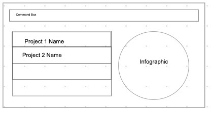
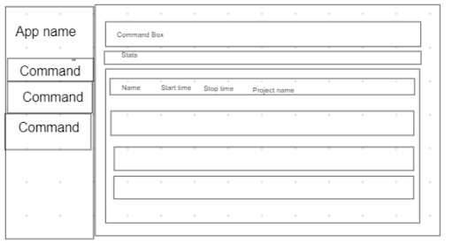
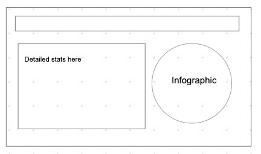

Momentum is a **desktop app** that **helps freelancers track time spent on different projects** and **gain insights on how their time is spent**. It is optimized for **Command Line Interface(CLI) users** so that frequent tasks can be done faster by typing in commands.

* Table of Contents
{:toc}

--------------------------------------------------------------------------------------------------------------------

## Quick start

1. Ensure you have Java `11` or above installed in your Computer.

1. Download the latest `momentum.jar` from [here](https://github.com/AY2021S1-CS2103T-T10-1/tp/releases).

1. Copy the file to the folder you want to use as the _home folder_ for your Momentum.

1. Double-click the file to start the app. The GUI similar to the below should appear in a few seconds. Note how the app contains some sample data. 
   

1. Type the command in the command box and press Enter to execute it. e.g. typing **`help`** and pressing Enter will open the help window. 
   Some example commands you can try:

   * **`project`**`n/Momentum d/CS2103T Team Project` : Adds a project named `Momentum` to the Project Book.

   * **`edit`**`3 n/NewMomentum d/newDescription` : Update the 3rd project in the current list. The name will be changed to “NewMomentum” and the description will be changed to “NewDescription”.

   * **`delete`**`3` : Deletes the 3rd project shown in the current list.

   * **`/home`** : Go to Home dashboard.

   * **`/stats`** : Go to Statistics tab.

   * **`/projects`** : Go to Projects tab.

   * **`/settings`** : Go to Settings tab.

   * **`start`**`3` : Start the timer of the 3rd project shown in the current list.

   * **`end`**`3` : End the timer of the 3rd project shown in the current list.

   * **`/exit`** : Exits the app.

2. Refer to the [Features](#features) below for details of each command.

--------------------------------------------------------------------------------------------------------------------

## Features

**:information_source: Notes about the command format:** 

* Words in `UPPER_CASE` are the parameters to be supplied by the user. 
  e.g. in `add n/NAME`, `NAME` is a parameter which can be used as `add n/John Doe`.

* Items in square brackets are optional. 
  e.g `n/NAME [t/TAG]` can be used as `n/John Doe t/friend` or as `n/John Doe`.

* Items with `…`​ after them can be used multiple times including zero times. 
  e.g. `[t/TAG]…​` can be used as ` ` (i.e. 0 times), `t/friend`, `t/friend t/family` etc.

* Parameters can be in any order. 
  e.g. if the command specifies `n/NAME p/PHONE_NUMBER`, `p/PHONE_NUMBER n/NAME` is also acceptable.

<!-- ### Viewing help : `help`

Shows a message explaning how to access the help page.

Format: `help` -->

### Creating a project: `project`

Create a project to be tracked by the application.

Format: `project n/NAME d/DESCRIPTION [t/TAG]`

:bulb: **Tip:**
A person can have any number of tags (including 0)

Example: `project n/Momentum d/CS2103T Team Project t/impt`

Result: Creates a project named “Momentum” with a description “CS2103T Team Project” and a tag "impt".

### Updating a project: `edit`

Update a project that has been previously created.

Format: `edit PROJECT_ID n/NAME d/DESCRIPTION [t/TAG]`

* Edits the person at the specified `PROJECT_ID`.
* The id refers to the id number shown in the displayed project list.
* The id **must be a positive integer** 1, 2, 3, …​

Example: `project 3 n/NewMomentum d/NewDescription t\normal`

Result: Updates the project with id 3. The name will be changed to “NewMomentum”, the description will be changed to “NewDescription”, the tag will be changed to normal.

### Deleting a project: `delete`

Deletes a project in the list.

Format: `delete PROJECT_ID`

* Deletes the person at the specified `PROJECT_ID`.
* The id refers to the id number shown in the displayed project list.
* The id **must be a positive integer** 1, 2, 3, …​

Example: `delete 2`

Result: Deletes the second project in the list.

### View

View different tabs of the application.

Format:   `\home`   `\stats`   `\projects`   `\settings`

* /home brings user to home dashboard
* /stats brings user to Statistics tab
* /projects brings user to Projects tab
* /settings brings user to Settings tab

Result: Moves to different tabs in the application.

#### Home View

#### Projects View

#### Statistics View

### Timer

Start and end a timer to record the duration of a project.

#### Start Timer: `start`

Format: `start PROJECT_ID`

* Starts the timer with `PROJECT_ID` specified
* The id refers to the id number shown in the displayed project list.
* The id **must be a positive integer** 1, 2, 3, …​

Example: `start 1`

Result: Start timer with project id 1.

#### End Timer: `end`

Format: `end PROJECT_ID`

* Ends the timer with `PROJECT_ID` specified
* The id refers to the id number shown in the displayed project list.
* The id **must be a positive integer** 1, 2, 3, …​

Example: `end 1`

Result: End timer with project id 1.

### Exiting the program : /`exit`

Format: `/exit`

Result: Exits the program.

--------------------------------------------------------------------------------------------------------------------

## FAQ

**Q**: How do I transfer my data to another Computer? 
**A**: Install the app in the other computer and overwrite the empty data file it creates with the file that contains the data of your previous Momentum home folder.

--------------------------------------------------------------------------------------------------------------------

## Command summary

Action | Format, Examples
--------|------------------
**Create** | `project n/NAME d/DESCRIPTION [t\Tag]​`   e.g., `project n/Momentum d/CS2103T Team Project`
**Update** | `edit PROJECT_ID n/NAME d/DESCRIPTION [t\Tag]`   e.g., `project 3 n/NewMomentum d/NewDescription t\normal`
**Delete** | `delete PROJECT_ID`  e.g., `delete 3`
**View** | `/home​`   `/stats`  `/projects`  `/settings`
**Timer** | `start PROJECT_ID`   e.g., `start 3`   `end PROJECT_ID`   e.g., `end 3`
**Exit** | `/exit`
