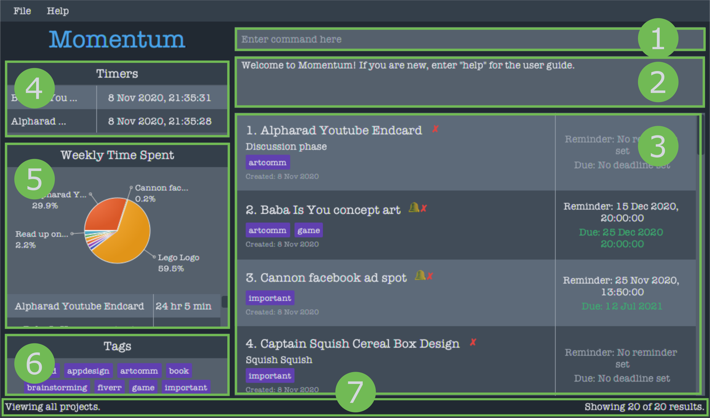
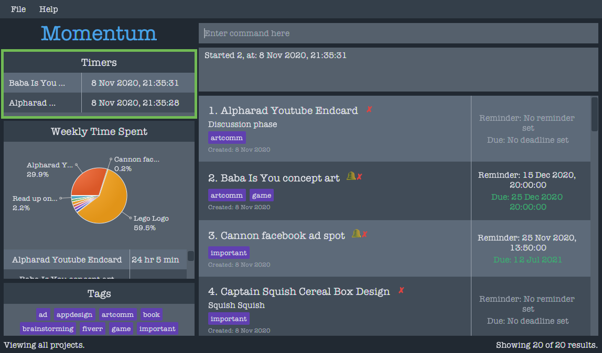
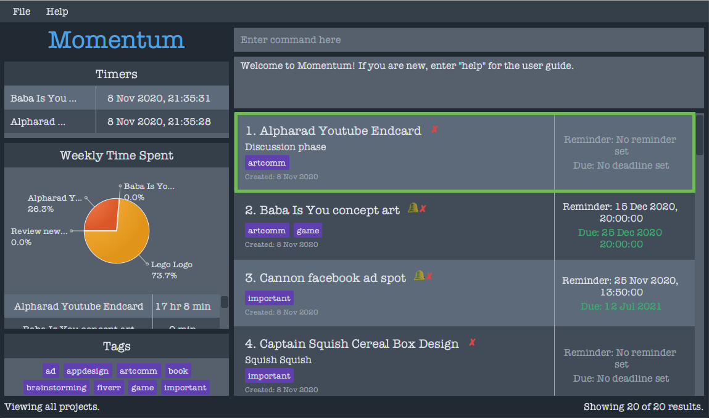
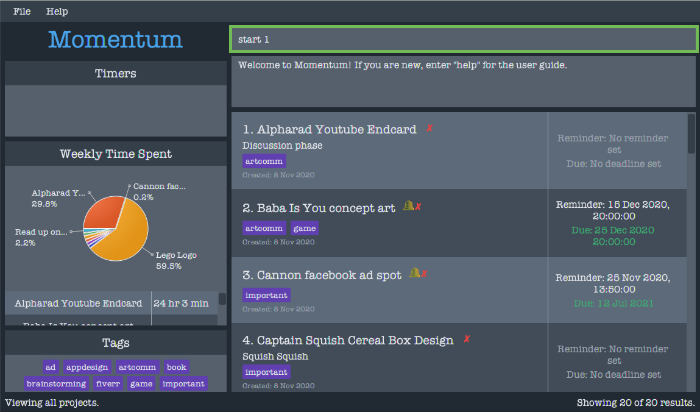
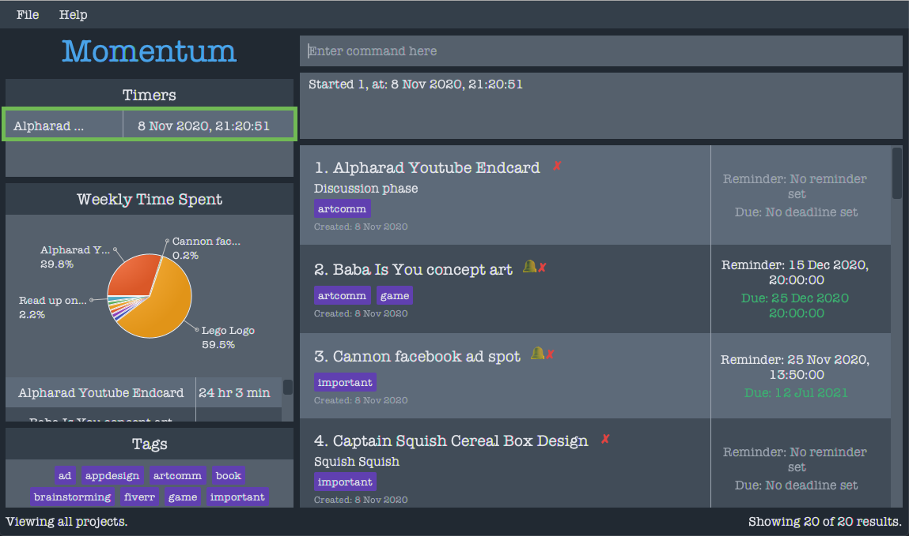
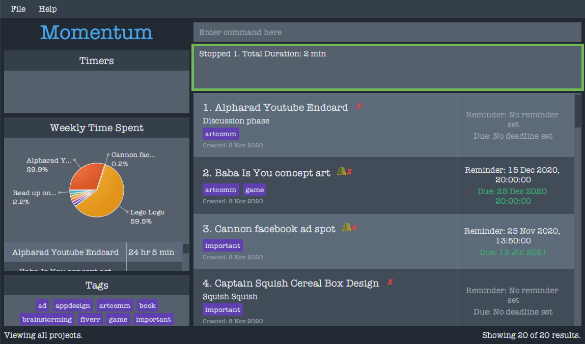
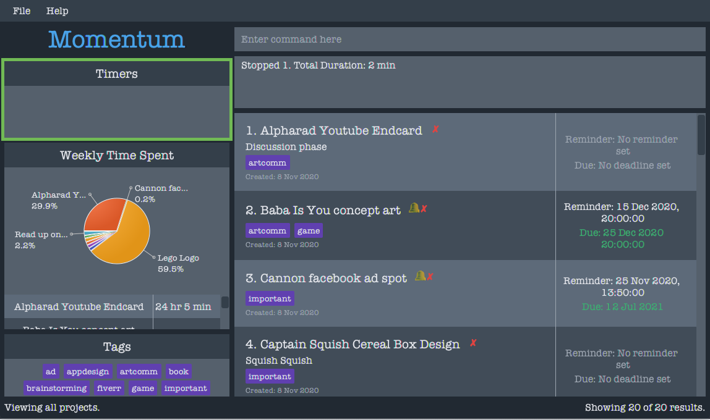
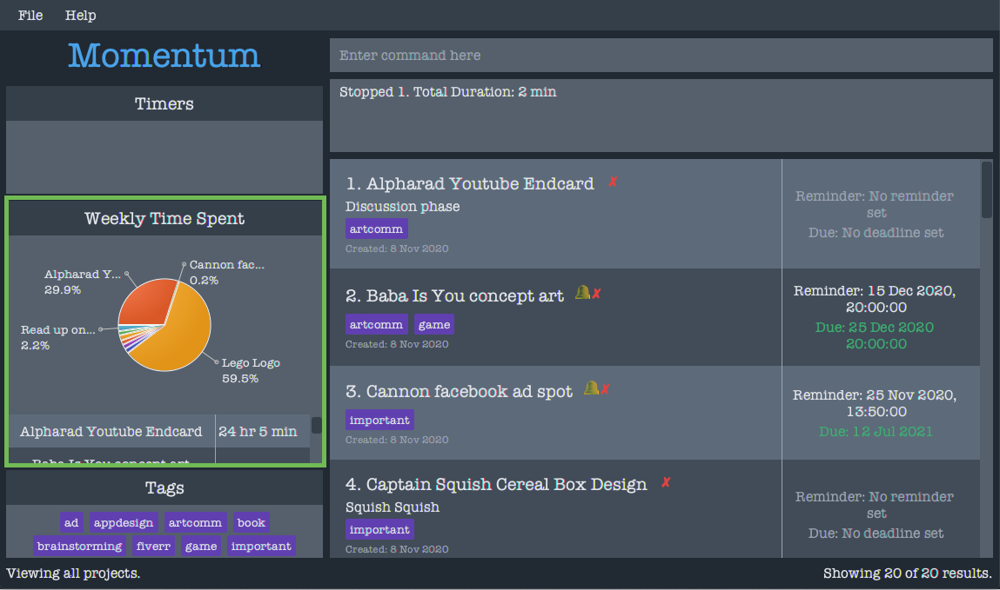
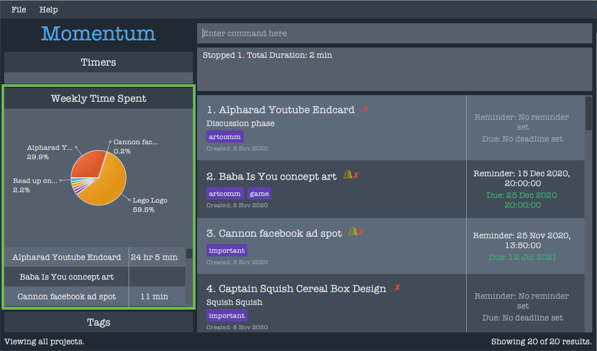
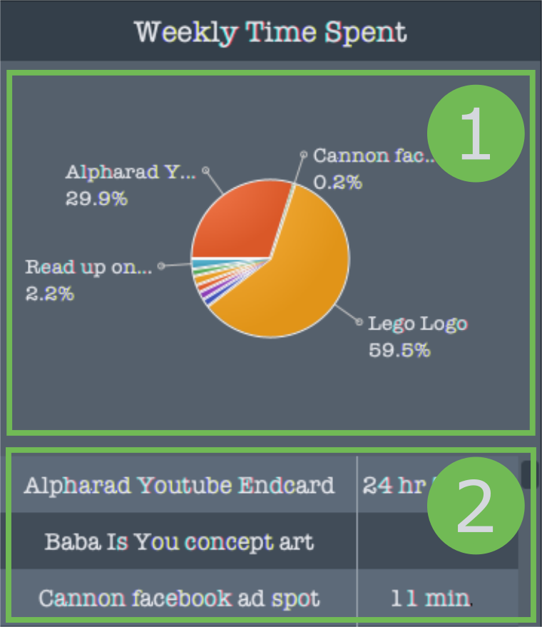

Momentum is a **desktop app** that **helps freelancers track time spent on different projects** and **gain insights on how their time is spent**.

It is designed for people that prefer typing, so that frequent tasks can be done faster by typing in commands.

*include purpose of the document* e.g. this user guide contains all the commands you need to be able to use the product effectively

*terminology used*

{:toc}

--------------------------------------------------------------------------------------------------------------------

<!-- # Table of contents
[1. Quick Start](#quick-start)
    [2. Features](#2-Features)
[3. Projects and Tasks](#3-Projects-and-Tasks)
    [3.1. View Projects: home](#31-View-Projects-home)
&nbsp;&nbsp;&nbsp;&nbsp; [3.2. Viewing a Project’s Tasks: view](#view)
    &nbsp;&nbsp;&nbsp;&nbsp;&nbsp;[3.3. Creating a Project/Task: add](#add)
    [3.4. Editing a Project/Task: edit](#edit)
    [3.5. Deleting a Project/Task: delete](#delete)
    [3.6. Project/Task Organisation](#organisation)
    [3.7. Time Tracking](#time-tracking)
    [3.8. Undo/Redo](#undoredo)
    [3.9. Statistics](#statistics)
    [3.10. Settings](#settings)
    [3.11. Clear All Projects/Tasks: clear](#clear)
    [3.12. Show and Hide SideBar Components : show](#show)
    [3.13. Exiting the Program : exit](exit)
[4. FAQ](#Faq)
[5. Glossary](#Glossary)
    [5.1. Date and Time Terms](#datetime)
[6. Command Summary](#command-summary)
 -->

## 1. Quick Start

1. Ensure you have Java `11` or above installed in your Computer.

2. Download the latest `momentum.jar` from [here](https://github.com/AY2021S1-CS2103T-T10-1/tp/releases).

3. Copy the file to the folder you want to use as the _home folder_ for Momentum.

4. Double-click the file to start Momentum. The GUI similar to the below should appear in a few seconds. Note how the app contains some sample data. 
   

5. Type the command in the command box and press Enter to execute it. e.g. typing **`help`** and pressing Enter will open the help window. 
   Some example commands you can try:

   * **`add`**`n/Momentum d/CS2103T Team Project` : Adds a project named `Momentum` to the Project Book.

   * **`edit`**`3 n/NewMomentum d/newDescription` : Update the 3rd project in the current list. The name will be changed to “NewMomentum” and the description will be changed to “NewDescription”.

   * **`find`**`n/NewMomentum` : Find a project that has `NewMomentum` in its name.

   * **`delete`**`3` : Deletes the 3rd project shown in the current list.

   * **`sort`**`type/deadline order/asc` : Sorts the list of projects by deadline in ascending order.

   * **`undo`** : Undoes the previous command (Sort command is revoked).

   * **`exit`** : Exits the app.

Refer to the [Features](#features) below for details of each command.

--------------------------------------------------------------------------------------------------------------------

## User Interface Overview
Momentum uses a GUI (Graphical User Interface) to collect input from you, and display information to you. Different
 parts of this GUI perform different functions, as explained below:

1. **Command Box**: THe place where you enter in your commands.
2. **Results Box**: Displays information about the result of executing the commands that you enter.
3. **Display List**: Displays a list of projects or tasks.
4. **Active Timers Panel**: Displays all the timers that are currently running. 
(see [Active Timers Panel](#active-timers-panel))
5. **Statistics Panel**: Displays the statistics data calculated by Momentum. 
(see [Statistics](#statistics))
6. **Tags Panel**: Displays a collection of all the tags visible in the display list.
7. **Bottom Bar**: Displays contextual information about what you are viewing, such as the specific project that you
 are viewing, and the number of items in the display list hidden due to finding or sorting commands.
 
The active timers, statistics, and tags panels can be resized to display more information by clicking and draging their
 edges.

## Command Format

Below is an explanation of the formatting used to show commands:

* Words in `UPPER_CASE` are the parameters to be supplied by the user.
  e.g. in `add n/NAME`, `NAME` is a parameter which can be used as `add n/Blog Design`.
* Items in square brackets are optional.
  e.g `n/NAME [t/TAG]` can be used as `n/Blog Design t/friend` or as `n/Blog Design`.
* Items with `…`​ after them can be used multiple times including zero times.
  e.g. `[t/TAG]…​` can be used as ` ` (i.e. 0 times), `t/friend`, `t/friend t/family` etc.
* Items with `…` inside square brackets `[t/TAG [MORE_TAGS]...]` can take in multiple space separated arguments
  e.g. `[[t/TAG [MORE_TAGS]...]` can represent `t/friend friend family`
* Parameters can be in any order.
  e.g. if the command specifies `n/NAME dd/2020-11-05`, `dd/2020-11-05 n/NAME` is also acceptable.

## Date and Time Terms

Dates and Times are an integral part of Momentum, and you will typing dates and times regularly. Here is a guide to the format for entering dates and times in Momentum.

### Date Terms

Dates should be entered in the order `YYYY-MM-DD`

Term  | Meaning | Example
----- |-------- | -------
`YYYY`| Year    | 2020
`MM`  | Month   | 02
`DD`  | Day     | 09

**Valid**: 2020-08-02

**Invalid**: 2-8-20 Wrong number of digits.

**Invalid**: 02-08-20 Wrong order of year, month and date.

**Invalid**: 2nd August 2020 You cannot use text to enter dates.

### Time Terms

Times should be entered in 24 hour format, in the order `HH:MM:SS`

Term | Meaning | Example
-----|-------- | -------
HH   | Hour    | 16
MM   | Minute  | 52
SS   | Second  | 03

**Valid**: 15:08:02

**Invalid**: 15:8:2 (Wrong number of digits.)

**Invalid**: 8:15:2 (Wrong order of hour, minute and second.)

**Invalid**: 03:08:02PM (Only 24 hour time is accepted.)

### Combining Date and Time

You may also have to enter both dates and times together. When entered together, dates and times should be entered in the order `YYYY-MM-DDTHH:MM:SS`. The letter `T` separates the date and time.

**Valid**: 2020-08-02T15:08:02

**Invalid**: 15:08:02T2020-08-02 (Wrong order of date and time.)

## 2. Features

<!-- ### Viewing help : `help`

Shows a message explaning how to access the help page.

Format: `help` -->

## 3. Projects and Tasks

You can add projects into Momentum to be tracked. Each project has the following information:

* Name
* Description
* Completion Status
* Deadline Date
* Deadline Time
* Reminder
* Tag

Apart from the name, all other information is optional.

Each project can also contain several tasks, each with the same information as a project.

When you first open Momentum, you will see all the projects being tracked in Momentum. You can then view the tasks for each project seperately.

:::info

**:information_source: Most commands in Momentum will do different things depending on whether you are viewing projects or tasks.** 
Please refer to each command for these differences.

:::

### 3.1 View Projects: `home`

View all the projects being tracked by Momentum.
This is the default view when Momentum is first opened.

Format: `home`

### 3.2 Viewing a Project's Tasks: `view`

View the tasks for a project.

Format: `view ID`

* The id refers to the id number shown in the displayed project list.
* The id **must be a positive integer** 1, 2, 3, …​

Example: `view 1`

### 3.3 Creating a Project/Task: `add`

When looking at projects, this command will create a new project. When looking at the tasks in a project, thsi command will create a new task for the project.

Format: `add n/NAME [d/DESCRIPTION] [c/] [dd/DEADLINE_DATE] [dt/DEADLINE_TIME] [r/REMINDER_DATE_TIME] [t/TAG]`

* The project is incomplete by default, adding `c/` will set the completion status to complete.
* The format for date of the deadline is YYYY-MM-DD, refer to [Date Terms](#Date-Terms) for more information on YYYY, MM and DD.
* The format for time of the deadline is HH:MM:SS in 24 hour format, refer to [Time Terms](#Time-Terms) for more information on HH, MM and SS.
* The date of the deadline cannot be earlier than the creation date of the project.
* Both date and time is compulsory for a reminder.
* The format for date and time of the reminder is YYYY-MM-DDTHH:MM:SS, refer to [Date and Time Terms](#Date-and-Time-Terms) for more information on YYYY, MM, DD, HH, MM, and SS.
* The date and time of the reminder needs to be later than the current time.

:::info
:bulb: **Tip:**

* Projects and tasks can have any number of tags (including 0).
* A deadline of a project can include time, but a deadline cannot only contain time.
* A project can have an empty description.
* `T` separates the date and time in a reminder.
* A reminder will be shown in the Reminder component of the sidebar at the date and time specified.
* The reminder will be removed after it is shown in the sidebar.
* If a reminder was missied, it will be greyed out.

:::

:::danger
:warning: **Warning**
If there are multiple reminders set at the same date and time, only one of the reminders will appear in the reminder panel. Other reminders will be missed.
:::

Example: `add n/Momentum d/CS2103T Team Project dd/2020-12-07 dt/11:01:12 r/2020-12-07T11:01:12 t/impt`

Result: Creates a project named “Momentum” with a description “CS2103T Team Project”, a tag "impt", deadline date "2020-10-07" with deadline time "11:01:12" and reminder "2020-10-07T11:01:12".

#### Adding a Project Walkthrough

### 3.4 Editing a Project/Task: `edit`

Edits a project or task that was been previously created.

Format: `edit ID [n/NAME] [d/DESCRIPTION] [c/] [dd/DEADLINE_DATE [dt/DEADLINE_TIME]] [t/TAG]`

* The id refers to the id number shown in the displayed list.
* The id **must be a positive integer** 1, 2, 3, …​
* Adding `c/` will reverse the completion status, if the project was incomplete the completion status will change to complete.
* The format for date of the deadline is YYYY-MM-DD, refer to [Date Terms](#Date-Terms) for more information on YYYY, MM and DD.
* The format for time of the deadline is HH:MM:SS in 24 hour format, refer to [Time Terms](#Time-Terms) for more information on HH, MM and SS.
* The date of the deadline cannot be earlier than the creation date of the project.
* The time of the deadline cannot be edited without editing the date of the deadline.
* Both date and time is compulsory for a reminder.
* The format for date and time of the reminder is YYYY-MM-DDTHH:MM:SS, refer to [Date and Time Terms](#Date-and-Time-Terms) for more information on YYYY, MM, DD, HH, MM, and SS.
* The date and time of the reminder needs to be later than the current time.
* At least one of the optional fields must be provided.
* Existing values will be updated to the input values.
* Removing a description or deadline by typing `d/` or `dd/` without specifying anything after it.
* When editing tags, the existing tags of the project will be removed i.e adding of tags is not cumulative.
* You can remove all the project’s tags by typing `t/` without specifying any tags after it.

Example: `edit 3 n/NewMomentum d/NewDescription dd/2020-12-07 t/normal`

Result: Updates the project with id 3. The name will be changed to “NewMomentum”, the description will be changed to “NewDescription”, all the tags will be removed and a tag named normal is added, and the deadline will be changed to "2020-12-07".

### 3.5 Deleting a Project/Task: `delete`

Deletes a project or task in the list.

Format: `delete ID`

* Deletes the project at the specified `PROJECT_ID`.
* The id refers to the id number shown in the displayed project list.
* The id **must be a positive integer** 1, 2, 3, …​

Example: `delete 2`

Result: Deletes the second project in the list.

### 3.6 Project/Task Organisation

#### 3.6.1 View All Projects : `list`

When viewing projects, this command shows a list of all projects in Momentum.

When viewing a project's tasks, this command shows a list of all the tasks for the project.

Format: `list`

#### 3.6.2 Sort Projects : `sort`

Sorts the list of displayed projects or tasks in the application.

Format: `sort [type/SORT_TYPE] [order/SORT_ORDER] [c/]`

* There are 3 types of sort.
  * `type/alpha` will sort the list of projects in alphabetical order.
  * `type/deadline` will sort the list of projects according to their deadlines.
  * `type/created` will sort the list of projects according to their date of creation.

* There are 2 sort orders.
  * `order/asc` will sort the list of projects in ascending order.
  * `order/dsc` will sort the list of projects in descending order.

* The projects can be sorted by incomplete then completed.
  * This is the default sort.
  * Add `c/` to reverse the previously set default.
  * If the sort grouped the incomplete and complete projects, `c/` will make the sort not consider the completion status of the projects.
  * Similarly, if the sorting did not group the projects by completion status, `c/` will make the sort consider the completion status of the projects.

:::info
:bulb: **Tip:**

* `type/alpha` and `order/asc` will be used as default if both sort type and order are not specified (i.e. command is `sort`)
* Current sort type will be used if the `type` is not specified but `order` is specified.
* `order/asc` will be used as default if the `order` is not specified but `type` is specified.
* For `sort type/deadline`, projects without deadlines will be ordered alphabetically after the ordered list of projects with deadlines.
* For both `sort type/deadline` and `sort type/created`, projects with same deadline or same created date will be sorted alphabetically.

:::

Example:

The following are 3 projects in the project book.

Project 1. Name: `Ant Hole`, Deadline: `2020-02-02`, Created Date: `2000-02-02`
Project 2. Name: `Brunch`, Deadline: `2010-01-01`, Created Date: `2002-09-09`
Project 3. Name: `Create Logo` , Deadline: `2040-04-04`, Created Date: `2001-01-01`

**3.6.2.3 Sorting by Default order**

Format: `sort`

* Sorts projects in alphabetical, ascending order

Result: [Project 1, Project 2, Project 3]

##### Sorting With Only Type Specified

Format: `sort type/SORT_TYPE`

* Sorts projects in a specified order
* Since order is not specified, default order is ascending

Example: `sort type/alpha`
Result: [Project 1, Project 2, Project 3]

Example: `sort type/deadline`
Result: [Project 2, Project 1, Project 3]

Example: `sort type/created`
Result: [Project 1, Project 3, Project 2]

#### Sorting With Only Order Specified

Format: `sort order/SORT_ORDER`

* Sorts projects in current project order.
* If there is no existing project order (when the application restarts), order will be alphabetical by default.

Example: `sort order/dsc` (After application restarts for the first time)
Result: [Project 3, Project 2, Project 1]

Example `sort order/asc` (Current sort type is Deadline)
Result: [Project 2, Project 1, Project 3]

#### Sorting With Both Type and Order Specified

* Sorts projects in specified type and order.
* Projects that cannot be ordered in a certain type will be ordered alphabetically.

Example: `sort type/alpha order/dsc`
Result: [Project 3, Project 2, Project 1]

Example: `sort type/deadline order/asc`
Result: [Project 2, Project 1, Project 3]

Example: `sort type/created order/dsc`
Result: [Project 2, Project 3, Project 1]

#### Filtering Projects: `find`

Searches for projects or tasks in the project book based on certain parameters.

Format: `find [match/FILTER_TYPE] [n/NAME [MORE_NAMES]...] [d/DESCRIPTION [MORE_DESCRIPTIONS]...] [t/TAG [MORE_TAGS]...] [c/COMPLETION_STATUS]`

* There are two values for the `match` command.
* `match/all` requires **all** parameters to match their respective entries in the project for it to be shown.
* `match/any` shows the project as long as any parameter matches the user's input.

:::info
:bulb: **Tip:**
You can only search for projects in the project view and tasks in the tasks view
:::

:::info
:bulb: **Tip:**
`match/any` will be used if the `match` type is not specified.
:::

Example:

If there are 3 projects in the project book:

1. Name: `Create Logo` , Description: `Make logo for startup XYZ`, Tags: `Design`
2. Name: `Write Song`, Description: `80s rock music, three minutes`, Tags: `Music`
3. Name: `Write Article`, Description: `Write and article about why Momentum is the best app out there`, Tags: `Press` and `Writing`

* `find match/any n/song article d/startup t/design` will return all three projects. This is because project 1 contains the keyword `startup` in its description and the tag `design`, project 2 contains the keyword `song` in its name and project 3 contains the keyword `article` in its name.
* `find match/all n/song article d/startup t/design` will not return any project as there is no project with `song` **and** `article` in its name **and** the `startup` in its description and the tag `design`.
* `find match/any n/write d/rock` will return projects 2 and 3. This is because project 2 contains `write` in its name and `rock` in its description. Project 3 also contains the word `write` in its name.
* `find match/all n/write d/rock` will only return project 2. This is because project 2 is the only project that contains both `write` in its name and `rock` in its description.

##### Searching by Name:

* The `n/` command checks whether a project has a certain name. There can be multiple names added to this command. For example, `n/car window` will check for the projects that contain `car` or `window` in their names.
* Searching by name only requires a partial match. This means that a project with the name `carpet` and `car` can potentially be the result of searching for the term `car`.

##### Searching by Description:

* The `d/` command hecks whether a project has a certain description. There can be multiple descriptions added to this command. For example, `d/sunday october` will check for the projects that contain `sunday` or `october` in their description.
* Searching by description only requires a partial match, similar to searching by name.

##### Searching by Tag:

* The `t/` command checks whether a project has a certain tag. There can be multiple tags added to this command. For example, `t/freelance errands` will check for the projects that contain the tags `freelance` or `errands`.
* Searching by tags will require a full word match unlike searching by name or description. This means that searching for the tag `free` will not find a project with the tag `freelance`.

:::info
:bulb: **Tip:**
Searches for tags require a full match whilst searches partial matches are sufficient for searches by name and description.
:::

#### Searching by Completion Status:

* There are keywords, completed and incomplete for`c/KEYWORD`. Other keywords are not accepted.
* The `c/` command checks whether a project is completed. For example, `c/completed` will check for the projects that are completed.
* When `c/` is not specified, both complete and incomplete projects will be shown.

:::info
:bulb: **Tip:**
If a certain search type is used more than once, the latest entry will be used.
`find n/a n/b n/c` will only search for projets/task that contain`c` in their name.
:::

## Time Tracking

You can track the time you spend working on a project or task by starting a timer when you start working, and then
 stopping the timer once you finish.

Momentum remembers each timer that you start/stop and uses this information to calculate statistics.

### Starting a Timer for a Project: `start`

Format: `/start ID`

* Starts a timer for the project or task at the specified `ID`.
* Only 1 timer can be running for each project or task at any time.
* The id refers to the id number shown in the displayed project list.
* The id **must be a positive integer** 1, 2, 3, …​

:::info
:bulb: **Tip:**
You can run timers for more than one project concurrently, if you are multi-tasking.
:::

:::info
:bulb: **Tip:**
You can run timers for a project separately from its tasks. This allows you to track the time you spent on the
 project as a whole, as well as the time spent on each individual task.
:::

Example: `/start 2`

Result: Starts a timer for the second project in the list.

### Stopping a Timer for a Project: `stop`

Format: `/stop ID`

* Stops a running timer for the project or task at the specified `ID`.
* A timer can only be stopped if there is one already running.
* The id refers to the id number shown in the displayed project list.
* The id **must be a positive integer** 1, 2, 3, …​

Example: `/stop 2`

Result: Stops the timer for the second project in the list.

### Active Timers Panel
On the left side of the window is the Active TImers Panel. This is where Momentum shows you all the timers that are
 currently running.
 

This panel will show you the name of the project/task, as well as when the timer was started.

### Time Traacking Example
Here is an example of how you can use the `start` and `stop` commands to track the time that you spend on a project.
Suppose that you are going to start working on _________, which is the first item shown below:

You can perform time tracking with the following steps:
1. To start the timer, type `start 1` into the command box and press `enter`.

1. You should see the following message in the result box, indicating that the timer has been successfully started.

1. You should also see the project's name and start time in the active timers panel:

1. Now that the timer has been successfully started, you can proceed to do your work. You can also choose to close
 Momentum. The timer will continue to run even when Momentum is closed. Proceed to the next step when you are done
  with your work.
  
1. To stop the timer, type `stop 1` into the command box and press `enter`.

1. You should see the following message in the result box, indicating that the timer has been successfully stopped.

1. You should also see that the project has been removed from the active timers panel:

1. The statistics panel (see [statistics](#statistics)) will also be updated to reflect the time that you have spent
 working on the
 project:
 

## Undo/Redo

Undo command undoes previous commmand and redo command redoes previously undone command.

### Undoing the Previous Command: `undo`

The undo command resets the application to the state before previous command was executed.

Format: `/undo`

Example: `start 1`, `undo`

Result: Timer for project/task at index 1 is started, then stopped and removed after undo is executed.

### Redoing the Previous Command: `redo`

The redo command redoes previously undone command and resets the application to the state before the previous undo command.

Format: `/redo`

Example: `sort type/deadline`, `undo`, `redo`

Result: Projects are sorted by deadline, then the application is reset to the sorting order before sort command was executed, then reset back to sort by deadline after redo command.

:::info
:bulb: **Tip:**

* Undo/redo feature keeps track of changes in state, and hence will not work on `help` command which does not change the state of the application.
* Redo command only works if there the previous command is `undo`.

:::

## Statistics
Momentum uses the data collected from your timers (see [time tracking](#time-tracking)) to calculate statistics. These
 statistics areautomatically generated and updated whenever you make any changes to your projects and tasks, such as
  when timers for a project /task are started or stopped. 
 These statistics can be seen in a panel on the left side of the window, as shown here: 

]

The statistics displayed correspond to the projects or tasks currently shown in the list, and will automatically
 change when the items in the list changes (such as when you find specific projects or sort the list of projects).

You do not need to use any additional commands to update or view the statistics.

### Timeframes
Momentum only tracks your statistics within a particular timeframe. By default, the timeframe will be set to weekly. 
You can change the timeframe through the [settings](#settings).

Momentum allows you to track the time spent within these timeframes:
* Daily
* Weekly
* Monthly

Here are the statistics being tracked by Momentum:

### Time Spent Per Project

This statistic tells you the total amount of time you have spent within the timeframe. For projects, this includes
 all the time you have spent on each individual task, as well as on the project as a whole.

The statistics are displayed in 2 different formats:
1. **Pie Chart**: Shows the relative time spent on each project. Useful for comparing different projects. Projects
 and tasks with less time spent on them may not be shown.
2. **Table**: Shows the exact (in minutes) amount of time spent on each project. Useful for calculations.

## Settings

You can adjust various settings in Momentum, which for now includes:

* GUI Theme
* Statistic Timeframe

Format: `set [th/THEME] [st/TIMEFRAME]`

* At least one of the optional fields must be provided.
* There are two GUI themes available, light and dark. The commands to apply them are:

  * `th/light`
  * `th/dark`

* There are three available timeframes for statistics, daily, weekly and monthly. The commands to apply them are:

  * `st/daily`
  * `st/weekly`
  * `st/monthly`

Example: `set th/dark st/daily`
Result: Sets a dark theme to the GUI and changes the statistics pane to show the time spent on projects within the day.

## Clear All Projects/Tasks : `clear`

Removes all projects and tasks in Momentum.

:::danger
:warning: **Warning**
This will remove **everything** in Momentum, including all saved data.
:::

Format: `clear`

## Dismiss a Reminder : `dismiss`

Format: `dismiss`

* If the reminder component of the sidebar is not visible, it cannot be dismissed.

Result: Hides the reminder component of the sidebar.

:::danger
:warning: **Warning**
A reminder that has been dismissed cannot be shown again in the reminder panel.
:::

:::info
:bulb: **Tip:**
Undo a dismissal to show an expired reminder in the project.
:::

## Show and Hide SideBar Components : `show`

You can hide or show compoenents in the sidebar.

The sidebar has three components:

* Tags
* Timers
* Time Spent

Currently, only the Tags component is supported.

Format: `show [t/]`

* At least one of the optional fields must be provided.
* `t/` would hide the tags if the tags component was shown.
* `t/` would show the tags if the tags component was hidden.

Example: `show t/`
Result: Hides the Tags component of the sidebar.

## Exiting the Program : `exit`

All project, task and timer data are saved automatically after every command. There is no need to save manually.

You can find the saved data in the following file in the same location where Momentum is located: `data/projectbook.json`

Format: `exit`

Result: Exits the program.

--------------------------------------------------------------------------------------------------------------------

## FAQ

**Q**: How do I transfer my data to another Computer?  
**A**: Install the app in the other computer and overwrite the empty data file it creates with the file that contains the data of your previous Momentum home folder.

--------------------------------------------------------------------------------------------------------------------

--------------------------------------------------------------------------------------------------------------------

## Glossary

Term | Meaning
-----|--------
GUI  | Stands for Graphical User Inferface. It is the interface of the application which you would interact with.

--------------------------------------------------------------------------------------------------------------------

## Command Summary

Action | Format | Example
--------|-------|-----------
**View tasks in a project**| `view ID` |`view 3`
**View all projects**| `home` | `home`
**Create new project/task** | `add n/NAME [d/DESCRIPTION] [c/] [dd/DEADLINE_DATE [dt/DEADLINE_TIME]] [r/REMINDER_DATE_TIME] [t/TAG]​`|  `project n/Momentum d/CS2103T Team Project dd/2020-12-07 t/impt`
**Edit existing project/task** | `edit ID n/NAME [d/DESCRIPTION] [c/]  [dd/DEADLINE_DATE [dt/DEADLINE_TIME]] [r/REMINDER_DATE_TIME] [t/TAG]`| `edit 3 n/NewMomentum d/NewDescription dl/2020-12-07 r/2020-12-07T01:21:21 t/normal`
**Delete a project/task** | `delete ID` | `delete 3`
**Find a project/task** | `find [match/FILTER_TYPE] [n/NAME [MORE_NAMES]...] [d/DESCRIPTION [MORE_DESCRIPTIONS]...] [t/TAG [MORE_TAGS]...]  [c/]`  | `find match/any n/Momentum d/new t/normal`
**Show All projects/tasks** | `list` | `list`
**Start Timer** | `start ID` | `start 2`
**Stop Timer** | `stop ID` | `stop 2`
**Undo/redo** | `undo` | `redo`
**Dismiss** | `dismiss` | `dismiss`
**Show and Hide Sidebar Components** | `show [t/] [r/]` | `show r/`
**Settings** | `set [th/THEME] [st/TIMEFRAME]` | `set th/dark st/daily`
**Exit** | `exit` | `exit`
